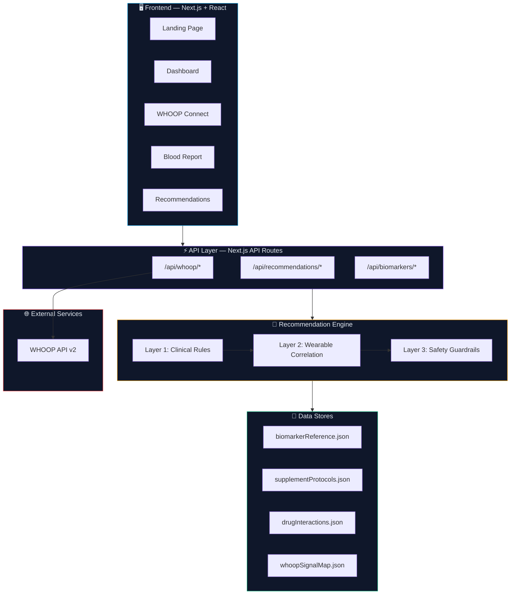
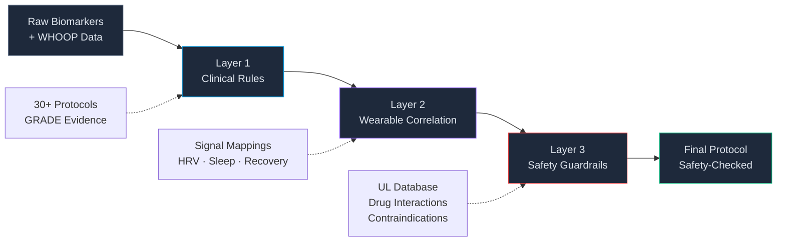

<


<br />

[**Getting Started**](#-quick-start) · [**Documentation**](#-documentation) · [**Architecture**](docs/ARCHITECTURE.md) · [**Roadmap**](#-roadmap)

<br />

---

</div>

## 🔬 The Problem

**Generic multivitamins treat everyone the same — but everyone is different.**

- **70% of Americans** have at least one nutrient deficiency, yet nearly all take identical, one-size-fits-all supplements.
- A person with **low ferritin, high CRP inflammation, and poor HRV** needs a completely different protocol than someone with **low Vitamin D and poor sleep latency**.
- Existing supplement recommendations ignore the rich biometric data flowing from wearable devices — data that reveals how your body *actually responds* to nutrition, stress, and recovery.
- **Drug-nutrient interactions** go unchecked, **upper limits** are exceeded, and critical biomarker findings are missed without proper guardrails.

> The supplement industry is a $60B market built on guesswork. VitalSync replaces guesswork with data.

---

## 💡 The Solution

**VitalSync** combines **WHOOP wearable data** (HRV, sleep architecture, recovery scores, strain) with **blood biomarker analysis** to generate evidence-based, personalized supplement recommendations using a **3-layer hybrid recommendation engine**.

Instead of generic "take a multivitamin" advice, VitalSync produces protocols like:

```
┌─────────────────────────────────────────────────────────────────────────┐
│  YOUR PROTOCOL                                                         │
│                                                                         │
│  🔴 PRIORITY: Magnesium Glycinate — 400mg before bed                   │
│     Reason: Low RBC Mg (3.8 mg/dL) + HRV below baseline (38ms)        │
│     Evidence: Level A (Multiple RCTs)                                   │
│     Interaction Check: ✅ No conflicts with current medications         │
│                                                                         │
│  🟡 MODERATE: Vitamin D3 + K2 — 5000 IU + 200mcg daily                │
│     Reason: 25(OH)D at 22 ng/mL (insufficient) + Low sleep quality     │
│     Evidence: Level A                                                   │
│     Interaction Check: ✅ Clear                                         │
│                                                                         │
│  🟢 MAINTENANCE: Omega-3 (EPA/DHA) — 2g with meals                    │
│     Reason: hs-CRP elevated (2.8 mg/L) + Recovery trending down       │
│     Evidence: Level A                                                   │
│     Interaction Check: ⚠️ Monitor with blood thinners                  │
└─────────────────────────────────────────────────────────────────────────┘
```

---

## ⚙️ How It Works


| Step | What Happens | Data |
|------|-------------|------|
| **① Connect WHOOP** | OAuth 2.0 flow pulls your real-time biometrics | HRV, sleep stages (deep/REM/light), recovery score, strain, SpO2, resting HR |
| **② Enter Blood Work** | Input 20+ biomarkers from any lab panel; each is classified into optimal/functional/suboptimal/deficient/critical zones in real time | Vitamin D, Ferritin, B12, Folate, Magnesium, Iron, hs-CRP, Homocysteine, Thyroid panel, CBC, and more |
| **③ Get Your Protocol** | The 3-layer recommendation engine synthesizes all data into a prioritized, safety-checked supplement protocol | Supplement name, specific form, dosage, timing, evidence grade, interaction warnings, doctor escalation flags |

---

## ✨ Key Features

| Feature | Description |
|---------|-------------|
| 🧬 **20+ Blood Biomarkers** | Comprehensive panel support with optimal/functional ranges — not just standard lab reference ranges |
| ⌚ **WHOOP Integration** | Real-time biometric correlation: HRV trends, sleep architecture, recovery scores, strain load, SpO2 |
| 💊 **30+ Supplement Protocols** | Evidence-based recommendations with specific forms (e.g., magnesium *glycinate* not oxide), dosages, and timing |
| ⚠️ **Drug-Nutrient Interactions** | Automated cross-checking against a curated database of known drug-supplement interactions |
| 🛡️ **Safety Guardrails** | Tolerable Upper Intake Level (UL) enforcement, contraindication detection, and pregnancy/condition flags |
| 📊 **Confidence Scoring** | Every recommendation carries a GRADE-framework evidence level (A/B/C/D) with cited clinical sources |
| 🩺 **Doctor Escalation** | Critical biomarker findings automatically flag for physician review — never replaces medical advice |
| 🎨 **Glassmorphism UI** | Premium dark-theme dashboard with frosted glass cards, smooth animations, and responsive design |
| 📱 **Responsive Design** | Full mobile-to-desktop experience with touch-optimized interactions |

---

## 🏗️ Architecture Overview



> For the complete architecture breakdown, see [**docs/ARCHITECTURE.md**](docs/ARCHITECTURE.md).

---

## 🛠️ Tech Stack

| Layer | Technology | Purpose |
|-------|-----------|---------|
| **Frontend** | Next.js 14, React 18 | Server-side rendering, file-based routing, React Server Components |
| **Styling** | CSS Modules + Custom Properties | Glassmorphism dark theme with frosted glass cards and gradient accents |
| **Backend** | Next.js API Routes | Serverless API endpoints for WHOOP OAuth, biomarker processing, recommendations |
| **Recommendation Engine** | Custom 3-layer system | Rule-based clinical logic + wearable signal correlation + safety guardrails |
| **Data Visualization** | Recharts | Responsive charts for biomarker trends, HRV analysis, sleep architecture |
| **Animation** | Framer Motion | Smooth page transitions, card animations, micro-interactions |
| **External APIs** | WHOOP API v2 (OAuth 2.0) | Biometric data: HRV, sleep, recovery, strain, SpO2, resting HR |
| **Data Storage** | JSON reference files | Biomarker ranges, supplement protocols, drug interactions, signal mappings |
| **Deployment** | Vercel (recommended) | Edge-optimized hosting with automatic preview deployments |

---

## 🚀 Quick Start

### Prerequisites

- **Node.js** 18+ and **npm** 9+
- **WHOOP Developer Account** — [developer.whoop.com](https://developer.whoop.com)

### 1. Clone & Install

```bash
git clone https://github.com/yourusername/vitalsync.git
cd vitalsync
npm install
```

### 2. Configure Environment

Create a `.env.local` file in the project root:

```env
# WHOOP OAuth 2.0 Credentials
WHOOP_CLIENT_ID=your_whoop_client_id
WHOOP_CLIENT_SECRET=your_whoop_client_secret
WHOOP_REDIRECT_URI=http://localhost:3000/api/whoop/callback

# Application
NEXT_PUBLIC_APP_URL=http://localhost:3000
NODE_ENV=development
```

> **How to get WHOOP credentials:**
> 1. Create a developer account at [developer.whoop.com](https://developer.whoop.com)
> 2. Register a new application
> 3. Set the redirect URI to `http://localhost:3000/api/whoop/callback`
> 4. Copy the Client ID and Client Secret

### 3. Run Development Server

```bash
npm run dev
```

Open [http://localhost:3000](http://localhost:3000) — you're live! 🎉

### 4. Build for Production

```bash
npm run build
npm start
```

---

## 📁 Project Structure

```
src/
├── app/                          # Next.js App Router
│   ├── layout.js                 # Root layout with global providers
│   ├── page.js                   # Landing page
│   ├── globals.css               # Global styles & CSS custom properties
│   ├── dashboard/
│   │   └── page.js               # Main dashboard view
│   ├── connect/
│   │   └── page.js               # WHOOP OAuth connection flow
│   ├── blood-report/
│   │   └── page.js               # Blood biomarker input & analysis
│   └── api/
│       ├── whoop/
│       │   ├── authorize/route.js    # Initiates OAuth 2.0 flow
│       │   ├── callback/route.js     # Handles OAuth callback
│       │   └── data/route.js         # Fetches WHOOP biometric data
│       ├── recommendations/
│       │   └── generate/route.js     # Runs recommendation engine
│       └── biomarkers/
│           └── analyze/route.js      # Biomarker classification
│
├── components/                   # React Components
│   ├── landing/                  # Landing page sections
│   │   ├── HeroSection.jsx
│   │   ├── FeaturesGrid.jsx
│   │   ├── HowItWorks.jsx
│   │   └── CTASection.jsx
│   ├── dashboard/                # Dashboard components
│   │   ├── BiomarkerCard.jsx
│   │   ├── WhoopMetrics.jsx
│   │   ├── RecommendationPanel.jsx
│   │   └── HealthScore.jsx
│   ├── blood-report/             # Blood work input
│   │   ├── BiomarkerInput.jsx
│   │   ├── ZoneClassifier.jsx
│   │   └── ReportSummary.jsx
│   └── shared/                   # Shared UI components
│       ├── GlassCard.jsx
│       ├── Navigation.jsx
│       ├── AnimatedCounter.jsx
│       └── LoadingSpinner.jsx
│
├── lib/                          # Core Business Logic
│   ├── whoop/
│   │   ├── whoopClient.js        # WHOOP API client wrapper
│   │   ├── oauthHandler.js       # OAuth 2.0 token management
│   │   └── signalProcessor.js    # Biometric signal analysis
│   ├── biomarkers/
│   │   ├── parser.js             # Blood work input parser
│   │   ├── classifier.js         # Zone classification engine
│   │   └── referenceRanges.js    # Optimal/functional range definitions
│   ├── recommendations/
│   │   ├── engine.js             # Main recommendation engine (3-layer)
│   │   ├── clinicalRules.js      # Layer 1: Clinical rule matching
│   │   ├── wearableCorrelation.js # Layer 2: WHOOP signal correlation
│   │   └── safetyGuardrails.js   # Layer 3: Safety & interaction checks
│   └── utils/
│       ├── evidenceGrading.js    # GRADE framework scoring
│       ├── dosageCalculator.js   # Safe dosage computation
│       └── formatters.js         # Display formatting helpers
│
├── data/                         # Reference Data
│   ├── biomarkerReference.json   # 20+ biomarkers with ranges & metadata
│   ├── supplementProtocols.json  # 30+ supplement protocols & evidence
│   ├── drugInteractions.json     # Drug-nutrient interaction database
│   └── whoopSignalMap.json       # WHOOP metric → supplement signal mappings
│
└── styles/                       # Component Styles
    ├── variables.css             # CSS custom properties (colors, spacing)
    ├── glassmorphism.css         # Glass card & blur effect styles
    └── animations.css            # Framer Motion keyframe definitions
```

---

## 📚 Documentation

| Document | Description |
|----------|-------------|
| [**ARCHITECTURE.md**](docs/ARCHITECTURE.md) | System architecture, data flow diagrams, component deep dives, security model |
| **BIOMARKERS.md** *(coming soon)* | Complete biomarker reference — all 20+ markers with optimal ranges, clinical significance, and evidence |
| **SUPPLEMENTS.md** *(coming soon)* | Supplement protocol reference — forms, dosages, evidence grades, mechanism of action |
| **WHOOP_INTEGRATION.md** *(coming soon)* | WHOOP API integration guide — OAuth flow, available metrics, signal processing |
| **SAFETY.md** *(coming soon)* | Safety guardrails — UL enforcement, drug interactions, contraindications, escalation rules |

---

## 🧠 Recommendation Engine Deep Dive

The engine operates in three sequential layers, each refining and validating the output of the previous:

### Layer 1: Clinical Rules Engine

```
Biomarker Value → Zone Classification → Protocol Match → Base Recommendation
```

- Maps each biomarker to a clinical zone: **Optimal**, **Functional**, **Suboptimal**, **Deficient**, or **Critical**
- Matches deficiency patterns against a curated database of 30+ supplement protocols
- Each protocol specifies: supplement name, specific form, base dosage, timing, and GRADE evidence level
- Uses **functional/optimal ranges** (narrower than standard lab ranges) for earlier intervention

### Layer 2: Wearable Correlation Engine

```
WHOOP Signals → Pattern Detection → Recommendation Modification → Enhanced Protocol
```

- Correlates WHOOP biometrics (HRV, sleep, recovery, strain) with biomarker findings
- **Amplifies** priority for supplements when wearable data corroborates the deficiency (e.g., low Mg + low HRV → higher priority for magnesium)
- **Introduces** new recommendations based on biometric patterns alone (e.g., consistently poor deep sleep → magnesium glycinate even without blood work)
- Adjusts **confidence scores** based on data convergence

### Layer 3: Safety Guardrails

```
Enhanced Protocol → UL Check → Interaction Screen → Contraindication Filter → Final Protocol
```

- Enforces **Tolerable Upper Intake Levels (ULs)** set by the Institute of Medicine
- Cross-references against the drug interaction database for known conflicts
- Checks for **contraindications** (pregnancy, kidney disease, bleeding disorders, etc.)
- Flags **critical findings** (e.g., ferritin < 12, Vitamin D < 10) for mandatory doctor escalation
- Adds **monitoring recommendations** for supplements requiring periodic lab reassessment



---

## ⚖️ Regulatory & Compliance

### FDA Positioning

VitalSync is positioned as a **wellness and educational tool**, not a medical device. It does not diagnose, treat, cure, or prevent any disease. All recommendations are informational and should be reviewed with a qualified healthcare provider.

### DSHEA Compliance

Under the **Dietary Supplement Health and Education Act (DSHEA) of 1994**, dietary supplements are regulated as food products. VitalSync's recommendations reference only structure/function claims supported by published clinical evidence and do not make disease claims.

### Data Privacy

- No blood work data is stored on servers — all processing happens client-side or in ephemeral serverless functions
- WHOOP OAuth tokens are handled per-session and are not persisted to any database
- HIPAA-level data handling practices are followed as a best practice (see [Security Model](docs/ARCHITECTURE.md#-security-model))
- No personally identifiable health information (PHI) is logged or transmitted to third parties

---

## 🗺️ Roadmap

### Phase 1 — MVP ✅ *(Current)*

- [x] WHOOP OAuth 2.0 integration
- [x] Blood biomarker input with 20+ markers
- [x] Real-time zone classification (optimal → critical)
- [x] 3-layer recommendation engine
- [x] Drug-nutrient interaction checking
- [x] Safety guardrails with UL enforcement
- [x] Glassmorphism dark-theme dashboard
- [x] Responsive design (mobile → desktop)

### Phase 2 — Intelligence Layer 🔮

- [ ] **ML-enhanced recommendations** — learn from anonymized outcome data
- [ ] **Lab report PDF parsing** — OCR + NLP extraction from PDF lab results
- [ ] **Supplement brand recommendations** — quality-verified product suggestions
- [ ] **Progress tracking** — before/after biomarker comparison over time
- [ ] **Multi-wearable support** — Apple Watch, Oura Ring, Garmin, WHOOP

### Phase 3 — Precision Health 🧬

- [ ] **Genomic integration** — SNP-based nutrient metabolism (MTHFR, VDR, CYP variants)
- [ ] **CGM data correlation** — continuous glucose monitor data for metabolic optimization
- [ ] **Microbiome integration** — gut health data for absorption optimization
- [ ] **Practitioner portal** — dashboard for healthcare providers to manage patient protocols
- [ ] **Telehealth integration** — direct consultation booking for flagged findings

---

## 🤝 Contributing

Contributions are welcome! VitalSync is a complex health-tech project, so please follow these guidelines:

### Getting Started

1. **Fork** the repository
2. **Create** a feature branch: `git checkout -b feature/your-feature-name`
3. **Commit** your changes: `git commit -m 'feat: add amazing feature'`
4. **Push** to the branch: `git push origin feature/your-feature-name`
5. **Open** a Pull Request

### Commit Convention

We follow [Conventional Commits](https://www.conventionalcommits.org/):

| Prefix | Use Case |
|--------|----------|
| `feat:` | New feature |
| `fix:` | Bug fix |
| `docs:` | Documentation changes |
| `refactor:` | Code refactoring |
| `test:` | Adding/updating tests |
| `data:` | Reference data updates (biomarkers, protocols) |

### Code Guidelines

- All supplement protocols must include **GRADE evidence levels** and **cited sources**
- Any new biomarker additions must include **optimal/functional ranges** with clinical references
- Drug interaction entries require **severity classification** and **mechanism description**
- Safety guardrails must be **conservative** — when in doubt, escalate to physician review

### Clinical Review

All pull requests that modify recommendation logic, biomarker ranges, or supplement protocols require review by a contributor with clinical/nutritional science background. Tag your PR with the `clinical-review` label.

---

## ⚠️ Disclaimer

> **VitalSync is not a medical device, diagnostic tool, or substitute for professional medical advice.**
>
> The supplement recommendations generated by this platform are for **educational and informational purposes only**. They are based on published clinical research and general nutritional science, but have **not been evaluated by the FDA** or any regulatory body.
>
> - **Always consult a qualified healthcare provider** before starting any supplement regimen, especially if you have pre-existing conditions, are pregnant or nursing, or take prescription medications.
> - **Do not discontinue** any prescribed medication based on information from this platform.
> - **Critical biomarker findings** (flagged in red) require **immediate physician consultation** — VitalSync will clearly indicate when findings are outside safe self-management ranges.
> - Individual responses to supplements vary. Past research results do not guarantee individual outcomes.
>
> By using VitalSync, you acknowledge that the creators and contributors assume **no liability** for health outcomes resulting from the use of this tool.

---

## 📄 License

This project is licensed under the **MIT License** — see the [LICENSE](LICENSE) file for details.

```
MIT License

Copyright (c) 2025 VitalSync Contributors

Permission is hereby granted, free of charge, to any person obtaining a copy
of this software and associated documentation files (the "Software"), to deal
in the Software without restriction, including without limitation the rights
to use, copy, modify, merge, publish, distribute, sublicense, and/or sell
copies of the Software, and to permit persons to whom the Software is
furnished to do so, subject to the following conditions:

The above copyright notice and this permission notice shall be included in all
copies or substantial portions of the Software.

THE SOFTWARE IS PROVIDED "AS IS", WITHOUT WARRANTY OF ANY KIND, EXPRESS OR
IMPLIED, INCLUDING BUT NOT LIMITED TO THE WARRANTIES OF MERCHANTABILITY,
FITNESS FOR A PARTICULAR PURPOSE AND NONINFRINGEMENT. IN NO EVENT SHALL THE
AUTHORS OR COPYRIGHT HOLDERS BE LIABLE FOR ANY CLAIM, DAMAGES OR OTHER
LIABILITY, WHETHER IN AN ACTION OF CONTRACT, TORT OR OTHERWISE, ARISING FROM,
OUT OF OR IN CONNECTION WITH THE SOFTWARE OR THE USE OR OTHER DEALINGS IN THE
SOFTWARE.
```

---

<div align="center">

**Built with ❤️ for personalized health optimization**

*VitalSync — Because your supplements should be as unique as your biology.*

</div>
]]>
# AI-HealthCare
