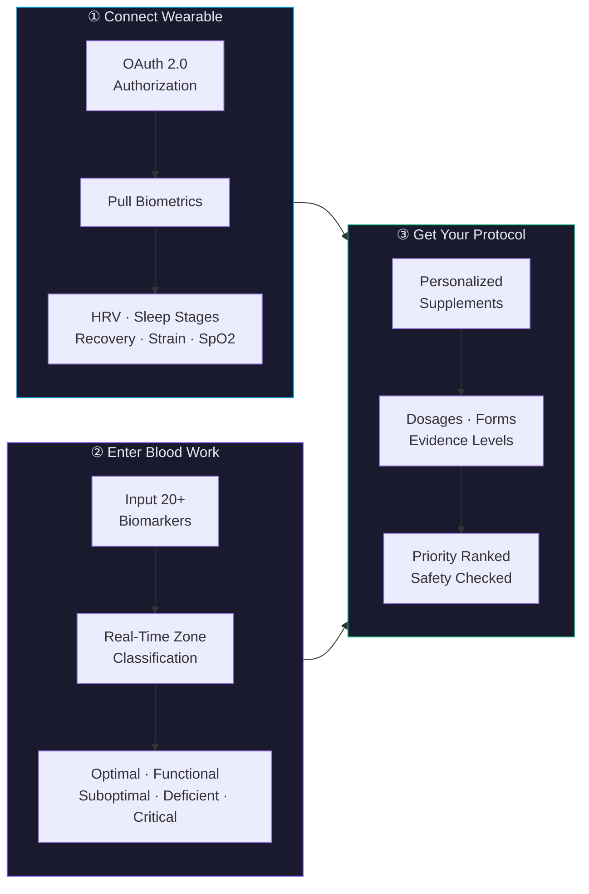
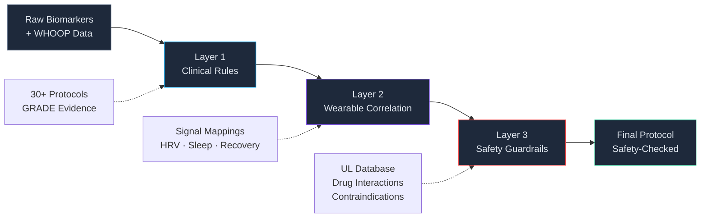

<div align="center">

# 💊 VitalSync

### Personalized supplement protocols — powered by your WHOOP biometrics and blood biomarkers


[Getting Started](#-quick-start) · [Documentation](#-documentation) · [Architecture](docs/ARCHITECTURE.md) · [Roadmap](#-roadmap)

</div>

---

## The Problem

Generic supplements treat everyone the same — but your blood work and biometrics are unique to you.

- A person with low ferritin, high CRP, and poor HRV needs a completely different protocol than someone with low Vitamin D and poor sleep latency
- Existing apps ignore the rich data flowing from wearables — data that shows how your body *actually* responds to nutrition and stress
- Drug-nutrient interactions go unchecked, upper intake limits get exceeded, and critical findings get missed

> The supplement industry is a $60B market built on guesswork. VitalSync replaces guesswork with data.

---

## The Solution

VitalSync combines **WHOOP wearable data** (HRV, sleep, recovery, strain) with **blood biomarker analysis** to generate evidence-based, personalized supplement protocols through a 3-layer recommendation engine.

**Example output:**

```
┌─────────────────────────────────────────────────────────────────────────┐
│  YOUR PROTOCOL                                                          │
│                                                                         │
│  🔴 PRIORITY: Magnesium Glycinate — 400mg before bed                   │
│     Reason: Low RBC Mg (3.8 mg/dL) + HRV below baseline (38ms)        │
│     Evidence: Level A (Multiple RCTs)                                   │
│     Interaction Check: ✅ No conflicts                                  │
│                                                                         │
│  🟡 MODERATE: Vitamin D3 + K2 — 5000 IU + 200mcg daily                │
│     Reason: 25(OH)D at 22 ng/mL + low sleep quality                   │
│     Evidence: Level A · Interaction Check: ✅ Clear                    │
│                                                                         │
│  🟢 MAINTAIN: Omega-3 (EPA/DHA) — 2g with meals                       │
│     Reason: hs-CRP elevated (2.8 mg/L) + recovery trending down       │
│     Evidence: Level A · ⚠️ Monitor with blood thinners                 │
└─────────────────────────────────────────────────────────────────────────┘
```

---

## How It Works



| Step | What Happens | Data |
|------|-------------|------|
| **① Connect WHOOP** | OAuth 2.0 pulls your real-time biometrics | HRV, sleep stages, recovery score, strain, SpO2, resting HR |
| **② Enter Blood Work** | Input 20+ biomarkers — each classified into optimal/functional/suboptimal/deficient/critical zones | Vitamin D, Ferritin, B12, Magnesium, hs-CRP, Homocysteine, Thyroid panel, CBC, and more |
| **③ Get Your Protocol** | The 3-layer engine synthesizes all data into a prioritized, safety-checked protocol | Supplement name, form, dosage, timing, evidence grade, interaction warnings, escalation flags |

---

## Key Features

| Feature | Description |
|---------|-------------|
| 🧬 **20+ Blood Biomarkers** | Comprehensive panel with optimal/functional ranges — not just standard lab reference ranges |
| ⌚ **WHOOP Integration** | Real-time biometric correlation: HRV trends, sleep architecture, recovery scores, strain, SpO2 |
| 💊 **30+ Supplement Protocols** | Evidence-based recommendations with specific forms (magnesium *glycinate* not oxide), dosages, timing |
| ⚠️ **Drug-Nutrient Interactions** | Automated cross-checking against a curated interaction database |
| 🛡️ **Safety Guardrails** | UL enforcement, contraindication detection, pregnancy/condition flags |
| 📊 **Confidence Scoring** | Every recommendation carries a GRADE evidence level (A–D) with cited sources |
| 🩺 **Doctor Escalation** | Critical biomarker findings automatically flagged for physician review |
| 🎨 **Glassmorphism UI** | Dark-theme dashboard with frosted glass cards, smooth animations, responsive layout |

---

## Architecture Overview


> For the full breakdown, see [docs/ARCHITECTURE.md](docs/ARCHITECTURE.md).

---

## Tech Stack

| Layer | Technology | Purpose |
|-------|-----------|---------|
| **Frontend** | Next.js 14, React 18 | SSR, file-based routing, React Server Components |
| **Styling** | CSS Modules + Custom Properties | Glassmorphism dark theme |
| **Backend** | Next.js API Routes | Serverless endpoints for WHOOP OAuth, biomarkers, recommendations |
| **Recommendation Engine** | Custom 3-layer system | Clinical rules + wearable correlation + safety guardrails |
| **Data Visualization** | Recharts | Biomarker trends, HRV analysis, sleep architecture |
| **Animation** | Framer Motion | Page transitions, card animations, micro-interactions |
| **External API** | WHOOP API v2 (OAuth 2.0) | HRV, sleep, recovery, strain, SpO2, resting HR |
| **Deployment** | Vercel | Edge-optimized hosting, automatic preview deployments |

---

## Quick Start

**Prerequisites:** Node.js 18+, npm 9+, [WHOOP developer account](https://developer.whoop.com)

### 1. Clone & install

```bash
git clone https://github.com/yourusername/vitalsync.git
cd vitalsync
npm install
```

### 2. Configure environment

Create `.env.local`:

```env
WHOOP_CLIENT_ID=your_whoop_client_id
WHOOP_CLIENT_SECRET=your_whoop_client_secret
WHOOP_REDIRECT_URI=http://localhost:3000/api/whoop/callback
NEXT_PUBLIC_APP_URL=http://localhost:3000
NODE_ENV=development
```

> Get WHOOP credentials at [developer.whoop.com](https://developer.whoop.com) — register a new app and set the redirect URI to `http://localhost:3000/api/whoop/callback`.

### 3. Run

```bash
npm run dev
```

Open [http://localhost:3000](http://localhost:3000) — you're live.

### 4. Build for production

```bash
npm run build
npm start
```

---

## Project Structure

```
src/
├── app/                        # Next.js App Router
│   ├── layout.js               # Root layout
│   ├── page.js                 # Landing page
│   ├── dashboard/page.js       # Main dashboard
│   ├── connect/page.js         # WHOOP OAuth flow
│   ├── blood-report/page.js    # Biomarker input
│   └── api/
│       ├── whoop/              # authorize, callback, data
│       ├── recommendations/    # generate
│       └── biomarkers/         # analyze
├── components/
│   ├── landing/                # HeroSection, FeaturesGrid, HowItWorks, CTASection
│   ├── dashboard/              # BiomarkerCard, WhoopMetrics, RecommendationPanel, HealthScore
│   ├── blood-report/           # BiomarkerInput, ZoneClassifier, ReportSummary
│   └── shared/                 # GlassCard, Navigation, AnimatedCounter, LoadingSpinner
├── lib/
│   ├── whoop/                  # whoopClient, oauthHandler, signalProcessor
│   ├── biomarkers/             # parser, classifier, referenceRanges
│   ├── recommendations/        # engine, clinicalRules, wearableCorrelation, safetyGuardrails
│   └── utils/                  # evidenceGrading, dosageCalculator, formatters
└── data/
    ├── biomarkerReference.json
    ├── supplementProtocols.json
    ├── drugInteractions.json
    └── whoopSignalMap.json
```

---

## Documentation

| Document | Description |
|----------|-------------|
| [ARCHITECTURE.md](docs/ARCHITECTURE.md) | System architecture, data flow, security model |
| [WHOOP_INTEGRATION.md](docs/WHOOP_INTEGRATION.md) | OAuth flow, available metrics, signal processing |
| [BIOMARKER_REFERENCE.md](docs/BIOMARKER_REFERENCE.md) | All 20+ markers, optimal ranges, clinical significance |
| [SUPPLEMENT_PROTOCOLS.md](docs/SUPPLEMENT_PROTOCOLS.md) | Forms, dosages, evidence grades, mechanisms |
| [SAFETY_COMPLIANCE.md](docs/SAFETY_COMPLIANCE.md) | UL enforcement, drug interactions, escalation rules |

---

## Recommendation Engine

Three layers run in sequence, each refining the previous output.

### Layer 1 — Clinical Rules

```
Biomarker Value → Zone Classification → Protocol Match → Base Recommendation
```

Maps each biomarker to a clinical zone (optimal / functional / suboptimal / deficient / critical), matches against 30+ supplement protocols, and assigns a GRADE evidence level to every match.

### Layer 2 — Wearable Correlation

```
WHOOP Signals → Pattern Detection → Recommendation Modification → Enhanced Protocol
```

Correlates WHOOP biometrics with biomarker findings. Low magnesium + low HRV → elevated magnesium priority. Poor deep sleep without blood work → still surfaces a magnesium recommendation. Confidence scores adjust based on data convergence.

### Layer 3 — Safety Guardrails

```
Enhanced Protocol → UL Check → Interaction Screen → Contraindication Filter → Final Protocol
```

Enforces Tolerable Upper Intake Levels, screens for drug-nutrient conflicts, checks contraindications, and flags critical findings (ferritin < 12, Vitamin D < 10) for mandatory physician review.



---

## Regulatory & Compliance

**FDA Positioning** — VitalSync is a wellness and educational tool, not a medical device. It does not diagnose, treat, cure, or prevent any disease.

**DSHEA Compliance** — Recommendations reference only structure/function claims supported by published clinical evidence under the Dietary Supplement Health and Education Act (1994).

**Data Privacy**
- No blood work data stored on servers — all processing is client-side or in ephemeral serverless functions
- WHOOP OAuth tokens are session-only and never persisted to any database
- No PHI is logged or transmitted to third parties
- HIPAA-level data handling practices followed as best practice — see [Security Model](docs/ARCHITECTURE.md#-security-model)

---

## Roadmap

### Phase 1 — MVP ✅ *(current)*

- [x] WHOOP OAuth 2.0 integration
- [x] 20+ biomarker input with real-time zone classification
- [x] 3-layer recommendation engine
- [x] Drug-nutrient interaction checking
- [x] Safety guardrails with UL enforcement
- [x] Glassmorphism dark-theme dashboard
- [x] Responsive design (mobile → desktop)

### Phase 2 — Intelligence Layer 🔮

- [ ] ML-enhanced recommendations from anonymized outcome data
- [ ] Lab report PDF parsing — OCR + NLP extraction
- [ ] Supplement brand recommendations with quality verification
- [ ] Progress tracking — before/after biomarker comparison
- [ ] Multi-wearable support (Apple Watch, Oura Ring, Garmin)

### Phase 3 — Precision Health 🧬

- [ ] Genomic integration — SNP-based nutrient metabolism (MTHFR, VDR, CYP variants)
- [ ] CGM data correlation for metabolic optimization
- [ ] Microbiome integration for absorption optimization
- [ ] Practitioner portal for healthcare providers
- [ ] Telehealth integration — direct consultation booking for flagged findings

---

## Contributing

### Getting Started

1. Fork the repository
2. Create a feature branch: `git checkout -b feature/your-feature-name`
3. Commit your changes following [Conventional Commits](https://www.conventionalcommits.org/)
4. Push and open a Pull Request

### Commit Convention

| Prefix | Use Case |
|--------|----------|
| `feat:` | New feature |
| `fix:` | Bug fix |
| `docs:` | Documentation |
| `refactor:` | Code refactoring |
| `test:` | Tests |
| `data:` | Biomarker/protocol data updates |

### Code Guidelines

- All supplement protocols must include GRADE evidence levels and cited sources
- New biomarker additions require optimal/functional ranges with clinical references
- Drug interaction entries need severity classification and mechanism description
- Safety guardrails must be conservative — when in doubt, escalate to physician review

### Clinical Review

PRs that modify recommendation logic, biomarker ranges, or supplement protocols require review by a contributor with a clinical or nutritional science background. Tag with `clinical-review`.

---

## Disclaimer

> **VitalSync is not a medical device, diagnostic tool, or substitute for professional medical advice.**
>
> Recommendations are for educational and informational purposes only, based on published clinical research, and have not been evaluated by the FDA.
>
> - Always consult a qualified healthcare provider before starting any supplement regimen, especially with pre-existing conditions, pregnancy, or prescription medications
> - Do not discontinue any prescribed medication based on information from this platform
> - Critical biomarker findings (flagged red) require immediate physician consultation
> - Individual responses to supplements vary — past research results do not guarantee individual outcomes
>
> By using VitalSync, you acknowledge that the creators assume no liability for health outcomes resulting from use of this tool.

---

## License

MIT — see [LICENSE](LICENSE).

---

<div align="center">

*VitalSync — because your supplements should be as unique as your biology.*

</div>
