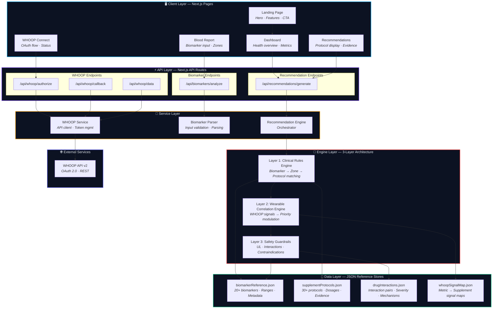
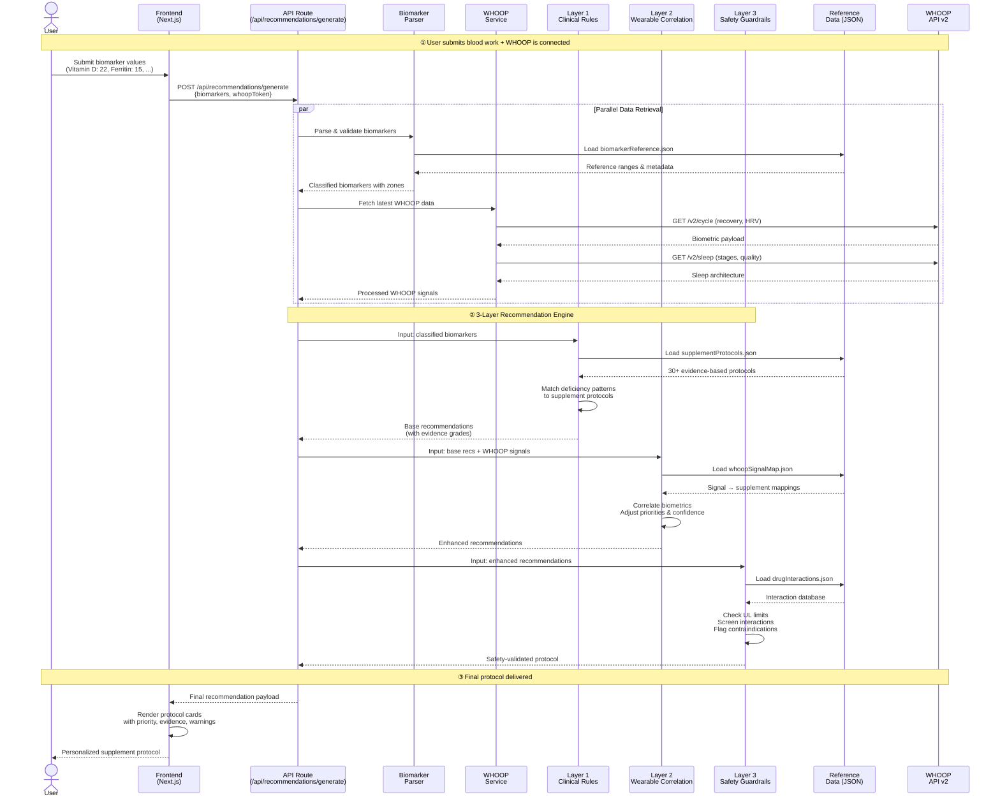
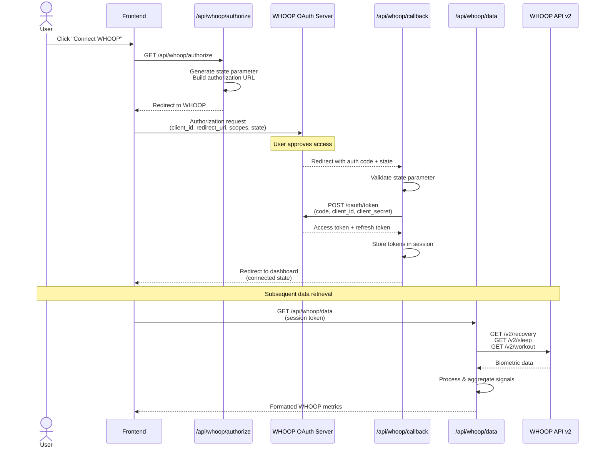
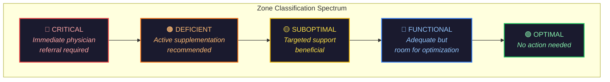
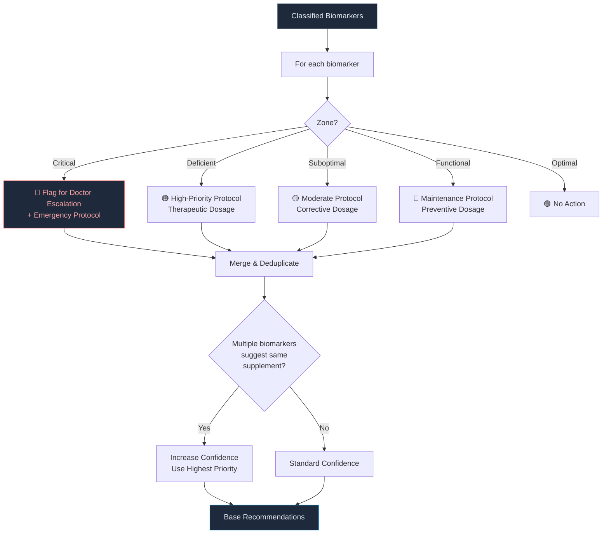
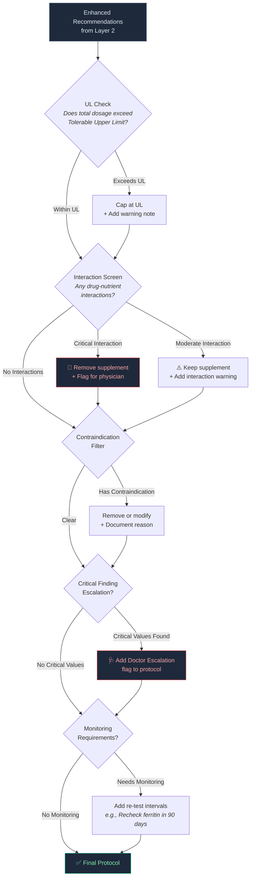
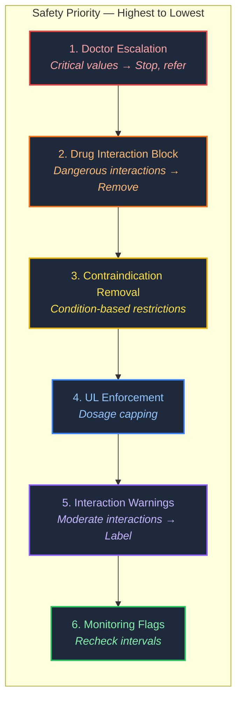
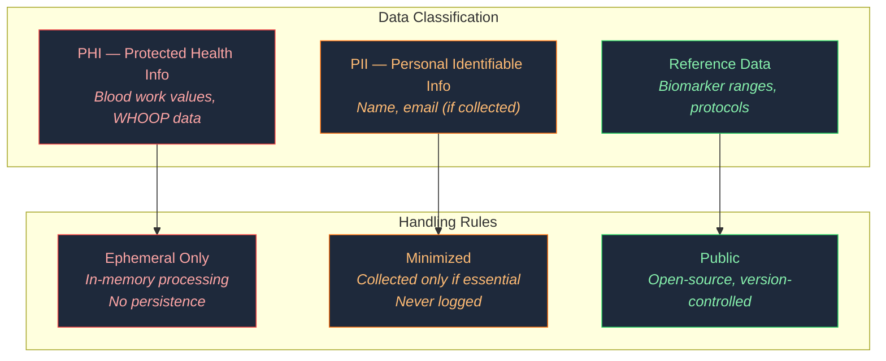
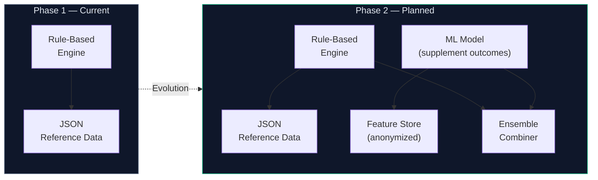
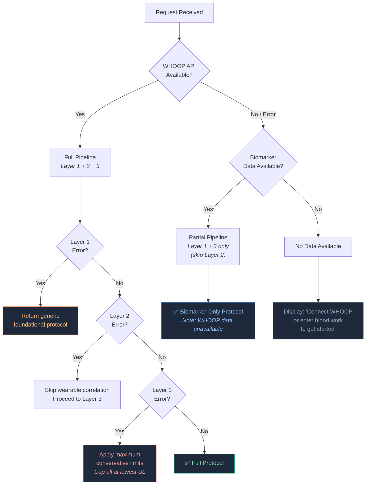

<
- [Architecture Diagram](#-architecture-diagram)
- [Data Flow](#-data-flow)
- [Component Architecture](#-component-architecture)
  - [WHOOP Integration Module](#1-whoop-integration-module)
  - [Biomarker System](#2-biomarker-system)
  - [Recommendation Engine](#3-recommendation-engine)
  - [Safety & Compliance Module](#4-safety--compliance-module)
- [Technology Decisions](#-technology-decisions)
- [Security Model](#-security-model)
- [Scalability Considerations](#-scalability-considerations)
- [Error Handling Strategy](#-error-handling-strategy)

---

## 🔭 System Overview

VitalSync is a **client-server web application** built on Next.js that combines wearable biometric data from WHOOP with user-provided blood biomarker results to generate personalized, evidence-based supplement recommendations.

The system follows a **layered architecture** with clear separation of concerns:

| Layer | Responsibility | Key Principle |
|-------|---------------|---------------|
| **Client** | User interface, data input, visualization | Responsive, accessible, privacy-first |
| **API** | Request routing, OAuth orchestration, data transformation | Stateless, serverless-ready |
| **Service** | Business logic, external API integration | Domain isolation, testable |
| **Engine** | Recommendation generation (3 sub-layers) | Evidence-based, deterministic, auditable |
| **Data** | Reference databases, protocol definitions | Version-controlled, clinically sourced |
| **External** | Third-party integrations (WHOOP API v2) | Abstracted, fail-safe |

### Core Design Principles

1. **Privacy by Design** — No persistent storage of health data; ephemeral processing only
2. **Evidence-Based Output** — Every recommendation cites GRADE-level evidence
3. **Safety-First** — The safety guardrail layer cannot be bypassed; it is the final gate
4. **Graceful Degradation** — System produces useful output even with partial data
5. **Deterministic Recommendations** — Same inputs always produce same outputs (no hidden randomness)

---

## 📐 Architecture Diagram



---

## 🔄 Data Flow

### Primary Flow: Biomarker Input → Personalized Protocol



### WHOOP OAuth 2.0 Flow



---

## 🧩 Component Architecture

### 1. WHOOP Integration Module

The WHOOP module handles the complete lifecycle of wearable data integration — from OAuth authentication to biometric signal extraction and interpretation.

#### Module Structure

```
lib/whoop/
├── whoopClient.js          # HTTP client for WHOOP API v2
├── oauthHandler.js         # OAuth 2.0 token management
└── signalProcessor.js      # Raw data → actionable signals
```

#### OAuth 2.0 Implementation

| Aspect | Detail |
|--------|--------|
| **Grant Type** | Authorization Code |
| **Scopes** | `read:recovery`, `read:sleep`, `read:workout`, `read:body_measurement` |
| **Token Storage** | Session-only (ephemeral); no persistent database storage |
| **Refresh Strategy** | Automatic token refresh on 401 response; single-retry pattern |
| **State Validation** | Cryptographic random state parameter; validated on callback |

#### Signal Processing Pipeline

The `signalProcessor.js` transforms raw WHOOP API data into health signals that the recommendation engine consumes:

```
Raw WHOOP Data                    Processed Signals
─────────────                    ──────────────────
recovery_score: 43%        →     recovery_status: "poor"
hrv_rmssd: 38ms            →     hrv_trend: "below_baseline"
sleep_performance: 62%     →     sleep_quality: "suboptimal"
deep_sleep_duration: 42min →     deep_sleep_status: "insufficient"
rem_sleep_duration: 55min  →     rem_sleep_status: "low"
respiratory_rate: 16.2     →     resp_rate_status: "normal"
spo2: 96.1%                →     spo2_status: "normal"
strain_score: 18.5         →     strain_level: "high"
resting_hr: 58             →     rhr_trend: "normal"
```

#### Polling & Rate Limiting

| Parameter | Value |
|-----------|-------|
| **API Rate Limit** | Respects WHOOP's rate limit headers (`X-RateLimit-Remaining`) |
| **Data Window** | Last 7 days for trend analysis; latest cycle for current state |
| **Retry Policy** | Exponential backoff: 1s → 2s → 4s → fail |
| **Timeout** | 10s per request; 30s total for full data pull |

---

### 2. Biomarker System

The biomarker system is responsible for accepting, validating, classifying, and contextualizing user-provided blood work results.

#### Module Structure

```
lib/biomarkers/
├── parser.js               # Input validation & normalization
├── classifier.js           # Zone classification engine
└── referenceRanges.js      # Optimal/functional range definitions
```

#### Supported Biomarkers (20+)

| Category | Biomarkers | Clinical Relevance |
|----------|-----------|-------------------|
| **Vitamins** | Vitamin D (25-OH), B12, Folate, Vitamin A, Vitamin E | Immune function, energy, methylation, antioxidant status |
| **Minerals** | Ferritin, Iron (serum), Magnesium (RBC), Zinc, Selenium, Iodine | Oxygen transport, muscle function, thyroid, immunity |
| **Inflammation** | hs-CRP, Homocysteine, ESR | Cardiovascular risk, systemic inflammation, methylation |
| **Thyroid** | TSH, Free T3, Free T4 | Metabolic regulation, energy, weight management |
| **Lipids** | Total Cholesterol, HDL, LDL, Triglycerides | Cardiovascular health, membrane integrity |
| **Blood Counts** | Hemoglobin, Hematocrit, MCV, RDW | Anemia detection, nutritional deficiency patterns |
| **Metabolic** | Fasting Glucose, HbA1c, Insulin | Metabolic health, diabetes risk |
| **Liver** | ALT, AST, GGT | Liver function, supplement metabolism safety |

#### Zone Classification Schema

Each biomarker is classified into one of five zones based on **functional/optimal ranges** (not just standard lab reference ranges):



**Example — Vitamin D (25-OH) Classification:**

| Zone | Range (ng/mL) | Action |
|------|--------------|--------|
| 🔴 Critical | < 10 | **Doctor escalation** — risk of osteomalacia |
| 🟠 Deficient | 10 – 20 | High-dose D3 + K2 (5000 IU daily) |
| 🟡 Suboptimal | 20 – 30 | Moderate D3 + K2 (2000–4000 IU daily) |
| 🔵 Functional | 30 – 50 | Maintenance D3 (1000–2000 IU daily) |
| 🟢 Optimal | 50 – 80 | No supplementation needed |

> **Key Design Decision:** VitalSync uses **functional medicine ranges** which are narrower than standard lab reference ranges. Standard labs report 30–100 ng/mL as "normal" for Vitamin D, but functional practitioners target 50–80 ng/mL for optimal health. This allows earlier, more proactive intervention.

---

### 3. Recommendation Engine

The recommendation engine is the core intellectual property of VitalSync — a deterministic, 3-layer pipeline that transforms raw health data into actionable, safety-checked supplement protocols.

#### Module Structure

```
lib/recommendations/
├── engine.js                 # Orchestrator — coordinates all 3 layers
├── clinicalRules.js          # Layer 1: Biomarker → Protocol matching
├── wearableCorrelation.js    # Layer 2: WHOOP signal modulation
└── safetyGuardrails.js       # Layer 3: Safety validation & filtering
```

#### Layer 1: Clinical Rules Engine

**Input:** Classified biomarkers (name, value, unit, zone)
**Output:** Base recommendations with evidence grades



**Protocol Matching Rules (examples):**

| Biomarker Pattern | Recommended Supplement | Form | Base Dose | Evidence |
|-------------------|----------------------|------|-----------|----------|
| Vitamin D < 30 | Vitamin D3 + K2 | Cholecalciferol + MK-7 | 2000–5000 IU | Grade A |
| Ferritin < 30 (women) | Iron Bisglycinate | Chelated bisglycinate | 25–50 mg | Grade A |
| RBC Magnesium < 4.2 | Magnesium Glycinate | Bisglycinate chelate | 200–400 mg | Grade A |
| hs-CRP > 1.0 | Omega-3 (EPA/DHA) | Triglyceride form | 2000–3000 mg | Grade A |
| B12 < 400 | Methylcobalamin | Methylated form | 1000–5000 mcg | Grade B |
| Homocysteine > 10 | Methylfolate + B12 + B6 | 5-MTHF + methylcobalamin + P5P | Varies | Grade B |

#### Layer 2: Wearable Correlation Engine

**Input:** Base recommendations + Processed WHOOP signals
**Output:** Priority-adjusted, confidence-enhanced recommendations

The wearable correlation engine performs two key functions:

**A. Corroboration Amplification**
When WHOOP data corroborates a biomarker finding, the recommendation's priority and confidence increase:

| Biomarker Finding | WHOOP Signal | Effect |
|-------------------|-------------|--------|
| Low Magnesium | Low HRV + Poor Deep Sleep | Priority ↑, Confidence ↑ |
| Low Vitamin D | Poor Sleep Quality Score | Priority ↑ |
| High hs-CRP | Declining Recovery Trend | Priority ↑, Confidence ↑ |
| Low Iron/Ferritin | Elevated Resting HR | Priority ↑ |
| Low B12 | Low HRV Variability | Confidence ↑ |

**B. Signal-Only Recommendations**
When WHOOP data alone suggests a deficiency pattern (no blood work for that biomarker):

| WHOOP Pattern | Suggested Supplement | Confidence | Note |
|--------------|---------------------|------------|------|
| Consistently poor deep sleep (< 60 min) | Magnesium Glycinate | Moderate | "Consider verifying with RBC Mg test" |
| HRV trending down over 7+ days | Magnesium + Omega-3 | Low | "Blood work recommended for confirmation" |
| High strain + low recovery pattern | Magnesium + CoQ10 | Moderate | "Recovery support protocol" |
| SpO2 consistently < 95% | **Doctor Escalation** | N/A | "Not supplement-related" |

#### Layer 3: Safety Guardrails

**Input:** Enhanced recommendations
**Output:** Final safety-validated protocol



**UL Reference Values (examples):**

| Nutrient | Tolerable Upper Level (UL) | Source |
|----------|---------------------------|--------|
| Vitamin D | 4000 IU/day (10,000 IU clinical) | IOM / Endocrine Society |
| Iron | 45 mg/day | IOM |
| Zinc | 40 mg/day | IOM |
| Magnesium (supplemental) | 350 mg/day | IOM |
| Vitamin A (preformed) | 10,000 IU/day | IOM |
| Folate (synthetic) | 1000 mcg/day | IOM |
| Selenium | 400 mcg/day | IOM |

**Drug Interaction Database Schema:**

```json
{
  "interaction_id": "IRON-LEVOTHYROXINE",
  "supplement": "Iron",
  "drug_class": "Thyroid Hormones",
  "specific_drugs": ["Levothyroxine", "Synthroid", "Armour Thyroid"],
  "severity": "MAJOR",
  "mechanism": "Iron chelates levothyroxine in the GI tract, reducing absorption by up to 75%",
  "recommendation": "Separate dosing by at least 4 hours",
  "action": "WARN",
  "sources": ["PMID: 27043119", "FDA Label"]
}
```

---

### 4. Safety & Compliance Module

The safety module operates as an independent, non-bypassable layer that ensures all recommendations meet clinical safety standards.

#### Safety Hierarchy



#### Doctor Escalation Triggers

| Biomarker | Critical Threshold | Escalation Action |
|-----------|-------------------|-------------------|
| Vitamin D | < 10 ng/mL | "Severe deficiency — see physician for prescription-strength repletion" |
| Ferritin | < 12 ng/mL | "Critical iron deficiency — physician evaluation required" |
| Ferritin | > 500 ng/mL | "Elevated ferritin — rule out hemochromatosis, infection, or inflammation" |
| TSH | > 10 mIU/L | "Significant hypothyroidism — requires medical management" |
| TSH | < 0.1 mIU/L | "Possible hyperthyroidism — urgent physician referral" |
| Hemoglobin | < 8 g/dL | "Severe anemia — immediate medical evaluation" |
| Fasting Glucose | > 126 mg/dL | "Diabetic range — physician management required" |
| hs-CRP | > 10 mg/L | "Significantly elevated — rule out infection or acute illness" |

---

## ⚙️ Technology Decisions

Each technology choice was made with specific rationale aligned to the project's requirements:

| Technology | Choice | Rationale |
|-----------|--------|-----------|
| **Framework** | Next.js 14 (App Router) | SSR for SEO, API Routes eliminate separate backend, React Server Components for performance, file-based routing for rapid development |
| **Styling** | CSS Modules + Custom Properties | No runtime CSS-in-JS overhead; CSS custom properties enable the glassmorphism theme system without library lock-in; easy dark-mode toggling |
| **State Management** | React Context + useState | Minimal client state complexity (no global store needed); data flows unidirectionally from API routes |
| **Charts** | Recharts | Declarative, composable, React-native charting with excellent responsive support; no D3 learning curve |
| **Animation** | Framer Motion | Declarative animations that integrate naturally with React component lifecycle; GPU-accelerated transforms |
| **Data Storage** | JSON files (version-controlled) | Clinical reference data changes infrequently; JSON files can be reviewed in PRs for clinical accuracy; no database overhead for MVP |
| **External API** | WHOOP API v2 | Most comprehensive wearable biometric API available; includes HRV, sleep stages, recovery, strain — all clinically relevant signals |
| **Deployment** | Vercel | Zero-config Next.js deployment; edge functions for low-latency API routes; automatic preview deployments for clinical review |

### Why Not a Database?

For the MVP phase, VitalSync intentionally avoids persistent data storage:

1. **Privacy** — No health data at rest means no data breach risk
2. **Compliance** — Eliminates HIPAA BAA requirements for cloud database providers
3. **Simplicity** — Reference data (biomarker ranges, protocols) is static and version-controlled
4. **Auditability** — All clinical data can be reviewed in Git diffs during PR review

> In Phase 2, anonymized outcome data for ML training will require a privacy-preserving data pipeline. See [Scalability Considerations](#-scalability-considerations).

---

## 🔒 Security Model

### Data Handling Principles



### Security Controls

| Control | Implementation |
|---------|---------------|
| **Transport Encryption** | HTTPS enforced via Vercel Edge; HSTS headers enabled |
| **OAuth Token Security** | Tokens stored in `httpOnly`, `secure`, `sameSite=strict` session cookies; never exposed to client JavaScript |
| **State Parameter** | Cryptographic random nonce for OAuth CSRF protection; validated on callback |
| **Input Validation** | All biomarker inputs validated against expected types, ranges, and units before processing |
| **Rate Limiting** | API routes rate-limited per-session to prevent abuse (Vercel Edge middleware) |
| **Error Sanitization** | Internal errors are caught and replaced with generic messages; stack traces never exposed |
| **Dependency Security** | `npm audit` integrated into CI; Dependabot alerts monitored |
| **No Logging of PHI** | Console and structured logs explicitly exclude health data values |
| **Content Security Policy** | CSP headers restrict script sources, frame ancestors, and connection endpoints |

### HIPAA-Level Practices (Best-Effort)

While VitalSync is not a covered entity under HIPAA (it does not process insurance or medical records), it follows HIPAA-level practices as a best-effort commitment:

| HIPAA Control | VitalSync Implementation |
|--------------|-------------------------|
| **Minimum Necessary** | Only biomarker values needed for recommendation are processed; no demographic data required |
| **Access Controls** | No multi-user access; single-user session model |
| **Audit Trail** | Recommendation engine produces a deterministic audit log of which rules fired and why |
| **Data Encryption** | TLS 1.3 in transit; no data at rest (ephemeral model) |
| **Business Associates** | No BAA required — no PHI transmitted to third-party services (WHOOP data is user-owned) |

---

## 📈 Scalability Considerations

### Current Architecture (Phase 1 — MVP)

```
Single User → Serverless API → Stateless Engine → JSON Data → Response
```

**Handles:** Single concurrent users; no state; instant cold starts. Sufficient for MVP demonstration and portfolio showcase.

### Phase 2 — Intelligence Layer



| Consideration | Current (Phase 1) | Planned (Phase 2+) |
|--------------|-------------------|---------------------|
| **Data Storage** | JSON files; no persistence | Privacy-preserving feature store; differential privacy for ML training |
| **ML Layer** | None — deterministic rules only | Gradient-boosted model trained on anonymized outcome data |
| **Multi-Wearable** | WHOOP only | Abstracted wearable adapter pattern; Apple Watch, Oura Ring, Garmin |
| **Caching** | None (stateless) | Edge-cached reference data; user-session result caching |
| **Concurrency** | Single-user serverless | Multi-user with session isolation; horizontal scaling via Vercel Edge |
| **Lab Integration** | Manual input | OCR + NLP pipeline for PDF lab report parsing |

### Multi-Wearable Adapter Pattern (Phase 2+)

```
┌────────────────────────────────────────────────────────┐
│  WearableAdapter (Interface)                            │
│                                                         │
│  getRecoveryScore() → number                           │
│  getHRV() → { rmssd: number, trend: string }           │
│  getSleepData() → { deep, rem, light, total }          │
│  getStrainScore() → number                             │
│  getRespiratoryRate() → number                         │
│  getSpO2() → number                                    │
│  getRestingHR() → number                               │
└────────────────────────────────────────────────────────┘
         ▲              ▲              ▲
         │              │              │
    WHOOPAdapter   OuraAdapter   AppleHealthAdapter
```

---

## 🛡️ Error Handling Strategy

VitalSync follows a **graceful degradation** philosophy — the system should always produce useful output, even when parts of the pipeline fail.

### Error Hierarchy & Fallback Behavior



### Error Types & Responses

| Error Type | Cause | User-Facing Response | System Behavior |
|-----------|-------|---------------------|-----------------|
| **WHOOP OAuth Failure** | User denied access, token expired | "WHOOP connection failed. Your recommendations will be based on blood work only." | Skip Layer 2; proceed with Layers 1+3 |
| **WHOOP API Timeout** | WHOOP service unavailable | "Unable to fetch latest WHOOP data. Using blood work only." | Skip Layer 2; cache miss logged |
| **Invalid Biomarker Input** | Out-of-range value, wrong unit | "Vitamin D value of 500 ng/mL appears incorrect. Please verify." | Reject specific biomarker; process remaining |
| **Reference Data Missing** | Corrupted JSON file | "System error. Applying safe defaults." | Fallback to hardcoded conservative ranges |
| **Layer 1 Failure** | Protocol matching error | "Unable to generate specific recommendations. Showing general protocol." | Return evidence-based foundational stack |
| **Layer 3 Failure** | Interaction DB unavailable | "Safety check partially unavailable. All supplements capped at conservative dosages." | Apply minimum ULs; add physician review flag |
| **Complete System Failure** | Unhandled exception | "We encountered an error. Please try again or consult your healthcare provider." | Return empty protocol with physician referral |

### Logging & Observability

| Signal | Mechanism | Purpose |
|--------|-----------|---------|
| **Request Tracing** | Correlation ID per request | Track full pipeline execution for debugging |
| **Layer Timing** | Performance marks per layer | Identify bottlenecks in recommendation generation |
| **Error Rates** | Structured error logging (no PHI) | Monitor system health and failure patterns |
| **WHOOP API Health** | Response time + status tracking | Detect WHOOP API degradation early |
| **Rule Firing Audit** | Log which rules matched (not values) | Ensure recommendation transparency |

---

## 📖 Related Documentation

- [**README.md**](../README.md) — Project overview, quick start, and roadmap
- **BIOMARKERS.md** *(coming soon)* — Complete biomarker reference with clinical citations
- **SUPPLEMENTS.md** *(coming soon)* — Supplement protocol database documentation
- **WHOOP_INTEGRATION.md** *(coming soon)* — WHOOP API integration technical guide
- **SAFETY.md** *(coming soon)* — Safety guardrails and compliance documentation

---

<div align="center">

*VitalSync Architecture Documentation — Last Updated June 2025*

</div>
]]>
