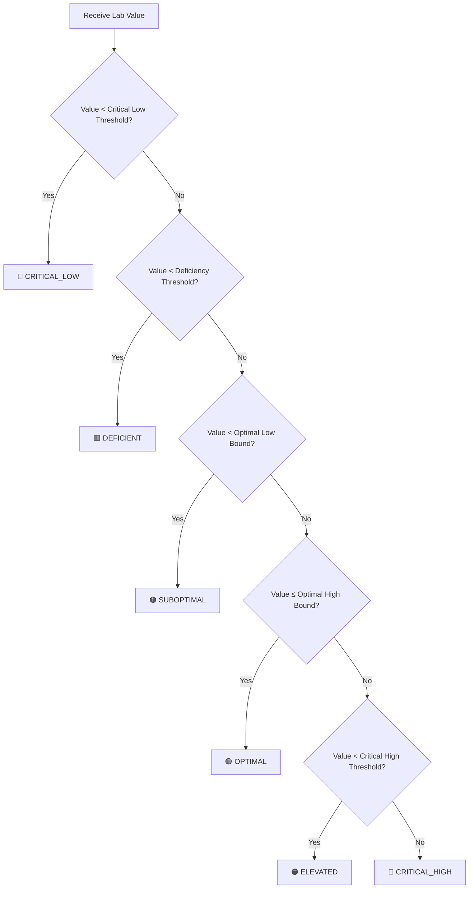
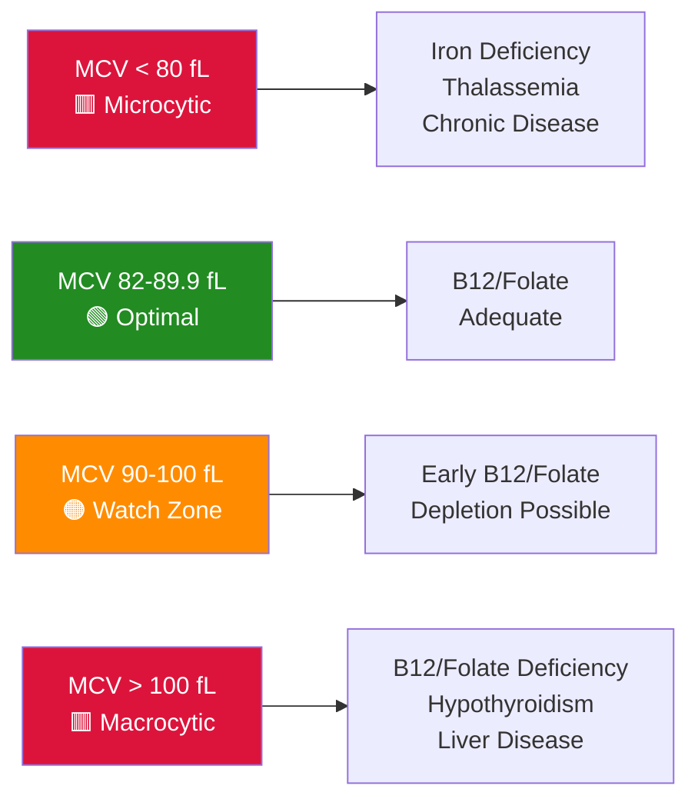
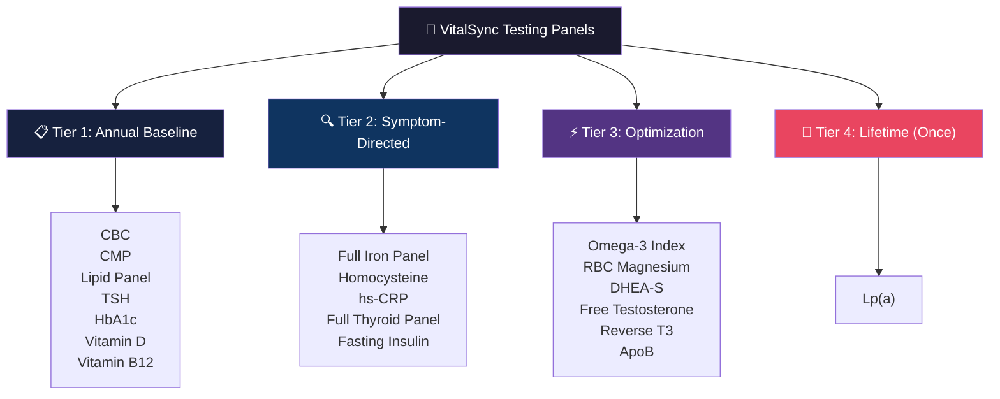

# Complete Blood Biomarker Reference Guide

> **VitalSync™ Clinical Reference Document**
> Version 2.0 · Updated June 2026

---

> [!IMPORTANT]
> **Clinical Disclaimer**: Laboratory reference ranges vary by institution, assay methodology, patient demographics, and clinical context. The ranges presented in this document represent consensus guidelines from major medical societies and peer-reviewed literature. They are intended to support — not replace — clinical judgment. All supplement recommendations generated by VitalSync require professional medical review before implementation. VitalSync does **not** diagnose, treat, or prescribe.

---

## Table of Contents

1. [VitalSync Zone Classification System](#1-vitalsync-zone-classification-system)
2. [Vitamins & Micronutrients](#2-vitamins--micronutrients)
3. [Minerals](#3-minerals)
4. [Metabolic & Inflammatory Markers](#4-metabolic--inflammatory-markers)
5. [Lipid Panel](#5-lipid-panel)
6. [Thyroid Panel](#6-thyroid-panel)
7. [Hormones](#7-hormones)
8. [CBC Highlights](#8-cbc-highlights)
9. [Specialized Markers](#9-specialized-markers)
10. [Recommended Testing Panels](#10-recommended-testing-panels)
11. [Biomarker Interaction Map](#11-biomarker-interaction-map)
12. [References & Clinical Guidelines](#12-references--clinical-guidelines)

---

## 1. VitalSync Zone Classification System

VitalSync classifies every biomarker result into one of **six clinical zones**. This system enables granular risk stratification and drives the recommendation engine's supplement logic.

### Zone Definitions

| Zone | Color | Hex Code | Clinical Meaning | System Action |
|------|-------|----------|-------------------|---------------|
| **CRITICAL_LOW** | Dark Red | `#8B0000` | Values dangerously below threshold; potential medical emergency | 🚨 Flag for immediate clinical review; no autonomous recommendation |
| **DEFICIENT** | Red | `#DC143C` | Clinically significant deficiency; symptoms likely present | Generate high-priority supplementation protocol with retest at 8–12 weeks |
| **SUBOPTIMAL** | Amber/Orange | `#FF8C00` | Below functional/optimal range; subclinical deficiency | Suggest targeted supplementation; retest at 12–16 weeks |
| **OPTIMAL** | Green | `#228B22` | Within functional medicine optimal range | Maintenance protocol; annual re-evaluation |
| **ELEVATED** | Orange | `#FF8C00` | Above optimal; risk of toxicity or clinical concern | Reduce/discontinue supplementation; investigate etiology |
| **CRITICAL_HIGH** | Dark Red | `#8B0000` | Dangerously elevated; potential toxicity or acute pathology | 🚨 Flag for immediate clinical review; discontinue related supplements |

### Zone Assignment Logic

> [!NOTE]
> Zone thresholds are biomarker-specific and may incorporate age, sex, pregnancy status, and comorbidity modifiers. See individual biomarker entries below for exact cutoffs.

---

## 2. Vitamins & Micronutrients

### 2.1 Vitamin D (25-Hydroxyvitamin D)

| Property | Details |
|----------|---------|
| **Full Name** | 25-Hydroxyvitamin D (25(OH)D) |
| **Also Known As** | Calcidiol, 25-OH Vitamin D |
| **Specimen** | Serum |
| **What It Measures** | The major circulating form of vitamin D; reflects total vitamin D status from sunlight exposure, diet, and supplementation. 25(OH)D is hydroxylated in the liver from cholecalciferol (D3) or ergocalciferol (D2) and serves as the substrate for renal conversion to the active hormone 1,25(OH)₂D (calcitriol). |
| **Why It Matters** | Vitamin D regulates calcium/phosphorus homeostasis, bone mineralization, immune modulation (innate and adaptive), neuromuscular function, and gene expression via the Vitamin D Receptor (VDR) present in >200 tissues. Deficiency is associated with osteoporosis, increased fracture risk, autoimmune disease, cardiovascular disease, mood disorders, and impaired immune function. |

#### Reference Ranges & Zone Mapping

| Zone | Range (ng/mL) | Range (nmol/L) | Clinical Interpretation |
|------|---------------|-----------------|------------------------|
| 🔴 **CRITICAL_LOW** | < 10 | < 25 | Severe deficiency; risk of osteomalacia (adults), rickets (children), hypocalcemia, proximal myopathy |
| 🟥 **DEFICIENT** | 10 – 19.9 | 25 – 49.9 | Clinically deficient; elevated PTH, impaired calcium absorption, bone loss accelerated |
| 🟠 **SUBOPTIMAL** | 20 – 29.9 | 50 – 74.9 | Insufficient by Endocrine Society criteria; subtle symptoms may be present |
| 🟢 **OPTIMAL** | 40 – 60 | 100 – 150 | Functional medicine optimal; associated with lowest all-cause mortality in observational studies |
| 🟠 **ELEVATED** | 60.1 – 100 | 150.1 – 250 | Above optimal; generally safe but no added benefit demonstrated |
| 🔴 **CRITICAL_HIGH** | > 100 | > 250 | Risk of hypercalcemia, nephrocalcinosis, soft-tissue calcification |

> [!NOTE]
> **Standard Lab Range** (most laboratories): 30–100 ng/mL. The **Endocrine Society** defines sufficiency as ≥30 ng/mL, but the 2024 guideline update recommends **empiric supplementation for at-risk groups** (ages 1–18, >75 years, pregnant individuals, those with prediabetes, and high-BMI adults) without mandatory baseline testing.

#### Deficiency Symptoms

- Fatigue, generalized weakness
- Bone pain, muscle aches, proximal myopathy
- Frequent infections, slow wound healing
- Depression, cognitive impairment
- Hair loss (especially in women)
- Impaired bone healing and stress fractures

#### Key Clinical Guidelines

| Guideline | Year | Key Recommendation |
|-----------|------|-------------------|
| Endocrine Society Clinical Practice Guideline | 2024 | Empiric vitamin D supplementation for at-risk groups (children, elderly >75, pregnant, prediabetes, high-BMI); target ≥30 ng/mL minimum |
| Institute of Medicine (IOM) | 2011 | RDA 600–800 IU/day; sufficiency defined as ≥20 ng/mL (population health perspective) |
| AACE/ACE | 2023 | Target 30–50 ng/mL for bone health; higher targets for high-risk populations |

---

### 2.2 Vitamin B12 (Cobalamin)

| Property | Details |
|----------|---------|
| **Full Name** | Cobalamin (Vitamin B12) |
| **Specimen** | Serum |
| **What It Measures** | Total serum B12, reflecting both active (holotranscobalamin, holoTC) and inactive (bound to haptocorrin) fractions. Functional assessment may require methylmalonic acid (MMA) and/or homocysteine. |
| **Why It Matters** | Essential coenzyme for methionine synthase (homocysteine → methionine, requiring folate) and methylmalonyl-CoA mutase. Critical for DNA synthesis, red blood cell maturation, myelin maintenance, and methylation pathways. Deficiency causes megaloblastic anemia and irreversible neurological damage if untreated. |

#### Reference Ranges & Zone Mapping

| Zone | Range (pg/mL) | Range (pmol/L) | Clinical Interpretation |
|------|---------------|-----------------|------------------------|
| 🔴 **CRITICAL_LOW** | < 150 | < 111 | Severe deficiency; high risk of megaloblastic anemia and neuropathy |
| 🟥 **DEFICIENT** | 150 – 299 | 111 – 220 | Borderline/low; functional deficiency likely (confirm with MMA ≥0.4 µmol/L) |
| 🟠 **SUBOPTIMAL** | 300 – 449 | 221 – 332 | Low-normal; subclinical deficiency possible especially with elevated homocysteine |
| 🟢 **OPTIMAL** | 450 – 800 | 332 – 590 | Functional optimal; adequate for methylation and neurological function |
| 🟠 **ELEVATED** | 801 – 1,100 | 591 – 812 | Above optimal; investigate if not supplementing (can indicate liver disease, myeloproliferative disorders) |
| 🔴 **CRITICAL_HIGH** | > 1,100 | > 812 | Unexplained elevation; evaluate for hepatic disease, CKD, or malignancy |

> [!WARNING]
> Serum B12 has limited sensitivity. Up to **50% of patients** with tissue-level B12 deficiency have serum levels in the "normal" range (200–400 pg/mL). Always correlate with **MMA** (elevated = functional B12 deficiency) and **homocysteine** (elevated = B12 and/or folate deficiency). Holotranscobalamin (holoTC) is the earliest marker of B12 depletion.

#### Deficiency Symptoms

- Megaloblastic/macrocytic anemia (↑MCV >100 fL)
- Peripheral neuropathy (numbness, tingling, paresthesias)
- Glossitis, mouth ulcers
- Cognitive decline, memory impairment, "brain fog"
- Depression, irritability
- Subacute combined degeneration of the spinal cord (advanced)
- Gait abnormalities, loss of proprioception

#### Key Clinical Notes

| Note | Detail |
|------|--------|
| High-Risk Groups | Vegans/vegetarians, elderly (↓intrinsic factor), metformin users, PPI/H2-blocker users, post-bariatric surgery, Crohn's/ileal disease |
| Functional Confirmation | MMA > 0.4 µmol/L = functional B12 deficiency regardless of serum B12 level |
| Folate Masking | High folate intake can mask B12 deficiency anemia (corrects MCV) while neurological damage progresses silently |

---

### 2.3 Folate (Serum)

| Property | Details |
|----------|---------|
| **Full Name** | Folate (Vitamin B9) — Serum Folate |
| **Also Known As** | Folic acid (synthetic form), 5-MTHF (active methylfolate) |
| **Specimen** | Serum (reflects recent intake); RBC folate reflects longer-term stores (2–4 months) |
| **What It Measures** | Circulating folate levels. Serum folate fluctuates with recent dietary intake; RBC folate (160–800 ng/mL) is a more stable indicator of tissue stores. |
| **Why It Matters** | Essential for one-carbon metabolism, DNA synthesis/repair, methylation reactions, amino acid metabolism, and red blood cell formation. Critical during pregnancy to prevent neural tube defects. Works synergistically with vitamin B12 in the methionine synthase reaction. |

#### Reference Ranges & Zone Mapping

| Zone | Range (ng/mL) | Range (nmol/L) | Clinical Interpretation |
|------|---------------|-----------------|------------------------|
| 🔴 **CRITICAL_LOW** | < 2 | < 4.5 | Severe deficiency; megaloblastic anemia, neural tube defect risk (pregnancy) |
| 🟥 **DEFICIENT** | 2 – 3.9 | 4.5 – 8.9 | Clinically deficient; elevated homocysteine, impaired DNA synthesis |
| 🟠 **SUBOPTIMAL** | 4 – 9.9 | 9 – 22.6 | Low-normal; may have subtle methylation impairment |
| 🟢 **OPTIMAL** | 10 – 25 | 22.7 – 56.7 | Functional optimal; supports robust methylation and DNA repair |
| 🟠 **ELEVATED** | 25.1 – 40 | 56.8 – 90.7 | Above optimal; usually from supplementation; generally benign |
| 🔴 **CRITICAL_HIGH** | > 40 | > 90.7 | Excessive; may mask B12 deficiency; evaluate supplementation regimen |

> [!CAUTION]
> **MTHFR Variants**: Individuals with MTHFR C677T or A1298C polymorphisms have reduced ability to convert folic acid to active 5-MTHF. VitalSync preferentially recommends **methylfolate (5-MTHF)** over folic acid when genetic data indicates MTHFR variants. High-dose unmetabolized folic acid (UMFA) in serum is an area of ongoing research regarding potential adverse effects.

#### Deficiency Symptoms

- Megaloblastic anemia (↑MCV)
- Elevated homocysteine (cardiovascular risk)
- Fatigue, weakness, pallor
- Irritability, cognitive difficulties
- Neural tube defects in pregnancy (spina bifida, anencephaly)
- Glossitis, diarrhea

---

### 2.4 Vitamin A (Retinol)

| Property | Details |
|----------|---------|
| **Full Name** | Retinol (Preformed Vitamin A) |
| **Specimen** | Serum (fasting preferred) |
| **What It Measures** | Circulating retinol bound to retinol-binding protein (RBP). Serum retinol is homeostatically maintained and only declines when liver stores are substantially depleted (<20 µg/g liver). |
| **Why It Matters** | Essential for vision (retinal → rhodopsin), immune function (mucosal barriers, T-cell differentiation), skin integrity, reproduction, and gene expression. Has a narrow therapeutic window — both deficiency and toxicity carry significant clinical risk. |

#### Reference Ranges & Zone Mapping

| Zone | Range (µg/dL) | Range (µmol/L) | Clinical Interpretation |
|------|---------------|-----------------|------------------------|
| 🔴 **CRITICAL_LOW** | < 10 | < 0.35 | Severe deficiency; xerophthalmia, night blindness, keratomalacia |
| 🟥 **DEFICIENT** | 10 – 19.9 | 0.35 – 0.69 | Marginal deficiency; impaired immune function, poor dark adaptation |
| 🟠 **SUBOPTIMAL** | 20 – 29.9 | 0.70 – 1.04 | Low-normal; liver stores may be depleted |
| 🟢 **OPTIMAL** | 30 – 65 | 1.05 – 2.27 | Adequate retinol status |
| 🟠 **ELEVATED** | 65.1 – 100 | 2.28 – 3.49 | Above optimal; evaluate intake; early toxicity risk in chronic elevation |
| 🔴 **CRITICAL_HIGH** | > 100 | > 3.49 | Hypervitaminosis A; risk of hepatotoxicity, teratogenicity, pseudotumor cerebri |

> [!WARNING]
> **Toxicity Risk**: Preformed vitamin A (retinol/retinyl esters) has a narrow therapeutic index. Chronic intake >10,000 IU/day in adults increases hepatotoxicity risk. **Pregnancy**: doses >10,000 IU/day are teratogenic. VitalSync caps retinol supplementation recommendations and preferentially suggests beta-carotene (provitamin A) for low-risk supplementation where appropriate.

#### Deficiency Symptoms

- Night blindness (earliest clinical sign)
- Xerophthalmia, Bitot's spots
- Dry skin, follicular hyperkeratosis
- Impaired immunity (increased respiratory/GI infections)
- Poor wound healing

---

### 2.5 Vitamin E (α-Tocopherol)

| Property | Details |
|----------|---------|
| **Full Name** | Alpha-Tocopherol (Vitamin E) |
| **Specimen** | Serum (fasting preferred; lipid-adjusted values preferred) |
| **What It Measures** | Circulating α-tocopherol, the most biologically active form of vitamin E. Since vitamin E is lipid-soluble and transported via lipoproteins, values should ideally be adjusted for total lipids (α-tocopherol/cholesterol+TG ratio). |
| **Why It Matters** | Primary lipid-soluble antioxidant protecting cell membranes from peroxidation. Modulates immune function, gene expression, and platelet aggregation. Deficiency (rare in isolation) causes progressive neurological damage including spinocerebellar ataxia and peripheral neuropathy. |

#### Reference Ranges & Zone Mapping

| Zone | Range (mg/L) | Range (µmol/L) | Clinical Interpretation |
|------|-------------|-----------------|------------------------|
| 🔴 **CRITICAL_LOW** | < 3.0 | < 7.0 | Severe deficiency; neuromuscular dysfunction, hemolytic anemia |
| 🟥 **DEFICIENT** | 3.0 – 4.9 | 7.0 – 11.5 | Clinically deficient; subtle neuropathy, impaired immune function |
| 🟠 **SUBOPTIMAL** | 5.0 – 5.4 | 11.6 – 12.5 | Borderline; optimize intake |
| 🟢 **OPTIMAL** | 5.5 – 17.0 | 12.6 – 39.5 | Adequate antioxidant protection |
| 🟠 **ELEVATED** | 17.1 – 30.0 | 39.6 – 69.7 | Above optimal; evaluate supplementation; generally well-tolerated |
| 🔴 **CRITICAL_HIGH** | > 30.0 | > 69.7 | Excessive; increased bleeding risk (inhibits vitamin K-dependent clotting), possible ↑ all-cause mortality at high chronic doses |

> [!NOTE]
> **Lipid Adjustment**: In hyperlipidemic patients, serum α-tocopherol may appear normal despite true tissue deficiency. Use the lipid-adjusted ratio: α-tocopherol (mg) / [total cholesterol (g) + triglycerides (g)]. A ratio < 0.8 mg/g suggests deficiency. High-dose supplementation (>400 IU/day) has shown inconsistent benefit and potential harm in meta-analyses; VitalSync limits recommendations to ≤200 IU/day unless clinically indicated.

#### Deficiency Symptoms

- Peripheral neuropathy, ataxia
- Skeletal myopathy
- Retinopathy
- Impaired immune response
- Hemolytic anemia (in premature infants)

---

### 2.6 Vitamin K (Functional Assessment)

| Property | Details |
|----------|---------|
| **Full Name** | Vitamin K Status — Functional Assessment |
| **Forms** | K1 (phylloquinone, dietary/plant-derived), K2 (menaquinones MK-4 through MK-13, bacterial/fermentation-derived) |
| **Specimen** | Serum phylloquinone (K1); functional markers: undercarboxylated osteocalcin (ucOC), des-gamma-carboxyprothrombin (PIVKA-II), undercarboxylated matrix Gla protein (ucMGP) |
| **What It Measures** | Direct serum K1 measures circulating phylloquinone but reflects recent dietary intake rather than tissue sufficiency. Functional markers (ucOC, PIVKA-II, ucMGP) assess whether vitamin K-dependent proteins are adequately carboxylated — a more clinically meaningful assessment. |
| **Why It Matters** | Essential cofactor for γ-carboxylation of clotting factors (II, VII, IX, X), osteocalcin (bone mineralization), and matrix Gla protein (vascular calcification inhibition). K2 (especially MK-7) plays a critical role in directing calcium to bones rather than arteries. |

#### Reference Ranges & Zone Mapping

**Serum Phylloquinone (K1):**

| Zone | Range (ng/mL) | Clinical Interpretation |
|------|---------------|------------------------|
| 🔴 **CRITICAL_LOW** | < 0.05 | Severe depletion; coagulopathy risk |
| 🟥 **DEFICIENT** | 0.05 – 0.14 | Depleted; elevated ucOC and PIVKA-II likely |
| 🟠 **SUBOPTIMAL** | 0.15 – 0.49 | Marginal status; subclinical under-carboxylation |
| 🟢 **OPTIMAL** | 0.50 – 2.50 | Adequate for coagulation and bone/vascular health |
| 🟠 **ELEVATED** | 2.51 – 5.00 | Above typical; usually dietary; not typically harmful |
| 🔴 **CRITICAL_HIGH** | > 5.00 | Investigate source; generally non-toxic but unusual |

> [!IMPORTANT]
> **No Direct Serum Test Routinely Available**: Vitamin K status is best assessed functionally. VitalSync uses indirect markers when available:
> - **ucOC (undercarboxylated osteocalcin)**: Elevated = vitamin K insufficiency for bone metabolism
> - **PIVKA-II (des-γ-carboxy prothrombin)**: Elevated = vitamin K insufficiency for coagulation
> - **PT/INR**: Prolonged only in severe deficiency
>
> **Drug Interaction**: Warfarin (vitamin K antagonist) — patients on warfarin require stable vitamin K intake. VitalSync flags warfarin use and does **not** recommend K supplementation in these patients.

#### Deficiency Symptoms

- Easy bruising, prolonged bleeding
- Osteoporosis, increased fracture risk (subclinical K deficiency)
- Arterial calcification (K2 deficiency)
- Poor wound healing
- Heavy menstrual bleeding

---

## 3. Minerals

### 3.1 Ferritin

| Property | Details |
|----------|---------|
| **Full Name** | Serum Ferritin |
| **Specimen** | Serum (fasting preferred) |
| **What It Measures** | Intracellular iron storage protein. Serum ferritin reflects total body iron stores under non-inflammatory conditions. 1 ng/mL serum ferritin ≈ 8–10 mg stored iron. |
| **Why It Matters** | The most sensitive and specific single test for iron deficiency (when inflammation is absent). Iron is essential for oxygen transport (hemoglobin), energy metabolism (cytochromes), DNA synthesis, and immune function. |

#### Reference Ranges & Zone Mapping

| Zone | Range (ng/mL) — Female | Range (ng/mL) — Male | Clinical Interpretation |
|------|------------------------|----------------------|------------------------|
| 🔴 **CRITICAL_LOW** | < 10 | < 10 | Iron stores depleted; iron-deficiency anemia likely |
| 🟥 **DEFICIENT** | 10 – 29 | 10 – 29 | Low iron stores; fatigue, hair loss, poor exercise tolerance |
| 🟠 **SUBOPTIMAL** | 30 – 49 | 30 – 49 | Borderline; functional iron deficiency possible (especially athletes) |
| 🟢 **OPTIMAL** | 50 – 150 | 50 – 200 | Adequate iron stores |
| 🟠 **ELEVATED** | 151 – 300 | 201 – 400 | Elevated; rule out inflammation, metabolic syndrome, liver disease |
| 🔴 **CRITICAL_HIGH** | > 300 | > 400 | Iron overload; evaluate for hemochromatosis (HFE gene), transfusion overload |

> [!WARNING]
> **Acute-Phase Reactant**: Ferritin is an acute-phase protein and rises with inflammation, infection, liver disease, metabolic syndrome, and malignancy — potentially masking true iron deficiency. When hs-CRP is elevated (>5 mg/L), a ferritin of <100 ng/mL may still indicate iron deficiency. VitalSync cross-references hs-CRP and adjusts ferritin interpretation accordingly. In inflammatory states, transferrin saturation (TSAT) < 20% is a more reliable indicator of iron deficiency.

#### Deficiency Symptoms

- Fatigue, exercise intolerance
- Hair loss, brittle nails
- Restless leg syndrome
- Pagophagia (ice craving)
- Pallor, tachycardia
- Cognitive impairment, poor concentration

---

### 3.2 Serum Iron

| Property | Details |
|----------|---------|
| **Full Name** | Serum Iron (Fe) |
| **Specimen** | Serum (fasting, morning draw preferred — diurnal variation up to 50%) |
| **What It Measures** | Circulating iron bound to transferrin. Highly variable throughout the day and with recent dietary intake. |
| **Why It Matters** | Part of the complete iron panel; interpreted alongside TIBC and transferrin saturation. Isolated serum iron has limited diagnostic value. |

#### Reference Ranges & Zone Mapping

| Zone | Range (µg/dL) | Range (µmol/L) | Clinical Interpretation |
|------|---------------|-----------------|------------------------|
| 🔴 **CRITICAL_LOW** | < 30 | < 5.4 | Very low; iron-deficiency anemia likely |
| 🟥 **DEFICIENT** | 30 – 49 | 5.4 – 8.8 | Low; evaluate with ferritin and TIBC |
| 🟠 **SUBOPTIMAL** | 50 – 59 | 8.9 – 10.6 | Borderline low |
| 🟢 **OPTIMAL** | 60 – 170 | 10.7 – 30.4 | Normal range |
| 🟠 **ELEVATED** | 171 – 200 | 30.5 – 35.8 | Elevated; correlate with TSAT% |
| 🔴 **CRITICAL_HIGH** | > 200 | > 35.8 | Iron overload; investigate hemochromatosis, acute hepatitis |

> [!NOTE]
> Serum iron alone is a **poor indicator** of iron status due to significant diurnal variation (highest in the morning, lowest in the evening), postprandial fluctuations, and acute-phase response. Always interpret in the context of the full iron panel (ferritin, TIBC, TSAT%).

---

### 3.3 Total Iron-Binding Capacity (TIBC)

| Property | Details |
|----------|---------|
| **Full Name** | Total Iron-Binding Capacity |
| **Specimen** | Serum |
| **What It Measures** | The total capacity of transferrin to bind iron. Inversely related to iron stores — the body upregulates transferrin production when iron is low. |
| **Why It Matters** | Elevated TIBC indicates iron deficiency (the body produces more transferrin to scavenge available iron). Low TIBC may indicate iron overload, chronic disease, or malnutrition. |

#### Reference Ranges & Zone Mapping

| Zone | Range (µg/dL) | Clinical Interpretation |
|------|---------------|------------------------|
| 🔴 **CRITICAL_LOW** | < 200 | Very low; chronic disease, malnutrition, iron overload |
| 🟥 **DEFICIENT** | 200 – 249 | Low; chronic inflammation or overload |
| 🟠 **SUBOPTIMAL** | 250 – 274 | Borderline |
| 🟢 **OPTIMAL** | 275 – 370 | Normal range |
| 🟠 **ELEVATED** | 371 – 450 | Elevated; likely iron deficiency, pregnancy, OCP use |
| 🔴 **CRITICAL_HIGH** | > 450 | Significantly elevated; severe iron deficiency |

---

### 3.4 Transferrin Saturation (TSAT%)

| Property | Details |
|----------|---------|
| **Full Name** | Transferrin Saturation Percentage |
| **Formula** | (Serum Iron / TIBC) × 100 |
| **What It Measures** | The percentage of transferrin binding sites occupied by iron. |
| **Why It Matters** | Most clinically useful derived iron metric. Low TSAT = iron deficiency; high TSAT = iron overload. More reliable than serum iron or ferritin alone in inflammatory states. |

#### Reference Ranges & Zone Mapping

| Zone | Range (%) | Clinical Interpretation |
|------|-----------|------------------------|
| 🔴 **CRITICAL_LOW** | < 10 | Severe iron deficiency; functional iron depletion |
| 🟥 **DEFICIENT** | 10 – 15 | Iron-deficient erythropoiesis |
| 🟠 **SUBOPTIMAL** | 16 – 19 | Borderline; early iron depletion |
| 🟢 **OPTIMAL** | 20 – 45 | Normal iron delivery to tissues |
| 🟠 **ELEVATED** | 46 – 55 | Elevated; investigate with ferritin |
| 🔴 **CRITICAL_HIGH** | > 55 | Iron overload; >45% warrants HFE testing per AASLD guidelines |

---

### 3.5 Magnesium (Serum)

| Property | Details |
|----------|---------|
| **Full Name** | Serum Magnesium (Total) |
| **Specimen** | Serum |
| **What It Measures** | Total circulating magnesium in serum — only ~1% of total body magnesium resides in blood; ~60% is in bone and ~39% is intracellular. |
| **Why It Matters** | Cofactor for >600 enzymatic reactions including ATP synthesis, DNA/RNA synthesis, muscle/nerve function, blood pressure regulation, and glucose metabolism. |

#### Reference Ranges & Zone Mapping

| Zone | Range (mg/dL) | Range (mmol/L) | Clinical Interpretation |
|------|---------------|-----------------|------------------------|
| 🔴 **CRITICAL_LOW** | < 1.0 | < 0.41 | Severe hypomagnesemia; arrhythmia risk, seizures |
| 🟥 **DEFICIENT** | 1.0 – 1.59 | 0.41 – 0.65 | Low; cardiac irritability, muscle cramps |
| 🟠 **SUBOPTIMAL** | 1.6 – 1.99 | 0.66 – 0.82 | Below functional optimal |
| 🟢 **OPTIMAL** | 2.0 – 2.3 | 0.82 – 0.95 | Functional optimal |
| 🟠 **ELEVATED** | 2.31 – 2.6 | 0.95 – 1.07 | Above normal; usually iatrogenic (Mg supplementation, renal insufficiency) |
| 🔴 **CRITICAL_HIGH** | > 2.6 | > 1.07 | Hypermagnesemia; loss of DTRs, respiratory depression, cardiac arrest |

> [!WARNING]
> **Poor Sensitivity**: Serum magnesium has **very poor sensitivity** for detecting total body magnesium depletion. Only **1% of total body magnesium** is extracellular, and the body tightly maintains serum levels by drawing from bone and intracellular stores. A patient can be severely magnesium-depleted while maintaining a normal serum level. RBC Magnesium is the preferred functional test. Serum magnesium typically only drops below normal when total body stores are depleted by **20–40%**.

---

### 3.6 Magnesium (RBC)

| Property | Details |
|----------|---------|
| **Full Name** | Red Blood Cell (Erythrocyte) Magnesium |
| **Specimen** | Whole blood (lysed RBCs) |
| **What It Measures** | Intracellular magnesium concentration within red blood cells, reflecting tissue-level magnesium status over the preceding ~120 days (RBC lifespan). |
| **Why It Matters** | **The gold standard** for assessing functional magnesium status. Correlates much better with total body magnesium stores than serum magnesium. Detects subclinical deficiency missed by serum testing. |

#### Reference Ranges & Zone Mapping

| Zone | Range (mg/dL) | Clinical Interpretation |
|------|---------------|------------------------|
| 🔴 **CRITICAL_LOW** | < 3.2 | Severe intracellular depletion; high risk of metabolic and cardiac complications |
| 🟥 **DEFICIENT** | 3.2 – 3.9 | Intracellular deficiency; symptoms likely present |
| 🟠 **SUBOPTIMAL** | 4.0 – 4.9 | Below functional optimal; consider supplementation |
| 🟢 **OPTIMAL** | 5.0 – 6.5 | Functional optimal; adequate intracellular stores |
| 🟠 **ELEVATED** | 6.6 – 7.0 | Above optimal; unusual without supplementation |
| 🔴 **CRITICAL_HIGH** | > 7.0 | Evaluate renal function and supplementation |

> [!TIP]
> **Preferred Test**: VitalSync recommends RBC Magnesium over serum magnesium for all optimization-focused panels. Common deficiency symptoms include muscle cramps, insomnia, anxiety, constipation, headaches/migraines, palpitations, and poor stress tolerance. An estimated **50–80% of the U.S. population** may be subclinically magnesium deficient due to soil depletion, processed food diets, and chronic stress.

---

### 3.7 Zinc (Serum)

| Property | Details |
|----------|---------|
| **Full Name** | Serum Zinc |
| **Specimen** | Serum (strict **fasting required**; morning draw; avoid hemolysis) |
| **What It Measures** | Circulating zinc bound primarily to albumin (~60%) and α2-macroglobulin (~30%). Reflects short-term zinc status. |
| **Why It Matters** | Cofactor for >300 enzymes and >2,000 transcription factors. Essential for immune function (T-cell maturation, NK cell activity), wound healing, taste/smell, DNA synthesis, testosterone production, and antioxidant defense (superoxide dismutase). |

#### Reference Ranges & Zone Mapping

| Zone | Range (µg/dL) | Range (µmol/L) | Clinical Interpretation |
|------|---------------|-----------------|------------------------|
| 🔴 **CRITICAL_LOW** | < 40 | < 6.1 | Severe deficiency; acrodermatitis, severe immune compromise |
| 🟥 **DEFICIENT** | 40 – 59 | 6.1 – 9.0 | Clinically deficient; impaired immunity, wound healing |
| 🟠 **SUBOPTIMAL** | 60 – 69 | 9.1 – 10.5 | Low-normal; subtle immune/taste/reproductive effects |
| 🟢 **OPTIMAL** | 70 – 120 | 10.7 – 18.4 | Adequate zinc status |
| 🟠 **ELEVATED** | 121 – 150 | 18.5 – 22.9 | Elevated; evaluate supplementation, potential copper depletion |
| 🔴 **CRITICAL_HIGH** | > 150 | > 22.9 | Toxicity risk; copper deficiency, GI distress, immune suppression (paradoxical) |

> [!IMPORTANT]
> **Pre-Analytical Requirements**: Zinc results are significantly affected by:
> - **Fasting status**: Postprandial zinc drops 10–20%
> - **Time of day**: Zinc peaks in the morning (diurnal variation)
> - **Hemolysis**: RBCs contain ~10x more zinc than serum; even mild hemolysis falsely elevates results
> - **Inflammation**: Zinc is a negative acute-phase reactant — acute illness/inflammation **lowers** serum zinc by up to 50% (hepatic redistribution)
>
> VitalSync cross-references hs-CRP and flags results obtained during inflammation.

> [!CAUTION]
> **Zinc-Copper Antagonism**: Chronic zinc supplementation >40 mg/day without copper can induce copper deficiency, leading to sideroblastic anemia, neutropenia, and myeloneuropathy. VitalSync co-recommends copper (1–2 mg/day) when zinc supplementation exceeds 25 mg/day.

---

### 3.8 Calcium (Serum)

| Property | Details |
|----------|---------|
| **Full Name** | Serum Calcium (Total) |
| **Specimen** | Serum (fasting; avoid tourniquet artifact) |
| **What It Measures** | Total circulating calcium: ~45% protein-bound (mostly albumin), ~45% ionized (free, biologically active), ~10% complexed with anions. |
| **Why It Matters** | Tightly regulated by PTH-Vitamin D-Calcitonin axis. Essential for bone structure, neuromuscular function, cardiac conduction, coagulation, and intracellular signaling. Abnormal calcium usually reflects parathyroid, vitamin D, or renal pathology rather than dietary deficiency. |

#### Reference Ranges & Zone Mapping

| Zone | Range (mg/dL) | Range (mmol/L) | Clinical Interpretation |
|------|---------------|-----------------|------------------------|
| 🔴 **CRITICAL_LOW** | < 7.0 | < 1.75 | Severe hypocalcemia; tetany, seizures, QT prolongation |
| 🟥 **DEFICIENT** | 7.0 – 8.4 | 1.75 – 2.10 | Low; evaluate PTH, vitamin D, magnesium, albumin |
| 🟠 **SUBOPTIMAL** | 8.5 – 8.9 | 2.11 – 2.22 | Low-normal |
| 🟢 **OPTIMAL** | 9.0 – 10.2 | 2.23 – 2.55 | Normal; homeostatic regulation intact |
| 🟠 **ELEVATED** | 10.3 – 10.9 | 2.56 – 2.72 | Borderline high; check PTH (primary hyperparathyroidism) |
| 🔴 **CRITICAL_HIGH** | > 11.0 | > 2.75 | Hypercalcemia; confusion, polyuria, cardiac arrhythmia |

> [!NOTE]
> **Serum calcium is tightly homeostatic** — it reflects hormonal regulation (PTH/vitamin D axis) rather than dietary calcium status. A normal serum calcium does **not** exclude osteoporosis or low bone density. **Ionized calcium** (iCa, normal 4.6–5.3 mg/dL) is the biologically active fraction and is more informative, especially in critically ill patients, hypoalbuminemia, or acid-base disturbances. **Albumin correction**: Corrected Ca = Measured Ca + 0.8 × (4.0 − albumin g/dL).

---

## 4. Metabolic & Inflammatory Markers

### 4.1 HbA1c (Glycated Hemoglobin)

| Property | Details |
|----------|---------|
| **Full Name** | Hemoglobin A1c (HbA1c, Glycosylated Hemoglobin) |
| **Specimen** | Whole blood (EDTA) |
| **What It Measures** | Percentage of hemoglobin glycated by glucose. Reflects average blood glucose over the preceding 2–3 months (proportional to RBC lifespan). |
| **Why It Matters** | Gold-standard for long-term glycemic control assessment and diabetes diagnosis/monitoring. Correlates with risk of microvascular complications (retinopathy, nephropathy, neuropathy). |

#### Reference Ranges & Zone Mapping

| Zone | Range (%) | eAG (mg/dL) | Clinical Interpretation |
|------|-----------|-------------|------------------------|
| 🔴 **CRITICAL_LOW** | < 4.0 | < 68 | Unusually low; evaluate for hemolytic anemia, blood loss, hemoglobinopathy |
| 🟥 **DEFICIENT** | N/A | N/A | *(Not applicable — no "deficiency" for HbA1c)* |
| 🟢 **OPTIMAL** | 4.0 – 5.3 | 68 – 105 | Excellent glycemic control; no insulin resistance |
| 🟠 **SUBOPTIMAL** | 5.4 – 5.6 | 106 – 117 | Increased insulin resistance risk; lifestyle intervention recommended |
| 🟠 **ELEVATED** — Prediabetes | 5.7 – 6.4 | 117 – 137 | **Prediabetes** (ADA criteria); annual monitoring, aggressive lifestyle modification |
| 🔴 **CRITICAL_HIGH** — Diabetes | ≥ 6.5 | ≥ 140 | **Diabetes mellitus** (ADA diagnostic threshold); requires medical management |

> [!IMPORTANT]
> **Prediabetes Range (ADA 2025)**:
> - HbA1c **5.7–6.4%** = Prediabetes
> - Fasting glucose **100–125 mg/dL** = Impaired Fasting Glucose (IFG)
> - 2-hr OGTT glucose **140–199 mg/dL** = Impaired Glucose Tolerance (IGT)
>
> **Interfering Conditions**: HbA1c may be falsely low in hemolytic anemias, recent blood loss/transfusion, pregnancy, and hemoglobin variants (HbS, HbC, HbE). May be falsely elevated in iron-deficiency anemia and chronic kidney disease. In these cases, fructosamine or continuous glucose monitoring (CGM) provides better assessment.

---

### 4.2 Fasting Glucose

| Property | Details |
|----------|---------|
| **Full Name** | Fasting Plasma Glucose (FPG) |
| **Specimen** | Plasma (8–12 hour fast required) |
| **What It Measures** | Blood glucose concentration after overnight fasting; reflects hepatic glucose output and basal insulin secretion. |
| **Why It Matters** | Fundamental metabolic parameter. Used alongside HbA1c and fasting insulin for diabetes diagnosis, insulin resistance assessment, and metabolic health evaluation. |

#### Reference Ranges & Zone Mapping

| Zone | Range (mg/dL) | Range (mmol/L) | Clinical Interpretation |
|------|---------------|-----------------|------------------------|
| 🔴 **CRITICAL_LOW** | < 55 | < 3.1 | Hypoglycemia; cognitive impairment, seizures, loss of consciousness |
| 🟠 **SUBOPTIMAL (Low)** | 55 – 69 | 3.1 – 3.8 | Reactive hypoglycemia; evaluate adrenal/insulin dynamics |
| 🟢 **OPTIMAL** | 70 – 85 | 3.9 – 4.7 | Functional optimal; excellent metabolic flexibility |
| 🟠 **SUBOPTIMAL (High)** | 86 – 99 | 4.8 – 5.5 | Upper normal; emerging insulin resistance may be present |
| 🟠 **ELEVATED** — IFG | 100 – 125 | 5.6 – 6.9 | **Impaired Fasting Glucose (Prediabetes)**; ADA criteria |
| 🔴 **CRITICAL_HIGH** | ≥ 126 | ≥ 7.0 | **Diabetes mellitus** (confirmed on 2 occasions) |

---

### 4.3 Fasting Insulin

| Property | Details |
|----------|---------|
| **Full Name** | Fasting Serum Insulin |
| **Specimen** | Serum (8–12 hour fast required) |
| **What It Measures** | Baseline insulin secretion by pancreatic β-cells in the fasted state. |
| **Why It Matters** | **Critical early marker of insulin resistance** — fasting insulin rises years before fasting glucose or HbA1c become abnormal. The pancreas compensates for insulin resistance by producing more insulin, maintaining normoglycemia until β-cell exhaustion occurs. This makes fasting insulin the earliest detectable metabolic warning signal. |

#### Reference Ranges & Zone Mapping

| Zone | Range (µIU/mL) | Range (pmol/L) | Clinical Interpretation |
|------|----------------|-----------------|------------------------|
| 🔴 **CRITICAL_LOW** | < 1.0 | < 6.9 | Extremely low; evaluate for Type 1 DM, late-stage β-cell failure |
| 🟢 **OPTIMAL** | 2.0 – 5.0 | 13.9 – 34.7 | Excellent insulin sensitivity |
| 🟠 **SUBOPTIMAL** | 5.1 – 8.0 | 34.8 – 55.6 | Early insulin resistance; lifestyle intervention critical |
| 🟠 **ELEVATED** | 8.1 – 15.0 | 55.7 – 104.2 | Significant insulin resistance; metabolic syndrome likely |
| 🔴 **CRITICAL_HIGH** | > 15.0 | > 104.2 | Severe hyperinsulinemia; high risk for T2DM, NAFLD, PCOS |

> [!TIP]
> **HOMA-IR Calculation**: Homeostatic Model Assessment for Insulin Resistance
>
> `HOMA-IR = (Fasting Glucose [mg/dL] × Fasting Insulin [µIU/mL]) / 405`
>
> | HOMA-IR | Interpretation |
> |---------|---------------|
> | < 1.0 | Optimal insulin sensitivity |
> | 1.0 – 1.9 | Normal |
> | 2.0 – 2.9 | Early insulin resistance |
> | ≥ 3.0 | Significant insulin resistance |
>
> VitalSync auto-calculates HOMA-IR when both fasting glucose and fasting insulin are available.

---

### 4.4 hs-CRP (High-Sensitivity C-Reactive Protein)

| Property | Details |
|----------|---------|
| **Full Name** | High-Sensitivity C-Reactive Protein |
| **Specimen** | Serum |
| **What It Measures** | Hepatically synthesized pentraxin elevated in response to IL-6. hs-CRP (high-sensitivity assay) detects low-grade chronic inflammation relevant to cardiovascular risk, unlike standard CRP used for acute infection/inflammation. |
| **Why It Matters** | Independent predictor of cardiovascular events. Chronic low-grade inflammation drives atherosclerosis, insulin resistance, and neurodegenerative disease. Also critical for interpreting other biomarkers (ferritin, zinc, albumin) affected by inflammatory status. |

#### Reference Ranges & Zone Mapping (AHA Cardiovascular Risk Categories)

| Zone | Range (mg/L) | AHA Risk Category | Clinical Interpretation |
|------|-------------|-------------------|------------------------|
| 🟢 **OPTIMAL** | < 1.0 | Low Risk | Minimal cardiovascular inflammation |
| 🟠 **SUBOPTIMAL** | 1.0 – 2.99 | Average/Moderate Risk | Moderate inflammatory burden; lifestyle optimization recommended |
| 🟠 **ELEVATED** | 3.0 – 9.99 | High Risk | Significant chronic inflammation; aggressive risk factor modification |
| 🔴 **CRITICAL_HIGH** | ≥ 10.0 | Acute Inflammation | Likely acute infection/injury; **not valid** for CV risk stratification; retest in 2–3 weeks |

> [!NOTE]
> **AHA/CDC Joint Scientific Statement**: hs-CRP < 1.0 mg/L = Low risk; 1.0–3.0 mg/L = Average risk; > 3.0 mg/L = High risk for cardiovascular events. Values >10 mg/L suggest acute inflammation and should prompt investigation for infection, autoimmune flare, or tissue injury — the result should **not** be used for cardiovascular risk assessment in that context. VitalSync invalidates hs-CRP for CV risk when values are >10 mg/L and flags for retest.
>
> The **JUPITER trial** (2008) demonstrated that statin therapy reduced cardiovascular events in patients with elevated hs-CRP (>2.0 mg/L) even with normal LDL-C, establishing hs-CRP as an independent risk predictor.

---

### 4.5 Homocysteine

| Property | Details |
|----------|---------|
| **Full Name** | Total Plasma Homocysteine |
| **Specimen** | Plasma (fasting; process promptly — levels rise with storage) |
| **What It Measures** | Sulfur-containing amino acid produced during methionine metabolism. Clearance depends on B12 (methionine synthase pathway), folate (methyl donor), B6 (transsulfuration to cysteine), and betaine. |
| **Why It Matters** | **Key methylation marker**. Elevated homocysteine is an independent risk factor for cardiovascular disease, stroke, venous thromboembolism, cognitive decline/dementia, neural tube defects, and osteoporotic fractures. Directly toxic to endothelium and promotes oxidative stress. |

#### Reference Ranges & Zone Mapping

| Zone | Range (µmol/L) | Clinical Interpretation |
|------|-----------------|------------------------|
| 🔴 **CRITICAL_LOW** | < 4.0 | Uncommon; usually insignificant |
| 🟢 **OPTIMAL** | 4.0 – 7.0 | Excellent methylation efficiency |
| 🟠 **SUBOPTIMAL** | 7.1 – 10.0 | Mildly elevated; evaluate B12, folate, B6 intake |
| 🟠 **ELEVATED** | 10.1 – 15.0 | Moderate hyperhomocysteinemia; cardiovascular risk increased |
| 🔴 **CRITICAL_HIGH** | > 15.0 | Severe; strong CVD/stroke risk; evaluate for MTHFR mutations, CBS deficiency, renal impairment |

> [!TIP]
> **Methylation Support Protocol**: VitalSync's algorithm addresses elevated homocysteine through synergistic supplementation:
> - **Methylfolate (5-MTHF)**: Provides the methyl group for B12-dependent remethylation
> - **Methylcobalamin (B12)**: Cofactor for methionine synthase
> - **Pyridoxal-5-Phosphate (P5P/B6)**: Supports the transsulfuration pathway
> - **Betaine (TMG)**: Alternative remethylation pathway via BHMT
>
> Elevated homocysteine should always prompt measurement of B12, folate, and renal function.

---

### 4.6 ESR (Erythrocyte Sedimentation Rate)

| Property | Details |
|----------|---------|
| **Full Name** | Erythrocyte Sedimentation Rate |
| **Specimen** | Whole blood (EDTA or citrate) |
| **What It Measures** | Rate at which RBCs settle in a column of anticoagulated blood over 1 hour (mm/hr). Reflects the presence of acute-phase proteins (fibrinogen, immunoglobulins) that promote rouleaux formation. |
| **Why It Matters** | Non-specific marker of systemic inflammation. Useful for monitoring inflammatory/autoimmune conditions (RA, PMR, temporal arteritis, SLE). Slower to rise and resolve than CRP. |

#### Reference Ranges & Zone Mapping

| Zone | Range (mm/hr) — Female | Range (mm/hr) — Male | Clinical Interpretation |
|------|------------------------|----------------------|------------------------|
| 🟢 **OPTIMAL** | 0 – 15 | 0 – 10 | No significant inflammation |
| 🟠 **SUBOPTIMAL** | 16 – 20 | 11 – 15 | Mildly elevated; borderline |
| 🟠 **ELEVATED** | 21 – 40 | 16 – 30 | Moderate inflammation; investigate source |
| 🔴 **CRITICAL_HIGH** | > 40 | > 30 | Significant inflammation; rule out infection, autoimmune disease, malignancy |

> [!NOTE]
> **Age/Sex Adjustment**: Upper limit of normal approximation: **Males** = Age / 2; **Females** = (Age + 10) / 2. ESR naturally increases with age. Conditions causing very high ESR (>100 mm/hr) include multiple myeloma, temporal arteritis, polymyalgia rheumatica, lymphoma, metastatic cancer, and severe infection.

---

## 5. Lipid Panel

### 5.1 Total Cholesterol

| Property | Details |
|----------|---------|
| **Full Name** | Total Cholesterol |
| **Specimen** | Serum (fasting preferred for accuracy of calculated LDL) |
| **What It Measures** | Sum of LDL-C + HDL-C + VLDL-C (+ IDL, Lp(a)-C). Reflects overall cholesterol burden. |
| **Why It Matters** | Traditional screening metric, though less informative than individual fractions. Component of Friedewald calculation for LDL-C and various cardiovascular risk scores (Framingham, ASCVD). |

#### Reference Ranges & Zone Mapping

| Zone | Range (mg/dL) | Range (mmol/L) | Clinical Interpretation |
|------|---------------|-----------------|------------------------|
| 🔴 **CRITICAL_LOW** | < 120 | < 3.1 | Very low; evaluate nutrition, malabsorption, hepatic function, hyperthyroidism |
| 🟢 **OPTIMAL** | 120 – 199 | 3.1 – 5.1 | Desirable |
| 🟠 **SUBOPTIMAL** | 200 – 239 | 5.2 – 6.2 | Borderline high; evaluate lipoprotein subfractions |
| 🔴 **CRITICAL_HIGH** | ≥ 240 | ≥ 6.2 | High; dyslipidemia workup, assess ASCVD risk |

---

### 5.2 LDL-C (Low-Density Lipoprotein Cholesterol)

| Property | Details |
|----------|---------|
| **Full Name** | Low-Density Lipoprotein Cholesterol |
| **Specimen** | Serum (fasting or non-fasting; direct measurement or Friedewald calculation) |
| **What It Measures** | Cholesterol carried by LDL particles — the primary atherogenic lipoprotein. Friedewald formula: LDL-C = TC − HDL-C − (TG/5); inaccurate when TG > 400 mg/dL. Direct LDL-C measurement available. |
| **Why It Matters** | Primary target of lipid-lowering therapy for ASCVD risk reduction. LDL particles penetrate the arterial intima, undergo oxidation, and drive atherosclerotic plaque formation. |

#### Reference Ranges & Zone Mapping (2026 AHA/ACC Risk-Stratified Goals)

| Risk Category | LDL-C Goal (mg/dL) | Zone Assignment |
|---------------|--------------------|-|
| **Very High Risk** (established ASCVD + high-risk features) | < 55 | 🟢 OPTIMAL |
| **High Risk** (established ASCVD or DM + risk factors) | < 70 | 🟢 OPTIMAL |
| **Moderate Risk** (≥2 risk factors, 10-yr ASCVD 7.5–20%) | < 100 | 🟢 OPTIMAL |
| **Low Risk** (0–1 risk factors, 10-yr ASCVD <7.5%) | < 130 | 🟢 OPTIMAL |
| **Primary Prevention (General Population)** | < 100 | 🟢 OPTIMAL |

#### General Population Zones (No Established ASCVD)

| Zone | Range (mg/dL) | Clinical Interpretation |
|------|---------------|------------------------|
| 🟢 **OPTIMAL** | < 100 | Optimal for primary prevention |
| 🟠 **SUBOPTIMAL** | 100 – 129 | Near/above optimal; lifestyle optimization |
| 🟠 **ELEVATED** | 130 – 159 | Borderline high |
| 🔴 **CRITICAL_HIGH** | ≥ 160 | High; evaluate for familial hypercholesterolemia if ≥190 in adults |

> [!IMPORTANT]
> **2026 AHA/ACC Guidelines Update**: The latest guidelines emphasize:
> 1. **Lifetime risk assessment** rather than 10-year risk alone
> 2. **ApoB and Lp(a)** as risk enhancers that may warrant earlier/more aggressive therapy
> 3. **Coronary artery calcium (CAC) scoring** for intermediate-risk patients
> 4. **LDL-C < 55 mg/dL** for very high-risk secondary prevention (established ASCVD with recurrent events or multivessel disease)
> 5. Consideration of bempedoic acid, inclisiran, and PCSK9 inhibitors when statins are insufficient or not tolerated

---

### 5.3 HDL-C (High-Density Lipoprotein Cholesterol)

| Property | Details |
|----------|---------|
| **Full Name** | High-Density Lipoprotein Cholesterol |
| **Specimen** | Serum |
| **What It Measures** | Cholesterol content of HDL particles, which mediate reverse cholesterol transport (removal of cholesterol from arterial walls to the liver for excretion). |
| **Why It Matters** | Inversely associated with cardiovascular risk. HDL has anti-inflammatory, antioxidant, and endothelial-protective properties. However, pharmacologically raising HDL has not consistently reduced cardiovascular events — HDL *function* may matter more than absolute levels. |

#### Reference Ranges & Zone Mapping

| Zone | Range (mg/dL) — Male | Range (mg/dL) — Female | Clinical Interpretation |
|------|----------------------|------------------------|------------------------|
| 🔴 **CRITICAL_LOW** | < 30 | < 30 | Very low; significant CV risk |
| 🟥 **DEFICIENT** | 30 – 39 | 30 – 49 | Low; independent CV risk factor |
| 🟠 **SUBOPTIMAL** | 40 – 49 | 50 – 59 | Below optimal |
| 🟢 **OPTIMAL** | 50 – 90 | 60 – 90 | Cardioprotective range |
| 🟠 **ELEVATED** | > 90 | > 90 | Very high; usually beneficial, but extremely high HDL (>90–100) may indicate HDL dysfunction or CETP deficiency |

---

### 5.4 Triglycerides

| Property | Details |
|----------|---------|
| **Full Name** | Serum Triglycerides (TG) |
| **Specimen** | Serum (12-hour fast required for accurate measurement) |
| **What It Measures** | Circulating triglyceride-rich lipoproteins (chylomicrons, VLDL). TG is the primary storage form of fatty acids. |
| **Why It Matters** | Marker of metabolic health and insulin resistance. Elevated TG correlates with increased remnant lipoproteins (atherogenic), NAFLD, and pancreatitis risk (when >500 mg/dL). The TG/HDL ratio is a strong surrogate for insulin resistance and small, dense LDL particles. |

#### Reference Ranges & Zone Mapping

| Zone | Range (mg/dL) | Range (mmol/L) | Clinical Interpretation |
|------|---------------|-----------------|------------------------|
| 🟢 **OPTIMAL** | < 100 | < 1.1 | Ideal; excellent metabolic health |
| 🟠 **SUBOPTIMAL** | 100 – 149 | 1.1 – 1.7 | Normal; room for optimization |
| 🟠 **ELEVATED** | 150 – 499 | 1.7 – 5.6 | Hypertriglyceridemia; address insulin resistance, refined carbs, alcohol |
| 🔴 **CRITICAL_HIGH** | ≥ 500 | ≥ 5.6 | **Pancreatitis risk**; urgent lifestyle/pharmacological intervention |

> [!TIP]
> **TG/HDL Ratio** (surrogate for insulin resistance):
> | TG/HDL Ratio | Interpretation |
> |-------------|----------------|
> | < 1.0 | Ideal; large buoyant LDL particles |
> | 1.0 – 2.0 | Good |
> | 2.0 – 3.0 | Borderline; small dense LDL increasing |
> | > 3.0 | High insulin resistance; atherogenic dyslipidemia |
>
> VitalSync auto-calculates TG/HDL ratio and uses it as an insulin resistance risk enhancer.

---

### 5.5 ApoB (Apolipoprotein B)

| Property | Details |
|----------|---------|
| **Full Name** | Apolipoprotein B (ApoB-100) |
| **Specimen** | Serum (fasting or non-fasting) |
| **What It Measures** | Each atherogenic lipoprotein particle (LDL, VLDL, IDL, Lp(a)) contains exactly one ApoB molecule. Therefore, ApoB directly quantifies the total number of atherogenic particles in circulation. |
| **Why It Matters** | **Increasingly favored over LDL-C** as the primary atherogenic risk metric. It is the number of atherogenic particles — not the cholesterol they carry — that drives atherosclerosis. ApoB captures risk from all atherogenic particles (including TG-rich remnants and Lp(a)) that LDL-C misses. Concordant in most patients but provides superior risk prediction in those with discordant LDL-C (metabolic syndrome, diabetes, hypertriglyceridemia). |

#### Reference Ranges & Zone Mapping

| Zone | Range (mg/dL) | Clinical Interpretation |
|------|---------------|------------------------|
| 🟢 **OPTIMAL** | < 80 | Low atherogenic particle count; low CV risk |
| 🟠 **SUBOPTIMAL** | 80 – 99 | Borderline; may warrant intervention if risk enhancers present |
| 🟠 **ELEVATED** | 100 – 130 | Elevated atherogenic burden; equivalent to LDL-C ≈130–160 |
| 🔴 **CRITICAL_HIGH** | > 130 | High; aggressive risk factor modification; evaluate for familial hypercholesterolemia |

#### Risk-Stratified Targets (2026 Guidelines)

| Risk Category | ApoB Goal (mg/dL) |
|---------------|-------------------|
| Very High Risk (established ASCVD) | < 65 |
| High Risk | < 80 |
| Moderate Risk | < 90 |
| Low Risk | < 100 |

> [!IMPORTANT]
> **ApoB vs. LDL-C**: The 2026 AHA/ACC guidelines and the European Atherosclerosis Society (EAS) increasingly recommend ApoB measurement, especially in patients with:
> - Metabolic syndrome / Type 2 diabetes
> - Hypertriglyceridemia (TG 150–500 mg/dL)
> - Discordant LDL-C / non-HDL-C results
> - On statin therapy with residual risk
>
> ApoB measurement is non-fasting, standardized across labs, and not affected by triglyceride levels — advantages over calculated LDL-C.

---

### 5.6 Lp(a) — Lipoprotein(a)

| Property | Details |
|----------|---------|
| **Full Name** | Lipoprotein(a) |
| **Specimen** | Serum (fasting or non-fasting) |
| **What It Measures** | A genetically determined lipoprotein consisting of an LDL-like particle covalently bound to apolipoprotein(a). Levels are >90% genetically determined (LPA gene, chromosome 6q25-26) and remain relatively stable throughout life. |
| **Why It Matters** | Independent, causal risk factor for atherosclerotic cardiovascular disease, aortic valve stenosis, and heart failure. Acts through three mechanisms: atherogenesis (LDL-like particle), thrombogenesis (structural homology to plasminogen, inhibits fibrinolysis), and pro-inflammatory effects. |

#### Reference Ranges & Zone Mapping

| Zone | Range (mg/dL) | Range (nmol/L) | Clinical Interpretation |
|------|---------------|-----------------|------------------------|
| 🟢 **OPTIMAL** | < 30 | < 75 | Low risk |
| 🟠 **SUBOPTIMAL** | 30 – 49 | 75 – 124 | Borderline; risk-enhancing factor per 2026 guidelines |
| 🟠 **ELEVATED** | 50 – 99 | 125 – 249 | Elevated; significantly increased ASCVD risk |
| 🔴 **CRITICAL_HIGH** | ≥ 100 | ≥ 250 | Very high; aggressive management of all other modifiable risk factors |

> [!IMPORTANT]
> **2026 Guideline Recommendation — Test at Least Once Per Lifetime**:
> The 2026 AHA/ACC, EAS, and Canadian CCS guidelines unanimously recommend that **every adult should have Lp(a) measured at least once in their lifetime** as part of comprehensive cardiovascular risk assessment. Key points:
> - Lp(a) is >90% genetically determined; diet and most medications have minimal effect
> - Elevated Lp(a) (≥50 mg/dL / ≥125 nmol/L) affects ~20% of the global population
> - **No approved Lp(a)-lowering therapy** as of mid-2026, though olpasiran, lepodisiran, and muvalaplin are in Phase 3 trials
> - Current management: Aggressive control of all other modifiable risk factors (LDL-C, blood pressure, diabetes, smoking)
> - PCSK9 inhibitors lower Lp(a) by ~20–30% (secondary benefit)
> - Niacin lowers Lp(a) by ~20–40% but evidence for clinical event reduction is limited
>
> **Reporting Caveat**: Lp(a) is reported in mg/dL or nmol/L — these are **not interconvertible** by a fixed factor due to variable apo(a) isoform size. nmol/L is the preferred and more standardized unit. VitalSync accepts both units and normalizes accordingly.

---

## 6. Thyroid Panel

### 6.1 TSH (Thyroid-Stimulating Hormone)

| Property | Details |
|----------|---------|
| **Full Name** | Thyroid-Stimulating Hormone (Thyrotropin) |
| **Specimen** | Serum (morning draw preferred; diurnal variation with peak at night) |
| **What It Measures** | Anterior pituitary hormone that stimulates thyroid hormone production. Inversely related to circulating T3/T4 via negative feedback. The most sensitive single screening test for primary thyroid dysfunction. |
| **Why It Matters** | TSH is the gatekeeper of thyroid assessment. Elevated TSH = hypothyroidism (primary); Suppressed TSH = hyperthyroidism. Subtle thyroid dysfunction profoundly affects metabolism, energy, mood, cognition, cardiovascular function, and reproductive health. |

#### Reference Ranges & Zone Mapping

| Zone | Standard Lab Range (mIU/L) | Functional/Optimal Range (mIU/L) | Clinical Interpretation |
|------|----------------------------|----------------------------------|------------------------|
| 🔴 **CRITICAL_LOW** | < 0.10 | < 0.10 | Suppressed; overt or subclinical hyperthyroidism; thyroiditis, Graves' disease |
| 🟥 **DEFICIENT (Low)** | 0.10 – 0.39 | 0.10 – 0.99 | Low; subclinical hyperthyroidism or central hypothyroidism |
| 🟠 **SUBOPTIMAL (Low)** | 0.40 – 0.99 | 1.0 – 1.49 | Low-normal; correlate with Free T3/T4 |
| 🟢 **OPTIMAL** | 1.0 – 2.5 (functional) | **1.5 – 2.5** | Functional optimal per integrative endocrinology |
| 🟠 **SUBOPTIMAL (High)** | 2.51 – 4.49 | 2.51 – 3.99 | Upper normal; early subclinical hypothyroidism may be present (especially if symptoms + elevated TPOAb) |
| 🟠 **ELEVATED** | 4.5 – 10.0 | 4.0 – 10.0 | **Subclinical hypothyroidism**; consider treatment if symptomatic or TPOAb positive |
| 🔴 **CRITICAL_HIGH** | > 10.0 | > 10.0 | **Overt hypothyroidism**; thyroid hormone replacement required |

> [!NOTE]
> **Standard vs. Functional Range Controversy**:
> - Standard lab range: ~0.40–4.50 mIU/L (varies by lab, assay, population)
> - Functional medicine optimal: **1.5–2.5 mIU/L** (associated with lowest symptom burden in observational data)
> - NHANES III data suggests the population-derived 97.5th percentile is ~4.12 mIU/L when thyroid-antibody-positive individuals are excluded
> - The 2025 ATA guidelines maintain 0.45–4.50 mIU/L as the standard reference range but acknowledge that the upper limit may need lowering
> - **Age adjustment**: TSH naturally increases with age; an upper limit of ~7.5 mIU/L may be appropriate for adults >70 years (NHANES data)

---

### 6.2 Free T3 (Triiodothyronine)

| Property | Details |
|----------|---------|
| **Full Name** | Free Triiodothyronine (FT3) |
| **Specimen** | Serum |
| **What It Measures** | Unbound (free) fraction of T3 — the **biologically active thyroid hormone**. Only ~0.3% of total T3 is free. T3 is ~5× more metabolically active than T4 and drives most thyroid-mediated gene expression. |
| **Why It Matters** | The primary effector hormone at the cellular level. Low FT3 with normal TSH/FT4 may indicate impaired T4→T3 conversion (often due to selenium deficiency, chronic stress, inflammation, or caloric restriction). Essential for evaluating "low T3 syndrome" and subclinical thyroid dysfunction not captured by TSH alone. |

#### Reference Ranges & Zone Mapping

| Zone | Range (pg/mL) | Range (pmol/L) | Clinical Interpretation |
|------|---------------|-----------------|------------------------|
| 🔴 **CRITICAL_LOW** | < 1.5 | < 2.3 | Very low; non-thyroidal illness syndrome, severe hypothyroidism |
| 🟥 **DEFICIENT** | 1.5 – 2.2 | 2.3 – 3.4 | Low; fatigue, cold intolerance, impaired metabolism |
| 🟠 **SUBOPTIMAL** | 2.3 – 2.9 | 3.5 – 4.4 | Below optimal; conversion issue possible |
| 🟢 **OPTIMAL** | 3.0 – 3.8 | 4.6 – 5.8 | Upper-third of reference range; functional optimal |
| 🟠 **ELEVATED** | 3.9 – 4.4 | 5.9 – 6.8 | Above optimal; correlate with TSH |
| 🔴 **CRITICAL_HIGH** | > 4.4 | > 6.8 | Hyperthyroid; thyrotoxicosis if symptomatic |

---

### 6.3 Free T4 (Thyroxine)

| Property | Details |
|----------|---------|
| **Full Name** | Free Thyroxine (FT4) |
| **Specimen** | Serum |
| **What It Measures** | Unbound (free) fraction of T4 — the **storage/transport form** of thyroid hormone. ~0.03% of total T4 is free. T4 must be converted to T3 by deiodinase enzymes (primarily in the liver, kidneys, and peripheral tissues) to exert biological effects. |
| **Why It Matters** | Primary output of the thyroid gland. Used alongside TSH for diagnosis and monitoring of thyroid disorders. Low FT4 with elevated TSH confirms primary hypothyroidism. Normal FT4 with elevated TSH indicates subclinical hypothyroidism. |

#### Reference Ranges & Zone Mapping

| Zone | Range (ng/dL) | Range (pmol/L) | Clinical Interpretation |
|------|---------------|-----------------|------------------------|
| 🔴 **CRITICAL_LOW** | < 0.5 | < 6.4 | Severely low; overt hypothyroidism or central hypothyroidism |
| 🟥 **DEFICIENT** | 0.5 – 0.79 | 6.4 – 10.2 | Low; evaluate with TSH for primary vs. secondary cause |
| 🟠 **SUBOPTIMAL** | 0.80 – 1.09 | 10.3 – 14.0 | Low-normal; may be suboptimal in symptomatic patients |
| 🟢 **OPTIMAL** | 1.1 – 1.5 | 14.1 – 19.3 | Mid-to-upper range; functional optimal |
| 🟠 **ELEVATED** | 1.51 – 1.8 | 19.4 – 23.2 | Above optimal; correlate with TSH |
| 🔴 **CRITICAL_HIGH** | > 1.8 | > 23.2 | Elevated; hyperthyroidism, Graves' disease, thyroiditis |

---

### 6.4 Reverse T3 (rT3)

| Property | Details |
|----------|---------|
| **Full Name** | Reverse Triiodothyronine (3,3',5'-Triiodothyronine) |
| **Specimen** | Serum |
| **What It Measures** | Metabolically inactive isomer of T3 produced by type 3 deiodinase (D3) from T4. rT3 acts as a "metabolic brake" — the body preferentially converts T4 to rT3 (instead of active T3) during physiological stress to conserve energy. |
| **Why It Matters** | **Stress marker** — elevated rT3 indicates the body is in a conservation/survival mode, shunting T4 away from active T3 production. Seen in chronic illness, caloric restriction, cortisol excess, selenium deficiency, heavy metal exposure, and chronic inflammation. A high rT3/FT3 ratio is a hallmark of "euthyroid sick syndrome" and functional hypothyroidism not detectable by TSH/FT4 alone. |

#### Reference Ranges & Zone Mapping

| Zone | Range (ng/dL) | Range (pmol/L) | Clinical Interpretation |
|------|---------------|-----------------|------------------------|
| 🟢 **OPTIMAL** | 10 – 18 | 154 – 277 | Normal conversion balance |
| 🟠 **SUBOPTIMAL** | 18.1 – 24 | 278 – 369 | Mildly elevated; early stress/illness signal |
| 🟠 **ELEVATED** | 24.1 – 30 | 370 – 462 | Significant T4→rT3 shunting; functional hypothyroidism |
| 🔴 **CRITICAL_HIGH** | > 30 | > 462 | Marked stress response; critical illness, severe caloric restriction |

> [!TIP]
> **rT3/FT3 Ratio** (calculated by VitalSync):
> | rT3/FT3 Ratio (ng/dL) | Interpretation |
> |----------------------|----------------|
> | < 10 | Normal T4 conversion |
> | 10 – 15 | Borderline; monitor |
> | > 15 | Impaired T4→T3 conversion; functional hypothyroidism despite normal TSH |
>
> Common causes of elevated rT3: chronic stress (↑cortisol), inflammation, iron deficiency, selenium deficiency, crash dieting, and chronic illness.

---

### 6.5 TPO Antibodies (Thyroid Peroxidase Antibodies)

| Property | Details |
|----------|---------|
| **Full Name** | Anti-Thyroid Peroxidase Antibodies (Anti-TPO, TPOAb) |
| **Specimen** | Serum |
| **What It Measures** | Autoantibodies targeting thyroid peroxidase, the enzyme responsible for iodine organification and thyroid hormone synthesis. |
| **Why It Matters** | Primary serological marker for autoimmune thyroid disease (Hashimoto's thyroiditis, Graves' disease). Positive TPOAb in a patient with subclinical hypothyroidism (elevated TSH, normal FT4) significantly increases the risk of progression to overt hypothyroidism (~4.3% per year vs. 2.6% for antibody-negative patients). |

#### Reference Ranges & Zone Mapping

| Zone | Range (IU/mL) | Clinical Interpretation |
|------|---------------|------------------------|
| 🟢 **OPTIMAL** | < 9 | Negative; no evidence of thyroid autoimmunity |
| 🟠 **SUBOPTIMAL** | 9 – 34 | Borderline/low positive; monitor; may be early autoimmunity |
| 🟠 **ELEVATED** | 35 – 500 | Positive; autoimmune thyroid disease likely (Hashimoto's) |
| 🔴 **CRITICAL_HIGH** | > 500 | Strongly positive; active autoimmune thyroiditis; correlate with TSH/FT4 and symptom burden |

> [!NOTE]
> **Prevalence**: TPOAb positivity is present in ~5% of the general population and up to ~15% of women. It increases the risk of hypothyroidism, postpartum thyroiditis, miscarriage, and thyroid nodules. Selenium supplementation (200 µg/day selenomethionine) has shown modest TPOAb reduction in some RCTs. VitalSync considers TPOAb positivity when generating thyroid-support supplement protocols.

---

## 7. Hormones

### 7.1 Total Testosterone

| Property | Details |
|----------|---------|
| **Full Name** | Total Testosterone (TT) |
| **Specimen** | Serum (morning draw 7–10 AM required due to diurnal variation; levels highest in morning, drop 20–50% by evening) |
| **What It Measures** | Sum of protein-bound (~98% — SHBG ~60%, albumin ~38%) and free (~2%) testosterone. |
| **Why It Matters** | Primary androgen in males; important in females for libido, bone density, muscle mass, and mood. In males, essential for spermatogenesis, reproductive health, body composition, bone density, erythropoiesis, and cardiometabolic health. |

#### Reference Ranges & Zone Mapping

**Males (Adult, 18–65 years):**

| Zone | Range (ng/dL) | Range (nmol/L) | Clinical Interpretation |
|------|---------------|-----------------|------------------------|
| 🔴 **CRITICAL_LOW** | < 200 | < 6.9 | Severe hypogonadism; investigate primary vs. secondary cause |
| 🟥 **DEFICIENT** | 200 – 299 | 6.9 – 10.4 | Deficient; symptoms of hypogonadism likely present |
| 🟠 **SUBOPTIMAL** | 300 – 449 | 10.4 – 15.6 | Low-normal; functional symptoms possible (fatigue, ↓libido, ↓muscle) |
| 🟢 **OPTIMAL** | 450 – 900 | 15.6 – 31.2 | Functional optimal |
| 🟠 **ELEVATED** | 901 – 1,100 | 31.3 – 38.2 | Above typical; usually exogenous (TRT, AAS) |
| 🔴 **CRITICAL_HIGH** | > 1,100 | > 38.2 | Supraphysiological; cardiovascular, hepatic, hematologic risk |

**Females (Adult, Premenopausal):**

| Zone | Range (ng/dL) | Range (nmol/L) | Clinical Interpretation |
|------|---------------|-----------------|------------------------|
| 🔴 **CRITICAL_LOW** | < 5 | < 0.17 | Very low; adrenal insufficiency, oophorectomy |
| 🟥 **DEFICIENT** | 5 – 14 | 0.17 – 0.49 | Low; fatigue, low libido, bone loss |
| 🟢 **OPTIMAL** | 15 – 50 | 0.52 – 1.73 | Normal female range |
| 🟠 **ELEVATED** | 51 – 80 | 1.74 – 2.77 | Elevated; evaluate for PCOS, adrenal hyperplasia |
| 🔴 **CRITICAL_HIGH** | > 80 | > 2.77 | Significant hyperandrogenism; investigate virilization, tumor |

---

### 7.2 Free Testosterone

| Property | Details |
|----------|---------|
| **Full Name** | Free (Unbound) Testosterone |
| **Specimen** | Serum (morning draw; equilibrium dialysis is gold standard, calculated free T using Vermeulen equation is acceptable) |
| **What It Measures** | The ~2% of total testosterone not bound to SHBG or albumin — the biologically active fraction that can enter cells and activate androgen receptors. |
| **Why It Matters** | More clinically relevant than total testosterone, especially when SHBG is abnormal. SHBG is elevated by aging, hepatic disease, hyperthyroidism, oral estrogen/OCP use — causing low free T despite normal total T. SHBG is decreased by obesity, insulin resistance, hypothyroidism, and androgen use — causing high free T despite normal/low total T. |

#### Reference Ranges & Zone Mapping

**Males (Adult):**

| Zone | Range (pg/mL) | Range (pmol/L) | Clinical Interpretation |
|------|---------------|-----------------|------------------------|
| 🔴 **CRITICAL_LOW** | < 35 | < 121 | Severe free testosterone deficiency |
| 🟥 **DEFICIENT** | 35 – 59 | 121 – 205 | Low; hypogonadal symptoms likely |
| 🟠 **SUBOPTIMAL** | 60 – 89 | 206 – 309 | Borderline; age-related decline or elevated SHBG |
| 🟢 **OPTIMAL** | 90 – 250 | 310 – 868 | Functional optimal |
| 🟠 **ELEVATED** | 251 – 350 | 869 – 1,215 | Elevated; likely exogenous |
| 🔴 **CRITICAL_HIGH** | > 350 | > 1,215 | Supraphysiological |

**Females (Adult, Premenopausal):**

| Zone | Range (pg/mL) | Clinical Interpretation |
|------|---------------|------------------------|
| 🔴 **CRITICAL_LOW** | < 0.5 | Very low |
| 🟢 **OPTIMAL** | 1.0 – 6.5 | Normal female range |
| 🟠 **ELEVATED** | 6.6 – 10.0 | Borderline high; evaluate PCOS |
| 🔴 **CRITICAL_HIGH** | > 10.0 | Hyperandrogenism |

---

### 7.3 DHEA-S (Dehydroepiandrosterone Sulfate)

| Property | Details |
|----------|---------|
| **Full Name** | Dehydroepiandrosterone Sulfate |
| **Specimen** | Serum (no diurnal variation; stable throughout the day — advantage over cortisol) |
| **What It Measures** | Most abundant circulating steroid hormone, produced almost exclusively by the adrenal zona reticularis. Sulfated form (DHEA-S) is the stable reservoir of DHEA, with a long half-life (~10–20 hours). |
| **Why It Matters** | **Adrenal reserve marker**. DHEA-S is a precursor to both androgens and estrogens. Peaks in the mid-20s and declines ~2–3% per year thereafter ("adrenopause"). Low DHEA-S is associated with adrenal fatigue/insufficiency, chronic stress, aging, autoimmune disease, and increased mortality in older adults. Reflects overall adrenal function without the diurnal variability of cortisol. |

#### Reference Ranges & Zone Mapping (Age-Adjusted)

**Males (30–50 years):**

| Zone | Range (µg/dL) | Range (µmol/L) | Clinical Interpretation |
|------|---------------|-----------------|------------------------|
| 🔴 **CRITICAL_LOW** | < 50 | < 1.4 | Severely low; adrenal insufficiency, chronic stress depletion |
| 🟥 **DEFICIENT** | 50 – 149 | 1.4 – 4.0 | Low; premature adrenal aging; HPA axis evaluation warranted |
| 🟠 **SUBOPTIMAL** | 150 – 249 | 4.1 – 6.7 | Below age-optimal |
| 🟢 **OPTIMAL** | 250 – 500 | 6.8 – 13.5 | Adequate adrenal reserve |
| 🟠 **ELEVATED** | 501 – 600 | 13.6 – 16.3 | Above typical; evaluate for adrenal hyperplasia, PCOS (females), tumor |
| 🔴 **CRITICAL_HIGH** | > 600 | > 16.3 | Investigate adrenal/gonadal tumor |

**Females (30–50 years):**

| Zone | Range (µg/dL) | Range (µmol/L) | Clinical Interpretation |
|------|---------------|-----------------|------------------------|
| 🔴 **CRITICAL_LOW** | < 30 | < 0.8 | Severely low; adrenal insufficiency |
| 🟥 **DEFICIENT** | 30 – 99 | 0.8 – 2.7 | Low; fatigue, low libido, impaired stress resilience |
| 🟠 **SUBOPTIMAL** | 100 – 149 | 2.7 – 4.0 | Below age-optimal |
| 🟢 **OPTIMAL** | 150 – 380 | 4.1 – 10.3 | Adequate adrenal reserve |
| 🟠 **ELEVATED** | 381 – 450 | 10.4 – 12.2 | Above typical; evaluate for PCOS, late-onset CAH |
| 🔴 **CRITICAL_HIGH** | > 450 | > 12.2 | Investigate adrenal pathology |

> [!NOTE]
> DHEA-S levels are **highly age-dependent** — always interpret in the context of age. A level of 200 µg/dL may be optimal for a 65-year-old but deficient for a 25-year-old. VitalSync uses age-stratified reference ranges. DHEA-S supplementation (25–50 mg/day) may be considered in deficient individuals, but evidence for clinical benefit remains mixed; it is **not** recommended as an anti-aging supplement in healthy individuals.

---

## 8. CBC Highlights

The Complete Blood Count (CBC) provides a foundational overview of hematological health. VitalSync tracks the following key parameters:

### CBC Reference Ranges

| Parameter | Unit | Male Optimal | Female Optimal | Low Flag | High Flag | Clinical Significance |
|-----------|------|-------------|----------------|----------|-----------|----------------------|
| **WBC** (White Blood Cells) | ×10³/µL | 4.5 – 7.5 | 4.5 – 7.5 | < 4.0 | > 11.0 | Immune function; ↑ infection/inflammation/stress; ↓ immunosuppression, bone marrow failure |
| **RBC** (Red Blood Cells) | ×10⁶/µL | 4.5 – 5.5 | 4.0 – 5.0 | < 4.0 (F) / < 4.2 (M) | > 5.5 (F) / > 6.0 (M) | Oxygen transport capacity |
| **Hemoglobin** (Hgb) | g/dL | 14.0 – 17.5 | 12.0 – 16.0 | < 12.0 (F) / < 13.5 (M) | > 17.5 (M) / > 16.0 (F) | Oxygen-carrying protein; primary anemia diagnostic |
| **Hematocrit** (Hct) | % | 40 – 50 | 36 – 44 | < 36 (F) / < 39 (M) | > 50 (M) / > 44 (F) | Volume percentage of RBCs; dehydration can falsely elevate |
| **MCV** (Mean Corpuscular Volume) | fL | 80 – 100 | 80 – 100 | < 80 | > 100 | RBC size; ↓ iron deficiency, thalassemia; ↑ B12/folate deficiency, hypothyroidism, liver disease |
| **Platelets** | ×10³/µL | 150 – 350 | 150 – 400 | < 150 | > 400 | Hemostasis; ↓ bleeding risk, bone marrow pathology; ↑ reactive thrombocytosis, myeloproliferative disorder |

### MCV Deep Dive — The Nutritional Window

> [!TIP]
> **MCV 82–89.9 fL — The Optimal Window for B12/Folate Assessment**
>
> MCV is a critical nutritional indicator:
> - **MCV < 80 fL** (microcytic): Think **iron deficiency**, thalassemia trait, chronic disease, copper deficiency, lead poisoning
> - **MCV 80–100 fL** (normocytic): "Normal" but the **sweet spot is 82–89.9 fL** — values at 95–100 fL may indicate early B12/folate depletion before frank macrocytosis develops
> - **MCV > 100 fL** (macrocytic): Think **B12 deficiency, folate deficiency**, hypothyroidism, liver disease, myelodysplastic syndrome, alcohol use, medications (methotrexate, phenytoin, hydroxyurea)
>
> VitalSync flags MCV 90–100 fL with concurrent B12 < 450 pg/mL or folate < 10 ng/mL as a **"pre-macrocytic B12/folate concern"** warranting supplementation even though MCV is technically within the standard reference range.

---

## 9. Specialized Markers

### 9.1 Omega-3 Index

| Property | Details |
|----------|---------|
| **Full Name** | Omega-3 Index (EPA + DHA in RBC Membranes) |
| **Specimen** | Whole blood (dried blood spot or RBC membrane fatty acid analysis) |
| **What It Measures** | The percentage of EPA (eicosapentaenoic acid) and DHA (docosahexaenoic acid) in red blood cell membrane phospholipids. Reflects long-term (≈120 days) omega-3 intake and tissue incorporation. |
| **Why It Matters** | Validated biomarker of cardiovascular risk, inversely correlated with sudden cardiac death, fatal CHD, and total mortality. Also associated with cognitive function, mood regulation, inflammatory status, and prenatal neurodevelopment. Unlike serum omega-3 levels (which fluctuate with recent meals), the Omega-3 Index reflects true tissue status. |

#### Reference Ranges & Zone Mapping

| Zone | Omega-3 Index (%) | Clinical Interpretation |
|------|-------------------|------------------------|
| 🔴 **CRITICAL_LOW** | < 4.0 | **High Risk** — greatest risk of fatal cardiac events; chronic inflammatory state |
| 🟥 **DEFICIENT** | 4.0 – 5.9 | High-intermediate risk; suboptimal membrane fluidity and anti-inflammatory capacity |
| 🟠 **SUBOPTIMAL** | 6.0 – 7.9 | Intermediate risk; supplementation recommended for optimization |
| 🟢 **OPTIMAL** | **≥ 8.0** | Cardioprotective; lowest risk of sudden cardiac death; optimal for brain and inflammatory health |

> [!IMPORTANT]
> **Risk Stratification Summary**:
>
> | Omega-3 Index | Cardiovascular Risk | Recommendation |
> |---------------|--------------------|-|
> | < 4% | 🔴 **High Risk** | Aggressive supplementation (2–4 g EPA+DHA/day); retest at 3–4 months |
> | 4–8% | 🟠 **Intermediate** | Moderate supplementation (1–2 g EPA+DHA/day); dietary optimization |
> | ≥ 8% | 🟢 **Optimal** | Maintenance (dietary fish 2–3×/week or 500–1000 mg EPA+DHA/day) |
>
> **Key Studies**: The Omega-3 Index was established as a risk factor for coronary heart disease death by Harris & von Schacky (2004). VITAL trial (2019) and REDUCE-IT trial (2019, icosapent ethyl) provide further evidence for omega-3 cardiovascular benefits, particularly with high-dose EPA.

---

## 10. Recommended Testing Panels

VitalSync recommends tiered testing panels based on clinical purpose:

### 10.1 Panel Overview

### 10.2 Tier 1 — Annual Baseline Panel

> **Purpose**: Foundational health screening for all adults. Detects common deficiencies and metabolic dysfunction early.

| Test | Why It's Included |
|------|-------------------|
| **CBC** | Anemia screening, immune status, platelet function |
| **CMP** (Comprehensive Metabolic Panel) | Glucose, electrolytes, kidney function (BUN/Cr), liver function (ALT/AST), calcium, albumin |
| **Lipid Panel** (TC, LDL-C, HDL-C, TG) | Cardiovascular risk assessment |
| **TSH** | Thyroid screening (most sensitive single test) |
| **HbA1c** | Long-term glycemic control; prediabetes/diabetes screening |
| **Vitamin D (25-OH)** | Most common deficiency globally; immune, bone, metabolic |
| **Vitamin B12** | Neurological health, methylation, anemia prevention |

**Recommended Frequency**: Annually for all adults ≥18 years.

---

### 10.3 Tier 2 — Symptom-Directed Panel

> **Purpose**: Deeper evaluation when symptoms are present (fatigue, brain fog, mood changes, hair loss, joint pain, recurrent infections, weight gain, etc.)

| Test | Triggered By Symptoms |
|------|----------------------|
| **Full Iron Panel** (Ferritin, Serum Iron, TIBC, TSAT%) | Fatigue, hair loss, restless legs, exercise intolerance, pallor |
| **Homocysteine** | Cognitive decline, mood disorders, cardiovascular concerns, family history of CVD/stroke |
| **hs-CRP** | Chronic fatigue, joint pain, autoimmune suspicion, cardiovascular risk assessment |
| **Full Thyroid Panel** (TSH, FT3, FT4, rT3, TPOAb) | Fatigue, weight changes, cold/heat intolerance, hair loss, mood changes, menstrual irregularity |
| **Fasting Insulin** | Weight gain (especially visceral), sugar cravings, energy crashes, PCOS suspicion, family history T2DM |

**Recommended Frequency**: As needed based on symptom presentation; retest at 8–16 weeks after intervention.

---

### 10.4 Tier 3 — Optimization Panel

> **Purpose**: For patients pursuing peak performance, longevity optimization, or with persistent symptoms despite normal baseline labs.

| Test | Optimization Insight |
|------|---------------------|
| **Omega-3 Index** | Cardiovascular protection, inflammatory balance, brain health |
| **RBC Magnesium** | True intracellular magnesium status (vs. poor sensitivity of serum Mg) |
| **DHEA-S** | Adrenal reserve, stress resilience, hormonal balance |
| **Free Testosterone** | Bioavailable androgen status (vs. total T masked by SHBG changes) |
| **Reverse T3** | T4→T3 conversion efficiency; stress/illness impact on metabolism |
| **ApoB** | True atherogenic particle count (superior to LDL-C for residual risk) |

**Recommended Frequency**: Annually or semi-annually for optimization-focused patients.

---

### 10.5 Tier 4 — Lifetime Panel (Test at Least Once)

| Test | Rationale |
|------|-----------|
| **Lp(a)** | Genetically determined, independent ASCVD risk factor; >90% genetically set; does not change meaningfully over time; 2026 guidelines recommend universal one-time screening |

**Recommended Frequency**: **Once per lifetime** (unless baseline elevated, then retest to confirm and monitor in context of evolving Lp(a)-lowering therapies).

---

## 11. Biomarker Interaction Map

Understanding how biomarkers interact is critical for accurate interpretation. VitalSync's algorithm cross-references the following known interactions:

```mermaid
graph TD
    subgraph "Iron-Inflammation Axis"
        FER["Ferritin"] <-->|"Acute-phase reactant"| CRP["hs-CRP"]
        FER <-->|"Iron status"| TSAT["TSAT%"]
        ZN["Zinc"] -->|"↓ by inflammation"| CRP
    end

    subgraph "Methylation Cycle"
        B12["Vitamin B12"] <-->|"Methionine synthase"| FOL["Folate"]
        B12 --> HCY["Homocysteine"]
        FOL --> HCY
        B6["Vitamin B6"] --> HCY
    end

    subgraph "Thyroid Conversion"
        FT4["Free T4"] -->|"Deiodinase"| FT3["Free T3"]
        FT4 -->|"Type 3 Deiodinase"| RT3["Reverse T3"]
        SE["Selenium"] -->|"Cofactor"| FT3
        IRON2["Iron"] -->|"TPO cofactor"| TSH2["TSH"]
    end

    subgraph "Metabolic Insulin Axis"
        FG["Fasting Glucose"] <-->|"HOMA-IR"| FI["Fasting Insulin"]
        FI -->|"Reflects"| A1C["HbA1c"]
        TG["Triglycerides"] -->|"TG/HDL ratio"| IR["Insulin Resistance"]
    end

    subgraph "Mineral Interactions"
        ZN2["Zinc"] <-->|"Antagonism"| CU["Copper"]
        CA["Calcium"] <-->|"PTH axis"| VD["Vitamin D"]
        VD <-->|"Absorption"| MG["Magnesium"]
        VK["Vitamin K2"] -->|"Directs Ca to bone"| CA
    end

    style B12 fill:#4a90d9,color:#FFFFFF
    style FOL fill:#4a90d9,color:#FFFFFF
    style HCY fill:#e74c3c,color:#FFFFFF
    style CRP fill:#e74c3c,color:#FFFFFF
    style FER fill:#f39c12,color:#FFFFFF
    style VD fill:#27ae60,color:#FFFFFF
```

### Key Cross-Reference Rules Used by VitalSync

| Scenario | Cross-Reference Logic | Action |
|----------|----------------------|--------|
| High ferritin + High hs-CRP | Ferritin elevation may be inflammatory, not true iron overload | Adjust ferritin interpretation; recommend TSAT% as primary iron metric |
| Low serum zinc + High hs-CRP | Zinc is a negative acute-phase reactant | Flag zinc result as potentially falsely low; retest when CRP normalizes |
| Low Free T3 + High Reverse T3 | Impaired T4→T3 conversion (stress, selenium/iron deficiency) | Evaluate selenium, iron, cortisol; address root cause before thyroid supplementation |
| Elevated homocysteine + Low B12 + Low folate | Methylation cycle impairment | Prioritize B12 and folate repletion; recheck homocysteine at 8–12 weeks |
| Low Vitamin D + Low Calcium | Possible secondary hyperparathyroidism | Check PTH; supplement D first; calcium supplementation may not be needed if PTH-mediated |
| High MCV (90–100) + Low-normal B12 | Pre-macrocytic B12 depletion | Flag for B12 supplementation despite "normal" MCV and B12 |
| Low ferritin + Elevated TSH | Iron is a cofactor for thyroid peroxidase | Address iron deficiency; may improve thyroid function without thyroid hormone replacement |
| Elevated fasting insulin + Normal glucose + Normal HbA1c | Early insulin resistance (compensated) | Lifestyle intervention critical; glucose/HbA1c will deteriorate later without action |

---

## 12. References & Clinical Guidelines

### Primary Clinical Guidelines

| Guideline | Organization | Year | Key Relevance |
|-----------|-------------|------|---------------|
| Vitamin D Clinical Practice Guideline | Endocrine Society | 2024 | Empiric supplementation for at-risk groups; revised target ≥30 ng/mL |
| Standards of Care in Diabetes | American Diabetes Association (ADA) | 2025 | HbA1c, fasting glucose, prediabetes diagnostic criteria |
| Guideline on Management of Blood Cholesterol | AHA/ACC | 2026 (Updated) | Risk-stratified LDL-C targets, ApoB, Lp(a) screening |
| Consensus Statement on Lipoprotein(a) | European Atherosclerosis Society (EAS) | 2026 | Universal one-time Lp(a) screening; risk thresholds |
| Thyroid Disease Guidelines | American Thyroid Association (ATA) | 2025 | TSH reference ranges, subclinical hypothyroidism management |
| Iron Deficiency and Anemia | WHO / ASH | 2024 | Ferritin thresholds, iron panel interpretation |
| Cardiovascular Risk Assessment: hs-CRP | AHA/CDC Joint Scientific Statement | 2023 (Reaffirmed) | hs-CRP risk categories for cardiovascular risk |
| Omega-3 Index as Risk Factor | Harris & von Schacky | 2004 | Omega-3 Index <4% = high risk; ≥8% = cardioprotective |
| REDUCE-IT Trial | Bhatt et al., NEJM | 2019 | High-dose icosapent ethyl CV event reduction |
| JUPITER Trial | Ridker et al., NEJM | 2008 | hs-CRP as independent CV risk predictor |

### Supplementary References

| Topic | Source |
|-------|--------|
| MTHFR Polymorphisms & Folate Metabolism | Liew & Gupta, *J Med Genet*, 2015 |
| Magnesium Deficiency Prevalence | DiNicolantonio et al., *Open Heart*, 2018 |
| Zinc-Copper Antagonism | Fosmire, *Am J Clin Nutr*, 1990 |
| Vitamin K2 and Vascular Calcification | Knapen et al., *Thromb Haemost*, 2015 |
| HOMA-IR Validation | Matthews et al., *Diabetologia*, 1985 |
| Subclinical Hypothyroidism Progression | Vanderpump et al., *Clin Endocrinol*, 1995 |
| Selenium and TPO Antibodies | Winther et al., *JCEM*, 2015 |
| ApoB Superiority over LDL-C | Sniderman et al., *Lancet Diabetes Endocrinol*, 2019 |

---

## Appendix A: Unit Conversion Quick Reference

| Analyte | Conventional Unit | SI Unit | Conversion Factor |
|---------|-------------------|---------|-------------------|
| Vitamin D (25-OH) | ng/mL | nmol/L | × 2.496 |
| Vitamin B12 | pg/mL | pmol/L | × 0.738 |
| Folate | ng/mL | nmol/L | × 2.266 |
| Glucose | mg/dL | mmol/L | × 0.0555 |
| Cholesterol (TC, LDL, HDL) | mg/dL | mmol/L | × 0.0259 |
| Triglycerides | mg/dL | mmol/L | × 0.0113 |
| Iron | µg/dL | µmol/L | × 0.179 |
| Calcium | mg/dL | mmol/L | × 0.25 |
| Magnesium | mg/dL | mmol/L | × 0.411 |
| Testosterone | ng/dL | nmol/L | × 0.0347 |
| Homocysteine | µmol/L | µmol/L | 1 (same) |
| HbA1c → eAG | % | mg/dL | eAG = 28.7 × A1c − 46.7 |

---

## Appendix B: Specimen Collection Notes

| Requirement | Applicable Biomarkers | Why |
|-------------|----------------------|-----|
| **Fasting (8–12 hrs)** | Glucose, Insulin, TG, Lipid Panel, Iron, Zinc | Postprandial variation significantly affects results |
| **Morning Draw (7–10 AM)** | Testosterone, DHEA-S, Iron, Cortisol | Diurnal variation; peak morning values |
| **Avoid Hemolysis** | Zinc, Potassium, Magnesium, LDH | RBCs contain much higher concentrations; hemolysis falsely elevates |
| **Avoid Tourniquet >1 min** | Calcium, Albumin, Potassium | Venous stasis increases protein-bound analytes |
| **Prompt Processing** | Homocysteine, Glucose | Levels change with storage if not separated quickly |

---

> [!CAUTION]
> **Final Disclaimer**: This reference guide is provided for educational and clinical decision-support purposes within the VitalSync platform. It does not constitute medical advice, diagnosis, or treatment. Laboratory reference ranges are method- and population-specific; always consult the performing laboratory's reference ranges. Clinical decisions should be made by qualified healthcare professionals integrating the full clinical picture — history, physical examination, laboratory data, and patient preferences. VitalSync's zone classifications and recommendations are tools to support, not replace, the clinician-patient relationship.

---

*© 2026 VitalSync Health Technologies. All rights reserved.*
*Document maintained by the VitalSync Clinical Science Team.*
*Last reviewed: June 2026 · Next review: December 2026*
