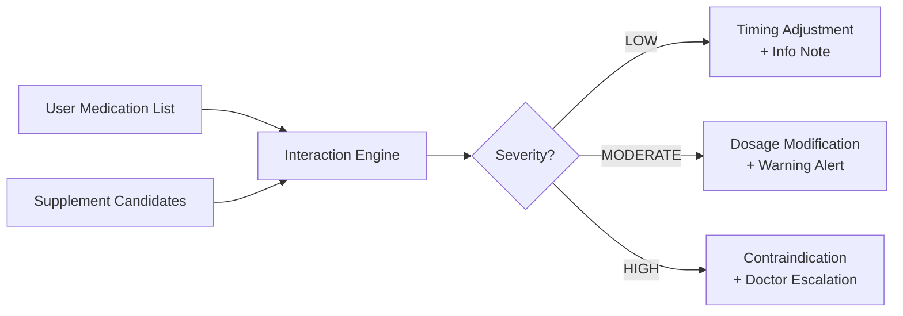
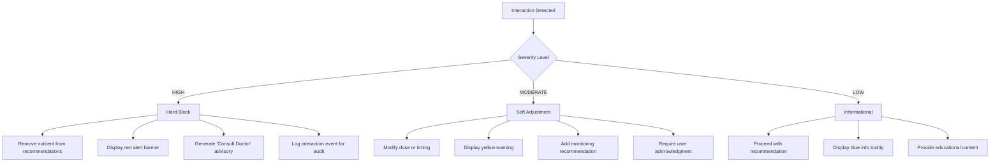
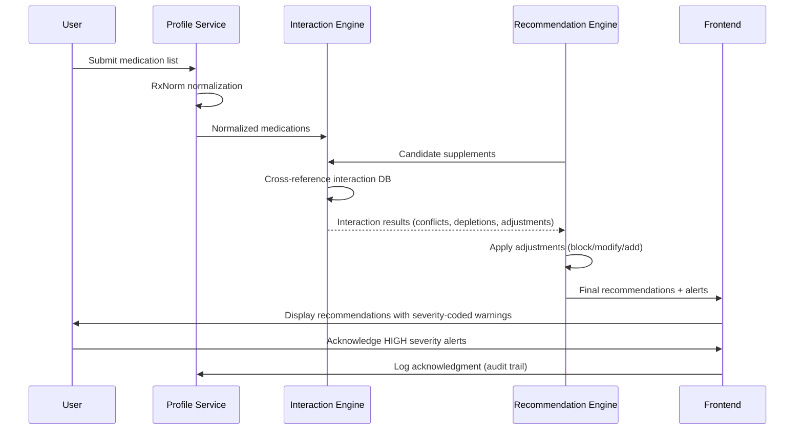

# Drug-Nutrient Interaction Reference

> **VitalSync Internal Documentation** | Version 2.1 | Last Updated: June 2026
>
> This document serves as the canonical reference for all drug-nutrient interactions evaluated by the VitalSync recommendation engine. All interactions are evidence-graded and mapped to system behavior.

---

## Table of Contents

- [Overview](#overview)
- [Critical Interaction Database](#critical-interaction-database)
  - [Anticoagulant & Antiplatelet Interactions](#1-anticoagulant--antiplatelet-interactions)
  - [Cardiovascular Medication Interactions](#2-cardiovascular-medication-interactions)
  - [Endocrine & Metabolic Interactions](#3-endocrine--metabolic-interactions)
  - [Gastrointestinal Medication Interactions](#4-gastrointestinal-medication-interactions)
  - [Neurological Medication Interactions](#5-neurological-medication-interactions)
  - [Anti-inflammatory & Immunosuppressant Interactions](#6-anti-inflammatory--immunosuppressant-interactions)
  - [Anti-infective Interactions](#7-anti-infective-interactions)
  - [Hormonal Therapy Interactions](#8-hormonal-therapy-interactions)
- [Interaction Severity Classification](#interaction-severity-classification)
- [How VitalSync Uses This Data](#how-vitalsync-uses-this-data)
- [Implementation Notes](#implementation-notes)
- [Clinical References](#clinical-references)

---

## Overview

Drug-nutrient interactions (DNIs) represent a frequently overlooked category of adverse drug events. These interactions can:

- **Reduce drug efficacy** (e.g., calcium chelating levothyroxine)
- **Amplify drug toxicity** (e.g., potassium supplements + potassium-sparing diuretics)
- **Cause nutrient depletion** (e.g., metformin depleting B12 over months/years)
- **Increase bleeding or other clinical risks** (e.g., omega-3 + warfarin)

VitalSync cross-references every user's active medication list against this interaction database before generating supplement recommendations. Interactions are classified by severity, and the system adjusts recommendations accordingly — from simple timing separations to full contraindications with physician escalation.



---

## Critical Interaction Database

### 1. Anticoagulant & Antiplatelet Interactions

#### 1a. Warfarin ↔ Vitamin K

| Field | Detail |
|---|---|
| **Medication** | Warfarin (Coumadin®) |
| **Nutrient Affected** | Vitamin K (phylloquinone, menaquinones) |
| **Mechanism** | Warfarin inhibits vitamin K epoxide reductase (VKORC1). Exogenous vitamin K directly antagonizes warfarin's mechanism of action, restoring clotting factor synthesis (Factors II, VII, IX, X). |
| **Clinical Impact** | Variable vitamin K intake destabilizes INR, increasing risk of either thromboembolic events (high K intake → subtherapeutic INR) or hemorrhage (low K intake → supratherapeutic INR). A single large serving of vitamin K-rich food can reduce INR by 1–2 points within 24–48 hours. |
| **Severity** | **🔴 HIGH** |
| **Management Strategy** | **Do NOT supplement vitamin K** unless directed by prescriber. Maintain consistent dietary vitamin K intake (target: 90–120 mcg/day). VitalSync excludes vitamin K from all recommendations for warfarin users. If multivitamin is recommended, system flags formulations containing >25 mcg vitamin K. |
| **Evidence** | Booth SL et al., *Am J Clin Nutr* 2004; 79(4):580-7. |

> [!CAUTION]
> VitalSync must **never** recommend vitamin K supplements to warfarin users. This is a hard contraindication coded as a system-level override that cannot be bypassed by user preference.

#### 1b. Warfarin ↔ High-Dose Omega-3 Fatty Acids

| Field | Detail |
|---|---|
| **Medication** | Warfarin (Coumadin®) |
| **Nutrient Affected** | Omega-3 fatty acids (EPA/DHA) at doses >2 g/day |
| **Mechanism** | EPA/DHA at pharmacological doses inhibit platelet aggregation via thromboxane A2 suppression and reduce fibrinogen levels. Combined with warfarin's anticoagulant effect, this creates additive bleeding risk. |
| **Clinical Impact** | Increased bleeding time, elevated INR (observed at doses >3 g/day). Case reports of significant bleeding events. Risk is dose-dependent; dietary omega-3 (1–2 servings of fish/week) is generally safe. |
| **Severity** | **🔴 HIGH** |
| **Management Strategy** | Cap omega-3 supplementation at ≤1 g EPA+DHA/day for warfarin users. VitalSync reduces default omega-3 dose and adds monitoring advisory. Doses >2 g/day are contraindicated without prescriber approval. Recommend INR monitoring if supplementation is initiated. |
| **Evidence** | Bays HE, *Am J Cardiol* 2007; 99(6A):44C-60C. |

#### 1c. Omega-3 Supplements ↔ All Anticoagulants/Antiplatelets

| Field | Detail |
|---|---|
| **Medication** | All anticoagulants (warfarin, apixaban, rivaroxaban, dabigatran) and antiplatelets (clopidogrel, prasugrel, ticagrelor, aspirin) |
| **Nutrient Affected** | Omega-3 fatty acids (EPA/DHA) at doses >2 g/day |
| **Mechanism** | Additive inhibition of hemostasis pathways. Omega-3s reduce platelet aggregation and may potentiate pharmacological anticoagulation/antiplatelet effects. |
| **Clinical Impact** | Increased bruising, prolonged bleeding from cuts, risk of GI or intracranial hemorrhage — particularly in elderly patients or those with multiple anticoagulant/antiplatelet agents. |
| **Severity** | **🔴 HIGH** |
| **Management Strategy** | Limit omega-3 to ≤1 g/day when used concurrently with any anticoagulant or antiplatelet. VitalSync automatically reduces recommended omega-3 dose and displays bleeding risk warning. For dual antiplatelet therapy (DAPT), omega-3 supplementation >1 g/day is fully contraindicated. |
| **Evidence** | Abdelhamid AS et al., *Cochrane Database Syst Rev* 2020; 3:CD003177. |

#### 1d. Chronic Aspirin ↔ Iron & Vitamin C

| Field | Detail |
|---|---|
| **Medication** | Aspirin (≥81 mg/day chronic use) |
| **Nutrient Affected** | Iron, Vitamin C |
| **Mechanism** | Chronic aspirin use causes occult GI blood loss (estimated 2–10 mL/day) via COX-1 inhibition of protective gastric prostaglandins, leading to gradual iron depletion. Vitamin C enhances non-heme iron absorption but may also increase GI irritation. |
| **Clinical Impact** | Iron-deficiency anemia develops in 10–15% of chronic aspirin users. Particularly significant in elderly, menstruating women, and those with H. pylori. Hemoglobin may decline 0.5–1.0 g/dL over 6–12 months. |
| **Severity** | **🟡 MODERATE** |
| **Management Strategy** | VitalSync flags iron status monitoring for chronic aspirin users. If ferritin <30 ng/mL, recommend iron supplementation (18–27 mg elemental iron/day) with vitamin C co-administration to enhance absorption. Recommend taking iron 2 hours apart from aspirin to minimize GI irritation. |
| **Evidence** | Lanas A et al., *Best Pract Res Clin Gastroenterol* 2012; 26(2):125-40. |

---

### 2. Cardiovascular Medication Interactions

#### 2a. Statins ↔ Coenzyme Q10 (CoQ10)

| Field | Detail |
|---|---|
| **Medication** | HMG-CoA reductase inhibitors: atorvastatin (Lipitor®), rosuvastatin (Crestor®), simvastatin (Zocor®), pravastatin, lovastatin, fluvastatin, pitavastatin |
| **Nutrient Affected** | Coenzyme Q10 (ubiquinone/ubiquinol) |
| **Mechanism** | Statins inhibit HMG-CoA reductase, which catalyzes an early step in both cholesterol and CoQ10 biosynthesis (shared mevalonate pathway). Plasma CoQ10 levels decrease 16–54% with statin therapy. |
| **Clinical Impact** | CoQ10 depletion may contribute to statin-associated myopathy (SAM), fatigue, and exercise intolerance. Approximately 5–10% of statin users report myalgia; CoQ10 depletion is a proposed (though debated) mechanism. Mitochondrial dysfunction in skeletal muscle may be exacerbated. |
| **Severity** | **🟡 MODERATE** |
| **Management Strategy** | VitalSync proactively recommends CoQ10 supplementation (100–200 mg/day ubiquinol or 200–300 mg/day ubiquinone) for all statin users. If user reports muscle pain/fatigue, escalate CoQ10 to 200 mg ubiquinol/day and add physician notification. Take CoQ10 with a fat-containing meal for optimal absorption. |
| **Evidence** | Banach M et al., *J Am Heart Assoc* 2015; 4(6):e002058. |

> [!TIP]
> Ubiquinol (reduced form) has ~2× higher bioavailability than ubiquinone. VitalSync defaults to ubiquinol-based product recommendations when available.

#### 2b. ACE Inhibitors ↔ Potassium & Zinc

| Field | Detail |
|---|---|
| **Medication** | ACE inhibitors: lisinopril, enalapril, ramipril, captopril, benazepril, fosinopril, quinapril, perindopril |
| **Nutrient Affected** | Potassium (↑ retention), Zinc (↓ depletion) |
| **Mechanism** | **Potassium:** ACE inhibitors reduce aldosterone secretion, decreasing renal potassium excretion. Supplemental potassium can cause dangerous hyperkalemia (K+ >5.5 mEq/L). **Zinc:** ACE inhibitors chelate zinc via their sulfhydryl groups, increasing urinary zinc excretion by up to 50%. |
| **Clinical Impact** | **Potassium:** Hyperkalemia risk — cardiac arrhythmias, muscle weakness, paresthesias. Risk amplified in renal impairment (eGFR <45), diabetes, and concurrent potassium-sparing diuretics. **Zinc:** Chronic depletion may impair taste (dysgeusia — a known ACE-I side effect), immune function, and wound healing. |
| **Severity** | **🔴 HIGH** (Potassium) · **🟡 MODERATE** (Zinc) |
| **Management Strategy** | **Potassium:** VitalSync contraindicated potassium supplements for ACE-I users. System removes potassium from all recommendations and displays hyperkalemia warning. **Zinc:** Recommend zinc supplementation (15–30 mg/day elemental zinc). Co-supplement with copper (1–2 mg/day) if zinc >30 mg to prevent copper depletion. |
| **Evidence** | Raebel MA, *Pharmacotherapy* 2012; 32(5):462-73 (potassium). Golik A et al., *J Am Coll Nutr* 1998; 17(1):75-8 (zinc). |

#### 2c. Thiazide Diuretics ↔ Potassium, Magnesium, Zinc

| Field | Detail |
|---|---|
| **Medication** | Hydrochlorothiazide (HCTZ), chlorthalidone, indapamide, metolazone |
| **Nutrient Affected** | Potassium (↓), Magnesium (↓), Zinc (↓) |
| **Mechanism** | Thiazides increase renal excretion of potassium (via increased distal sodium delivery and aldosterone stimulation), magnesium (via reduced paracellular reabsorption in the distal convoluted tubule), and zinc (mechanism not fully elucidated; likely related to increased urinary losses). |
| **Clinical Impact** | **Potassium:** Hypokalemia (K+ <3.5 mEq/L) in 7–56% of patients — muscle cramps, weakness, arrhythmias, potentiation of digoxin toxicity. **Magnesium:** Hypomagnesemia in 20–50% — exacerbates hypokalemia (refractory hypokalemia), muscle spasms, QT prolongation. **Zinc:** Impaired taste, immune dysfunction, slow wound healing. |
| **Severity** | **🔴 HIGH** (Potassium, Magnesium) · **🟡 MODERATE** (Zinc) |
| **Management Strategy** | VitalSync proactively recommends: Potassium supplementation (40–80 mEq/day) with regular monitoring. Magnesium supplementation (200–400 mg/day glycinate or citrate). Zinc supplementation (15–25 mg/day). System flags concurrent digoxin use as critical (hypokalemia + digoxin = arrhythmia risk). |
| **Evidence** | Clayton JA et al., *BMJ* 2006; 332(7533):132-5. |

#### 2d. Potassium-Sparing Diuretics ↔ Potassium

| Field | Detail |
|---|---|
| **Medication** | Spironolactone (Aldactone®), eplerenone (Inspra®), amiloride, triamterene |
| **Nutrient Affected** | Potassium (↑ dangerous retention) |
| **Mechanism** | These agents block aldosterone receptors (spironolactone, eplerenone) or ENaC channels (amiloride, triamterene) in the collecting duct, directly reducing potassium secretion. Any exogenous potassium supplementation creates additive hyperkalemia risk. |
| **Clinical Impact** | Life-threatening hyperkalemia (K+ >6.0 mEq/L) — cardiac arrest, peaked T-waves, widened QRS, sine wave pattern on ECG. Risk is highest in: renal impairment, diabetes, concurrent ACE-I/ARB use, elderly, dehydration. |
| **Severity** | **🔴 HIGH** |
| **Management Strategy** | **Absolute contraindication.** VitalSync must NEVER recommend potassium supplements to users on potassium-sparing diuretics. System-level hard block. All potassium-containing supplements (including potassium-containing salt substitutes) are excluded. Display prominent warning: *"Potassium supplementation is contraindicated with your current medication. Excess potassium can cause life-threatening heart rhythm changes."* |
| **Evidence** | Juurlink DN et al., *N Engl J Med* 2004; 351(6):543-51. |

> [!CAUTION]
> This is one of VitalSync's **absolute contraindications** — a non-negotiable system block. The combination of potassium supplements with potassium-sparing diuretics has caused documented fatalities. No user override is permitted.

---

### 3. Endocrine & Metabolic Interactions

#### 3a. Metformin ↔ Vitamin B12

| Field | Detail |
|---|---|
| **Medication** | Metformin (Glucophage®, Fortamet®, Glumetza®) |
| **Nutrient Affected** | Vitamin B12 (cobalamin) |
| **Mechanism** | Metformin impairs B12 absorption in the terminal ileum by interfering with the calcium-dependent intrinsic factor–B12 complex binding to the ileal cubilin receptor. It may also alter gut microbiome composition, reducing bacterial B12 synthesis. Effect is dose-dependent and cumulative. |
| **Clinical Impact** | B12 deficiency develops in 5.8–30% of metformin users (dose-dependent, duration-dependent). Manifests as: megaloblastic anemia, peripheral neuropathy (often misdiagnosed as diabetic neuropathy), cognitive decline, elevated homocysteine (cardiovascular risk factor). Onset typically 12–36 months after initiation. |
| **Severity** | **🟡 MODERATE** |
| **Management Strategy** | VitalSync proactively recommends B12 supplementation for all metformin users: methylcobalamin 1,000 mcg/day sublingual or 500 mcg/day oral. Flag for annual serum B12 and methylmalonic acid (MMA) monitoring. If B12 <300 pg/mL or MMA elevated, escalate to prescriber for potential IM B12 injections. |
| **Evidence** | Aroda VR et al., *J Clin Endocrinol Metab* 2016; 101(4):1754-61 (DPPOS long-term data). |

#### 3b. Levothyroxine ↔ Calcium, Iron, Magnesium

| Field | Detail |
|---|---|
| **Medication** | Levothyroxine (Synthroid®, Levoxyl®, Tirosint®, Euthyrox®) |
| **Nutrient Affected** | Calcium, Iron, Magnesium (all via chelation/adsorption) |
| **Mechanism** | Divalent and trivalent cations (Ca²⁺, Fe²⁺/Fe³⁺, Mg²⁺) form insoluble complexes with levothyroxine in the GI tract, physically preventing absorption. Calcium carbonate reduces T4 absorption by up to 64%. Iron sulfate reduces absorption by 50–74%. Magnesium hydroxide reduces absorption by 40–55%. |
| **Clinical Impact** | Subtherapeutic thyroid hormone levels → elevated TSH → recurrence of hypothyroid symptoms (fatigue, weight gain, cold intolerance, cognitive slowing). Patients may require dose escalation, leading to potential overreplacement when supplement is later discontinued. |
| **Severity** | **🔴 HIGH** |
| **Management Strategy** | **Enforce 4-hour separation rule.** VitalSync adds mandatory timing instructions: take levothyroxine on empty stomach (30–60 min before breakfast), then calcium/iron/magnesium supplements ≥4 hours later. System displays visual timing guide. If user cannot maintain separation, recommend Tirosint® (liquid/gel cap — less susceptible to chelation) and flag for prescriber discussion. |
| **Evidence** | Singh N et al., *Arch Intern Med* 2000; 160(2):150-3. Zamfirescu I & Carlson HE, *Endocrine* 2011; 40(1):72-5. |

> [!IMPORTANT]
> The 4-hour separation rule is critical. VitalSync generates a personalized timing schedule for levothyroxine users showing when to take each supplement relative to their thyroid medication.

---

### 4. Gastrointestinal Medication Interactions

#### 4a. Proton Pump Inhibitors (PPIs) ↔ Magnesium, Vitamin B12, Calcium, Iron

| Field | Detail |
|---|---|
| **Medication** | PPIs: omeprazole (Prilosec®), esomeprazole (Nexium®), lansoprazole (Prevacid®), pantoprazole (Protonix®), rabeprazole (AcipHex®), dexlansoprazole (Dexilant®) |
| **Nutrient Affected** | Magnesium (↓), Vitamin B12 (↓), Calcium (↓), Iron (↓) |
| **Mechanism** | PPIs irreversibly inhibit the H⁺/K⁺-ATPase proton pump, raising gastric pH to 4–7. This impairs: **Magnesium:** disrupted TRPM6/7 channel-mediated intestinal Mg absorption. **B12:** reduced acid-pepsin cleavage of B12 from food proteins. **Calcium:** reduced ionization of calcium salts (especially CaCO₃). **Iron:** reduced conversion of Fe³⁺ to absorbable Fe²⁺. |
| **Clinical Impact** | **Magnesium:** Hypomagnesemia (onset typically >1 year PPI use) — muscle cramps, arrhythmias, seizures. FDA safety warning issued 2011. **B12:** Deficiency in 12–33% of long-term users — neuropathy, anemia. **Calcium:** Increased fracture risk (hip, wrist, spine) — FDA warning 2010. **Iron:** Iron-deficiency anemia, particularly in menstruating women and vegetarians. |
| **Severity** | **🟡 MODERATE** (individual nutrients) · **🔴 HIGH** (cumulative with long-term PPI use >1 year) |
| **Management Strategy** | VitalSync recommends for all PPI users: Magnesium glycinate 200–400 mg/day (better absorbed than oxide in low-acid environment). Methylcobalamin 1,000 mcg/day sublingual (bypasses acid-dependent absorption). Calcium citrate (NOT carbonate — citrate doesn't require acid) 500–600 mg/day. Iron bisglycinate (acid-independent absorption) if ferritin <50 ng/mL. Flag long-term PPI use (>1 year) for prescriber review of continued need. |
| **Evidence** | Lam JR et al., *JAMA* 2013; 310(22):2435-42. Heidelbaugh JJ, *Curr Gastroenterol Rep* 2013; 15(7):332. |

---

### 5. Neurological Medication Interactions

#### 5a. Anticonvulsants ↔ Folate, Vitamin D, Calcium

| Field | Detail |
|---|---|
| **Medication** | Phenytoin (Dilantin®), carbamazepine (Tegretol®), phenobarbital, valproic acid (Depakote®), topiramate (Topamax®), levetiracetam (Keppra®), lamotrigine (Lamictal®) |
| **Nutrient Affected** | Folate (↓), Vitamin D (↓), Calcium (↓) |
| **Mechanism** | **Folate:** Enzyme-inducing AEDs (phenytoin, carbamazepine, phenobarbital) upregulate hepatic CYP450 enzymes that accelerate folate metabolism. Phenytoin also directly inhibits intestinal folate conjugase. **Vitamin D:** CYP3A4/CYP24A1 induction accelerates 25(OH)D catabolism to inactive metabolites by 2–4×. **Calcium:** Secondary to vitamin D depletion → impaired intestinal calcium absorption. |
| **Clinical Impact** | **Folate:** Deficiency in 40–90% of long-term AED users — megaloblastic anemia, elevated homocysteine, neural tube defect risk if pregnant. **Vitamin D/Calcium:** Anticonvulsant-induced osteomalacia/osteoporosis — fracture risk increased 2–6× compared to age-matched controls. Bone mineral density declines 0.5–1.5% per year on enzyme-inducing AEDs. |
| **Severity** | **🔴 HIGH** |
| **Management Strategy** | VitalSync recommends for AED users: Folate 1,000 mcg/day (the UL — appropriate for drug-induced depletion). *Note:* For lamotrigine users, cap folate at 400 mcg/day — high-dose folate may reduce lamotrigine levels via induction of glucuronidation. Vitamin D3 2,000–4,000 IU/day (target 25(OH)D >40 ng/mL). Calcium citrate 1,000–1,200 mg/day in divided doses. Annual DEXA scan recommendation for long-term users. |
| **Evidence** | Pack AM & Morrell MJ, *Neurology* 2004; 63(9 Suppl 4):S2-6. Valsamis HA et al., *Clin Med Res* 2006; 4(1):27-31. |

> [!WARNING]
> **Lamotrigine-folate special case:** High-dose folate (>800 mcg/day) can reduce lamotrigine serum levels, potentially triggering seizures. VitalSync implements a specific dose cap for lamotrigine users and displays a differentiated warning.

---

### 6. Anti-inflammatory & Immunosuppressant Interactions

#### 6a. Corticosteroids ↔ Calcium, Vitamin D, Potassium

| Field | Detail |
|---|---|
| **Medication** | Prednisone, prednisolone, methylprednisolone, dexamethasone, hydrocortisone (systemic, chronic use ≥7.5 mg prednisone-equivalent/day for >3 months) |
| **Nutrient Affected** | Calcium (↓), Vitamin D (↓), Potassium (↓) |
| **Mechanism** | **Calcium/Vitamin D:** Glucocorticoids (1) reduce intestinal calcium absorption by antagonizing vitamin D action, (2) increase renal calcium excretion, (3) directly suppress osteoblast function and enhance osteoclast activity, (4) accelerate vitamin D metabolism via CYP3A4 induction. **Potassium:** Mineralocorticoid activity of some glucocorticoids increases renal potassium excretion. |
| **Clinical Impact** | **Bone:** Glucocorticoid-induced osteoporosis (GIOP) — the most common cause of secondary osteoporosis. Bone loss is most rapid in first 3–6 months (up to 12% trabecular bone loss in year 1). Fracture risk increases within 3 months of starting therapy. **Potassium:** Hypokalemia — muscle weakness, cramps, cardiac arrhythmias. |
| **Severity** | **🔴 HIGH** (Calcium/Vitamin D) · **🟡 MODERATE** (Potassium) |
| **Management Strategy** | VitalSync recommends for chronic corticosteroid users: Calcium citrate 1,200–1,500 mg/day (divided doses). Vitamin D3 2,000–4,000 IU/day (target 25(OH)D >30 ng/mL). Potassium monitoring — supplement if K+ <3.5 mEq/L (40 mEq/day). Flag for baseline DEXA within 6 months of initiating chronic steroids. Consider bisphosphonate discussion for prescriber if T-score <-1.0. |
| **Evidence** | ACR 2022 Guidelines for GIOP. Compston J et al., *Lancet* 2018; 391(10127):1174-87. |

---

### 7. Anti-infective Interactions

#### 7a. Antibiotics ↔ B Vitamins, Vitamin K, Magnesium, Zinc

| Field | Detail |
|---|---|
| **Medication** | Broad-spectrum antibiotics: fluoroquinolones (ciprofloxacin, levofloxacin), tetracyclines (doxycycline, minocycline), cephalosporins, aminoglycosides, macrolides (azithromycin, clarithromycin) |
| **Nutrient Affected** | B vitamins (B1, B2, B6, B12, biotin), Vitamin K, Magnesium, Zinc |
| **Mechanism** | **B vitamins & Vitamin K:** Gut microbiome disruption — antibiotics reduce commensal bacteria (Bacteroides, Bifidobacterium, Lactobacillus) that synthesize B vitamins and vitamin K2 (menaquinone). Recovery of gut flora takes 2–12 weeks post-antibiotic course. **Magnesium/Zinc:** Fluoroquinolones and tetracyclines chelate divalent cations (Mg²⁺, Zn²⁺, Ca²⁺, Fe²⁺), both reducing antibiotic absorption AND depleting mineral stores. Aminoglycosides cause renal magnesium wasting. |
| **Clinical Impact** | **Short-term (1–2 weeks):** Usually subclinical. **Extended courses (>2 weeks):** B vitamin depletion → fatigue, glossitis. Vitamin K depletion → coagulopathy (particularly with cephalosporins containing NMTT side chain). **Chelation:** Reduced antibiotic efficacy if minerals taken concurrently (30–50% reduction in fluoroquinolone bioavailability). |
| **Severity** | **🟡 MODERATE** |
| **Management Strategy** | **During antibiotic course:** Separate mineral supplements (Ca, Fe, Mg, Zn) by ≥2 hours from fluoroquinolones and ≥3 hours from tetracyclines. Recommend probiotic (Saccharomyces boulardii or Lactobacillus rhamnosus GG) 2 hours after antibiotic dose. **Post-antibiotic (4–8 weeks):** VitalSync initiates "Gut Recovery Protocol" — B-complex supplementation, vitamin K2 100 mcg/day, probiotic continuation, and zinc 15 mg/day. |
| **Evidence** | Langdon A et al., *Genome Med* 2016; 8(1):39. Neuvonen PJ, *Clin Pharmacokinet* 1976; 1(1):7-28 (chelation). |

---

### 8. Hormonal Therapy Interactions

#### 8a. Oral Contraceptives ↔ B6, B12, Folate, Magnesium, Zinc

| Field | Detail |
|---|---|
| **Medication** | Combined oral contraceptives (ethinylestradiol + progestin): various brands including Yaz®, Ortho Tri-Cyclen®, Lo Loestrin®, NuvaRing®, Xulane® patch |
| **Nutrient Affected** | Vitamin B6 (↓), Vitamin B12 (↓), Folate (↓), Magnesium (↓), Zinc (↓) |
| **Mechanism** | **B6:** Estrogen induces tryptophan-2,3-dioxygenase, shunting tryptophan metabolism toward the kynurenine pathway, which consumes pyridoxal phosphate (active B6) as a cofactor. **B12:** Altered binding proteins (reduced haptocorrin levels) lower circulating B12. **Folate:** Estrogen impairs folate polyglutamate absorption and alters folate metabolism. **Magnesium:** Estrogen promotes magnesium shift from plasma to soft tissue/bone. **Zinc:** Estrogen redistributes zinc from plasma to erythrocytes and liver; also increases ceruloplasmin (copper), which competitively inhibits zinc absorption. |
| **Clinical Impact** | **B6:** Depletion linked to OC-associated mood changes, depression (via reduced serotonin synthesis). **Folate:** Particularly critical — if OC is discontinued for pregnancy, inadequate folate stores increase neural tube defect risk. **Magnesium:** Muscle cramps, headaches/migraines (OC-associated migraines may be partially Mg-mediated). **Multi-nutrient:** Elevated homocysteine (from B6/B12/folate depletion) — cardiovascular risk amplification in OC users who smoke. |
| **Severity** | **🟡 MODERATE** |
| **Management Strategy** | VitalSync recommends a targeted "OC Support Protocol" for oral contraceptive users: B6 (P5P form) 25–50 mg/day. Methylcobalamin 500 mcg/day. Methylfolate 400–800 mcg/day. Magnesium glycinate 200–300 mg/day. Zinc picolinate 15 mg/day + copper 1 mg/day. Emphasize folate adequacy especially for users who may discontinue OC for planned pregnancy. |
| **Evidence** | Palmery M et al., *Eur Rev Med Pharmacol Sci* 2013; 17(13):1804-13. |

---

## Interaction Severity Classification

VitalSync uses a three-tier severity system to guide clinical decision-making and UI treatment:

| Severity | Definition | System Behavior | UI Treatment |
|---|---|---|---|
| **🔴 HIGH** | Life-threatening risk, therapeutic failure, or absolute contraindication | Hard block — nutrient removed from recommendations. No user override permitted. Auto-generates "Consult Your Doctor" advisory. | Red banner alert. Warning icon on recommendation card. Modal dialog requiring acknowledgment. |
| **🟡 MODERATE** | Clinically significant but manageable with timing/dose adjustments | Soft adjustment — dose modified, timing separation enforced, monitoring recommended. User can proceed with informed consent. | Yellow warning badge. Expandable info panel with management instructions. Timing reminder integration. |
| **🟢 LOW** | Minor interaction, theoretical concern, or subclinical effect | Informational note only. Recommendation proceeds unchanged. Educational content provided. | Blue info icon. Tooltip with brief explanation. No blocking behavior. |



---

## How VitalSync Uses This Data

### Medication Input & Processing

1. **User enters current medications** via the profile setup flow or the `POST /api/user/medications` endpoint
2. Medications are normalized against the RxNorm database for standardized identification (RxCUI mapping)
3. Each medication is classified into therapeutic categories (anticoagulant, statin, PPI, etc.)

### Interaction Screening

4. The **Interaction Engine** cross-references the user's medication list against the interaction database
5. All candidate supplement recommendations are screened for interactions before display
6. Interactions are evaluated for:
   - **Direct conflicts** (supplement X contraindicated with medication Y)
   - **Additive risks** (multiple medications increasing same nutrient interaction)
   - **Depletion signals** (medication known to deplete specific nutrients → proactive supplementation)

### Alert Generation & Display

7. Flagged interactions are displayed as **severity-coded warning alerts**:
   - 🔴 **HIGH** — Red modal alert, blocks recommendation, requires doctor consult
   - 🟡 **MODERATE** — Yellow inline warning, modifies recommendation, offers management strategy
   - 🟢 **LOW** — Blue info tooltip, educational only
8. Users must acknowledge HIGH severity alerts before proceeding
9. All interaction alerts are timestamped and logged for compliance audit

### Recommendation Adjustment

10. Recommendations are adjusted based on detected interactions:
    - **Dosage modification** — e.g., omega-3 capped at 1 g/day for anticoagulant users
    - **Timing separation** — e.g., 4-hour gap for levothyroxine + calcium/iron/magnesium
    - **Form substitution** — e.g., calcium citrate instead of carbonate for PPI users
    - **Contraindication** — e.g., vitamin K excluded entirely for warfarin users
    - **Proactive supplementation** — e.g., CoQ10 added for statin users, B12 for metformin users



---

## Implementation Notes

### Interaction Data Model

```json
{
  "interaction_id": "INT-WAR-VITK-001",
  "medication": {
    "rxcui": "11289",
    "name": "warfarin",
    "class": "anticoagulant"
  },
  "nutrient": {
    "id": "NUT-VITK",
    "name": "Vitamin K",
    "forms": ["phylloquinone", "menaquinone-4", "menaquinone-7"]
  },
  "severity": "HIGH",
  "interaction_type": "contraindication",
  "mechanism": "Direct pharmacological antagonism via VKORC1 pathway",
  "clinical_impact": "INR destabilization, thromboembolic or hemorrhagic risk",
  "management": {
    "action": "BLOCK",
    "dosage_modification": null,
    "timing_separation_hours": null,
    "alternative_form": null,
    "monitoring": ["INR"],
    "escalation": "CONSULT_DOCTOR"
  },
  "evidence": {
    "grade": "A",
    "references": ["PMID:15113720"],
    "last_reviewed": "2026-04-15"
  },
  "flags": {
    "hard_block": true,
    "user_overridable": false,
    "requires_acknowledgment": true
  }
}
```

### Confidence Score Modification

When interactions are detected, the recommendation confidence score is adjusted using a penalty multiplier:

| Interaction Severity | Confidence Multiplier | Effect |
|---|---|---|
| **HIGH** (contraindication) | `0.0` — recommendation removed entirely | Nutrient excluded from protocol |
| **HIGH** (depletion) | `1.2` — confidence *boosted* | Proactive supplementation prioritized |
| **MODERATE** | `0.7` — confidence reduced by 30% | Recommendation shown with caveats |
| **LOW** | `0.95` — minimal reduction | Recommendation essentially unchanged |

Formula:
```
adjusted_confidence = base_confidence × interaction_multiplier × evidence_weight
```

If `adjusted_confidence < 0.3`, the recommendation is suppressed and replaced with a "Consult Your Doctor" advisory.

### Doctor Escalation Triggers

The system escalates to "Consult Your Doctor" status under these conditions:

| Trigger | Condition | System Action |
|---|---|---|
| HIGH severity contraindication | Any HIGH severity interaction with `action: BLOCK` | Remove recommendation, display red alert |
| Multiple MODERATE interactions | ≥3 MODERATE interactions for single nutrient | Escalate to HIGH, require physician input |
| Renal impairment flag | User-reported eGFR <45 mL/min/1.73m² | Block potassium and magnesium supplements |
| Polypharmacy | User on ≥5 medications | Add general disclaimer, reduce all confidence scores by 15% |
| Pregnancy/Lactation | User indicates pregnant or breastfeeding | Apply pregnancy-specific ULs and contraindication list |
| Narrow therapeutic index | Medication with NTI flag (warfarin, phenytoin, digoxin, lithium, theophylline) | Apply strictest interaction rules, mandatory acknowledgment |

### Audit & Compliance Logging

Every interaction event is logged to the compliance audit trail:

```json
{
  "event_type": "INTERACTION_DETECTED",
  "timestamp": "2026-06-07T11:00:00Z",
  "user_id": "usr_abc123",
  "interaction_id": "INT-WAR-VITK-001",
  "severity": "HIGH",
  "action_taken": "BLOCKED",
  "user_acknowledged": true,
  "acknowledged_at": "2026-06-07T11:00:15Z",
  "recommendation_modified": true,
  "original_recommendation": "Vitamin K2 100mcg",
  "final_recommendation": null,
  "escalation_triggered": true
}
```

---

## Clinical References

| # | Reference | PMID | Topic |
|---|---|---|---|
| 1 | Booth SL et al., *Am J Clin Nutr* 2004; 79(4):580-7 | 15113720 | Warfarin–Vitamin K interaction |
| 2 | Bays HE, *Am J Cardiol* 2007; 99(6A):44C-60C | 17368278 | Omega-3 and anticoagulants |
| 3 | Banach M et al., *J Am Heart Assoc* 2015; 4(6):e002058 | 26012633 | Statin–CoQ10 depletion |
| 4 | Aroda VR et al., *J Clin Endocrinol Metab* 2016; 101(4):1754-61 | 26900641 | Metformin–B12 (DPPOS data) |
| 5 | Singh N et al., *Arch Intern Med* 2000; 160(2):150-3 | 10647752 | Levothyroxine–calcium binding |
| 6 | Lam JR et al., *JAMA* 2013; 310(22):2435-42 | 24327038 | PPI–nutrient depletion |
| 7 | Pack AM & Morrell MJ, *Neurology* 2004; 63(9 Suppl 4):S2-6 | 15557545 | AED–nutrient interactions |
| 8 | Compston J et al., *Lancet* 2018; 391(10127):1174-87 | 29571426 | Glucocorticoid osteoporosis |
| 9 | Palmery M et al., *Eur Rev Med Pharmacol Sci* 2013; 17(13):1804-13 | 23852908 | OC nutrient depletion |
| 10 | Juurlink DN et al., *N Engl J Med* 2004; 351(6):543-51 | 15295047 | Hyperkalemia and K-sparing diuretics |
| 11 | Raebel MA, *Pharmacotherapy* 2012; 32(5):462-73 | 22570188 | ACE-I hyperkalemia |
| 12 | Clayton JA et al., *BMJ* 2006; 332(7533):132-5 | 16399822 | Thiazide electrolyte depletion |
| 13 | Lanas A et al., *Best Pract Res Clin Gastroenterol* 2012; 26(2):125-40 | 22542151 | Aspirin GI blood loss |
| 14 | Langdon A et al., *Genome Med* 2016; 8(1):39 | 27074706 | Antibiotics and gut microbiome |
| 15 | Abdelhamid AS et al., *Cochrane Database Syst Rev* 2020; 3:CD003177 | 32114706 | Omega-3 and bleeding risk |

---

> [!NOTE]
> This document is reviewed quarterly by the VitalSync Clinical Advisory Board. Last clinical review: April 2026. Next scheduled review: July 2026. All PMIDs are verified against PubMed. Interaction data reflects current FDA safety communications and clinical practice guidelines as of June 2026.
