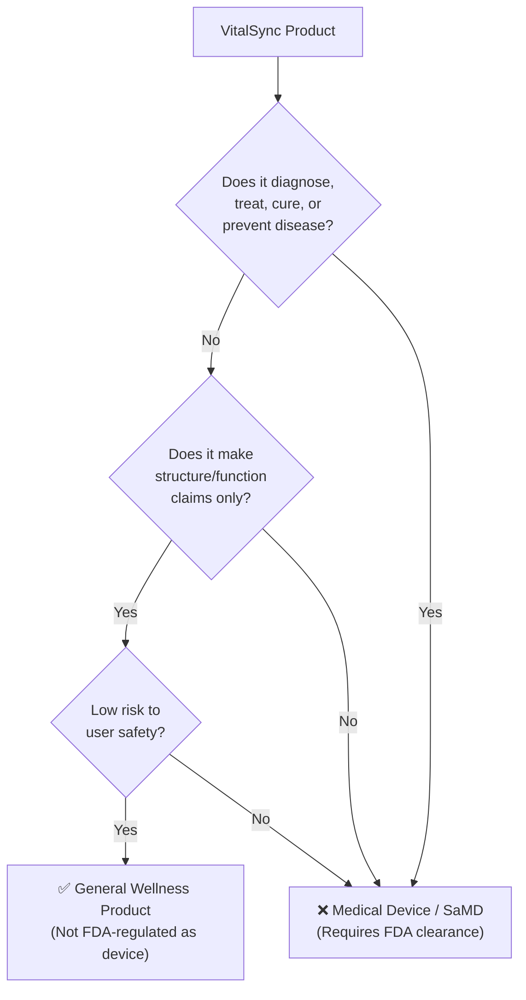
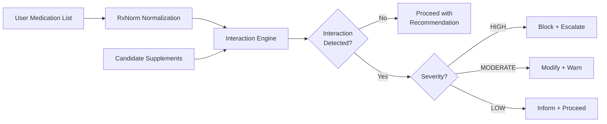
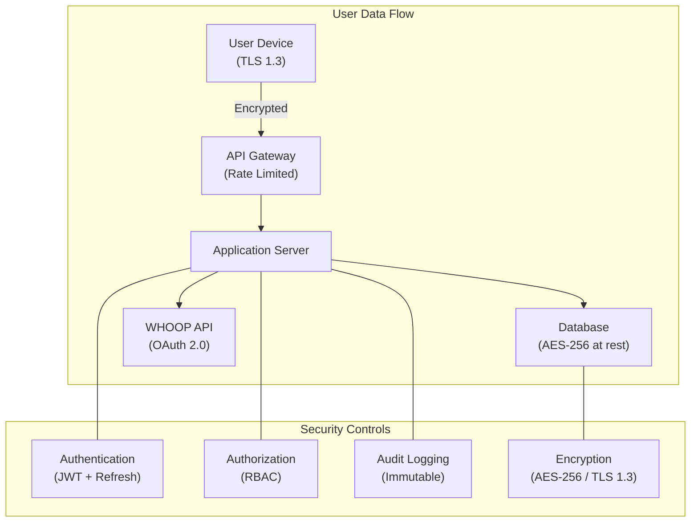
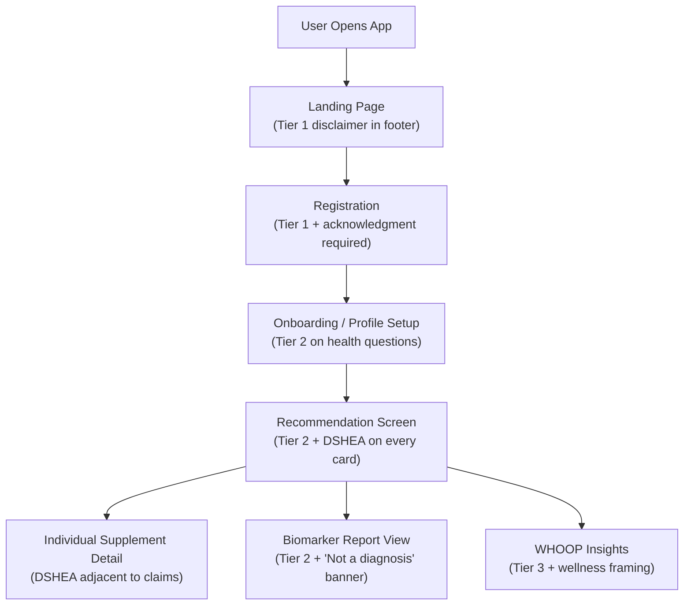

# Safety, Regulatory & Compliance Guide

> **VitalSync Internal Documentation** | Version 3.0 | Last Updated: June 2026
>
> This document defines VitalSync's regulatory positioning, safety guardrails, data privacy practices, medical disclaimers, and evidence evaluation methodology. It is the authoritative compliance reference for all team members.

---

## Table of Contents

- [1. Regulatory Classification](#1-regulatory-classification)
  - [General Wellness Product Positioning](#general-wellness-product-positioning)
  - [FDA "Intended Use" Principle](#fda-intended-use-principle)
  - [Software as a Medical Device (SaMD) Avoidance](#software-as-a-medical-device-samd-avoidance)
  - [January 2026 FDA Guidance Updates](#january-2026-fda-guidance-updates)
- [2. DSHEA Compliance](#2-dshea-compliance)
  - [Required Disclaimers](#required-disclaimers)
  - [Structure/Function Claims vs. Disease Claims](#structurefunction-claims-vs-disease-claims)
  - [Compliant vs. Non-Compliant Language Examples](#compliant-vs-non-compliant-language-examples)
  - [December 2025 Enforcement Discretion Update](#december-2025-enforcement-discretion-update)
- [3. Safety Guardrails](#3-safety-guardrails)
  - [Tolerable Upper Intake Levels (ULs)](#tolerable-upper-intake-levels-uls)
  - [Contraindication Screening](#contraindication-screening)
  - [Drug Interaction Checking](#drug-interaction-checking)
  - [Doctor Escalation Triggers](#doctor-escalation-triggers)
- [4. Data Privacy](#4-data-privacy)
  - [HIPAA Applicability](#hipaa-applicability)
  - [GDPR Considerations](#gdpr-considerations)
  - [CCPA Compliance](#ccpa-compliance)
  - [Data Architecture & Security](#data-architecture--security)
  - [WHOOP Data Handling](#whoop-data-handling)
- [5. Medical Disclaimers](#5-medical-disclaimers)
  - [Required Disclaimer Text](#required-disclaimer-text)
  - [Disclaimer Placement Requirements](#disclaimer-placement-requirements)
  - [User Acknowledgment Tracking](#user-acknowledgment-tracking)
- [6. Evidence Scoring](#6-evidence-scoring)
  - [GRADE Framework](#grade-framework)
  - [CEBM Evidence Levels](#cebm-evidence-levels)
  - [VitalSync Confidence Score Calculation](#vitalsync-confidence-score-calculation)

---

## 1. Regulatory Classification

### General Wellness Product Positioning

VitalSync is classified as a **General Wellness Product** — not a medical device, not a diagnostic tool, and not a Software as a Medical Device (SaMD). This classification is foundational to all product design decisions, marketing language, and feature boundaries.



**General Wellness Products**, as defined by the FDA, are products that:

1. **Make only general wellness claims** — related to maintaining or encouraging a healthy lifestyle
2. **Are low-risk** — they do not raise significant safety concerns if used as intended
3. **Do not make disease claims** — they do not claim to diagnose, treat, cure, mitigate, or prevent any specific disease or condition

VitalSync fits this definition because it:

- Provides **educational nutritional recommendations** based on user-reported data
- Does **not diagnose** any medical condition
- Does **not prescribe** medications or controlled substances
- Does **not interpret** lab results as diagnostic findings
- Presents supplement suggestions as **informational wellness guidance**, not medical treatment
- Includes prominent disclaimers directing users to consult healthcare providers

### FDA "Intended Use" Principle

The FDA's regulatory classification hinges on a product's **intended use** — determined by:

| Factor | VitalSync Approach |
|---|---|
| **Marketing claims** | All marketing uses structure/function language only. No disease claims. No "treatment" language. |
| **Labeling & UI text** | Every recommendation screen includes general wellness framing. Supplements are "suggested for wellness support," never "prescribed for treatment." |
| **User context** | Users self-report health goals (energy, sleep, fitness) — not disease symptoms. |
| **Clinical integration** | No EHR integration. No physician ordering. No diagnostic codes (ICD-10). |
| **Algorithmic output** | Recommendations are educational. Confidence scores reflect evidence quality, not diagnostic certainty. |

> [!IMPORTANT]
> **Intended use is determined by the totality of evidence** — not just what the label says, but how the product is marketed, discussed, and used in practice. A single disease claim in a blog post, social media ad, or customer testimonial can reclassify the entire product.

### Software as a Medical Device (SaMD) Avoidance

The International Medical Device Regulators Forum (IMDRF) defines SaMD as *"software intended to be used for one or more medical purposes that perform these purposes without being part of a hardware medical device."*

**VitalSync is NOT SaMD because it does not:**

| SaMD Criterion | VitalSync Status |
|---|---|
| Diagnose a disease or condition | ❌ Does not diagnose. Biomarker reports are user-submitted; system categorizes values into zones but does not render clinical diagnoses. |
| Drive clinical management | ❌ Does not determine treatment. Recommendations are educational; users are directed to healthcare providers for medical decisions. |
| Inform treatment decisions | ❌ Does not replace clinical judgment. All outputs include "Consult Your Doctor" for clinical questions. |
| Provide real-time patient monitoring | ❌ WHOOP data integration is for wellness tracking, not clinical monitoring. No alarms or alerts for vital sign thresholds. |

**Key design constraints that maintain non-SaMD status:**

1. **No diagnostic language** — system says "your vitamin D level is in the low zone" not "you have vitamin D deficiency"
2. **No treatment claims** — system says "consider supplementing" not "take this to treat your condition"
3. **No clinical workflow integration** — no FHIR/HL7 interfaces, no EHR data exchange, no provider ordering
4. **User-initiated, self-reported data** — no direct lab integrations or diagnostic device connectivity
5. **General population** — not targeted at patients with specific diseases

### January 2026 FDA Guidance Updates

In January 2026, the FDA issued updated guidance on **"General Wellness: Policy for Low Risk Devices"** (Revision 2.0). Key updates relevant to VitalSync:

| Update | Impact on VitalSync |
|---|---|
| **Expanded wellness definition** | Now explicitly includes "software that provides general health and wellness recommendations based on user-reported data and publicly available health information." VitalSync clearly falls within this expanded scope. |
| **Wearable data integration clarity** | FDA clarified that integrating consumer wearable data (e.g., WHOOP, Fitbit, Apple Watch) for wellness recommendations does **not** trigger SaMD classification, provided the software does not interpret the data for diagnostic or treatment purposes. |
| **AI/ML wellness recommendations** | Guidance notes that AI-driven wellness recommendations remain non-SaMD as long as they are "informational in nature and intended to support general health," with appropriate disclaimers. |
| **Enforcement discretion** | FDA confirmed it will continue to exercise enforcement discretion for general wellness products that are low-risk and make only wellness claims, even if they incorporate biometric data. |

> [!NOTE]
> The January 2026 guidance is favorable for VitalSync's positioning. However, it also emphasizes that any product making "disease-specific claims, even implicitly" will be subject to full medical device regulation. This underscores the critical importance of our language compliance program.

---

## 2. DSHEA Compliance

The **Dietary Supplement Health and Education Act of 1994 (DSHEA)** governs how dietary supplements can be marketed and labeled in the United States. Since VitalSync recommends dietary supplements, all recommendation language must comply with DSHEA requirements.

### Required Disclaimers

Every supplement recommendation generated by VitalSync must include the following FDA-mandated disclaimer:

> [!IMPORTANT]
> **Required DSHEA Disclaimer (exact text — do not modify):**
>
> *"These statements have not been evaluated by the Food and Drug Administration. This product is not intended to diagnose, treat, cure, or prevent any disease."*

This disclaimer must appear:

- On every recommendation screen
- Adjacent to any structure/function claim
- In a legible font size (minimum 10pt equivalent on screen)
- Not hidden behind scrolling, expandable sections, or tooltips — it must be immediately visible

### Structure/Function Claims vs. Disease Claims

DSHEA permits **structure/function claims** but prohibits **disease claims** unless the supplement has an approved New Drug Application (NDA).

| Claim Type | Definition | Example | Permitted? |
|---|---|---|---|
| **Structure/Function** | Describes the role of a nutrient in maintaining normal body structure or function | "Calcium supports bone health" | ✅ Yes |
| **Nutrient Deficiency** | Describes a benefit related to a classical nutrient deficiency disease (must include prevalence statement) | "Vitamin C prevents scurvy" | ✅ Yes (with disclaimer) |
| **General Well-being** | Describes general well-being from nutrient consumption | "Supports overall wellness and energy" | ✅ Yes |
| **Disease Claim** | Claims to diagnose, treat, cure, mitigate, or prevent a specific disease | "Treats osteoporosis" | ❌ No |
| **Implied Disease Claim** | Uses disease-adjacent language that implies therapeutic benefit | "Reduces tumor growth" | ❌ No |
| **Drug Claim** | Claims pharmacological action comparable to a drug | "Anti-inflammatory supplement" | ❌ No |

### Compliant vs. Non-Compliant Language Examples

| ❌ Non-Compliant (Disease Claim) | ✅ Compliant (Structure/Function Claim) |
|---|---|
| "Vitamin D treats osteoporosis" | "Vitamin D supports calcium absorption and helps maintain strong bones" |
| "Omega-3 reduces heart disease risk" | "Omega-3 fatty acids support cardiovascular health and normal triglyceride levels" |
| "Magnesium lowers blood pressure" | "Magnesium supports healthy muscle and nerve function, including the heart" |
| "Probiotics treat IBS" | "Probiotics support digestive health and a balanced gut microbiome" |
| "Iron cures anemia" | "Iron supports healthy red blood cell formation and oxygen transport" |
| "Melatonin treats insomnia" | "Melatonin supports the body's natural sleep-wake cycle" |
| "B12 prevents Alzheimer's" | "B12 supports normal neurological function and cognitive health" |
| "CoQ10 prevents heart failure" | "CoQ10 supports cellular energy production, particularly in the heart" |
| "Zinc fights COVID-19" | "Zinc supports normal immune system function" |
| "Folate prevents birth defects" | "Folate supports healthy fetal development" (note: this specific claim IS allowed by FDA as a health claim with qualified evidence) |

> [!WARNING]
> **Common pitfalls that trigger non-compliance:**
> - Using disease names (e.g., "diabetes," "depression," "hypertension") in any recommendation text
> - Using words like "treats," "cures," "prevents," "diagnoses," "mitigates," "therapeutic"
> - Referencing clinical endpoints (e.g., "reduces HbA1c," "lowers LDL cholesterol")
> - Citing clinical trial results that imply treatment efficacy
> - User testimonials that include disease claims ("this cured my arthritis")

### December 2025 Enforcement Discretion Update

In December 2025, the FDA issued an **Enforcement Discretion Notice** with significant implications:

| Update | Detail |
|---|---|
| **Personalized supplement recommendations** | FDA acknowledged that AI-powered personalized supplement recommendations are an emerging category. The agency indicated it will exercise enforcement discretion for platforms that provide "educational, non-diagnostic nutritional guidance" based on user-reported data, provided DSHEA disclaimers are prominent. |
| **Biomarker-informed recommendations** | The FDA noted that using user-submitted blood test results to inform supplement suggestions does not constitute diagnostic activity, as long as the platform does not render clinical interpretations (e.g., does not state "you have vitamin D deficiency" — instead states "your reported vitamin D level is below the reference range"). |
| **Structure/function claim modernization** | FDA signaled interest in updating structure/function claim guidance to accommodate data-driven wellness platforms. No formal rulemaking initiated yet, but a public comment period was announced for Q2 2026. |
| **Adverse event reporting** | FDA reinforced that supplement manufacturers (not recommendation platforms) bear primary AER responsibility under 21 CFR 314.80, but noted that recommendation platforms should have a mechanism for users to report adverse experiences, which should be forwarded to the relevant supplement manufacturer. |

---

## 3. Safety Guardrails

### Tolerable Upper Intake Levels (ULs)

VitalSync enforces **Tolerable Upper Intake Levels (ULs)** — the maximum daily intake of a nutrient unlikely to cause adverse health effects — as defined by the National Academies of Sciences, Engineering, and Medicine (NASEM) and the Institute of Medicine (IOM).

> [!CAUTION]
> VitalSync must **never** recommend a daily nutrient dose that exceeds the UL for the user's demographic group, unless a specific clinician-supervised exception has been documented and the user has explicitly opted in to therapeutic dosing.

#### UL Reference Table — Adults (19–70 years)

| Nutrient | Tolerable Upper Intake Level (UL) | Therapeutic Range (clinician-supervised) | Toxicity Symptoms | VitalSync Max Recommendation |
|---|---|---|---|---|
| **Vitamin D** | 4,000 IU/day (100 mcg) | Up to 10,000 IU/day | Hypercalcemia, nausea, renal calculi, vascular calcification | 4,000 IU/day (default cap) |
| **Iron** | 45 mg/day (elemental) | Varies by indication | GI distress, hemochromatosis, organ damage, oxidative stress | 45 mg/day |
| **Zinc** | 40 mg/day (elemental) | Up to 50 mg/day (short-term) | Copper deficiency, immune suppression, nausea, HDL reduction | 40 mg/day |
| **Calcium** | 2,500 mg/day (19–50 yr) / 2,000 mg/day (51+ yr) | N/A | Hypercalcemia, renal calculi, milk-alkali syndrome, cardiovascular risk | 1,500 mg/day (conservative) |
| **Vitamin A** | 10,000 IU/day (3,000 mcg RAE) | N/A | Hepatotoxicity, teratogenicity, intracranial hypertension | 10,000 IU/day (preformed) |
| **Magnesium** (supplemental only) | 350 mg/day | Up to 500 mg/day (divided) | Diarrhea, nausea, abdominal cramping; severe: hypotension, respiratory depression | 350 mg/day |
| **Selenium** | 400 mcg/day | Up to 200 mcg/day recommended | Selenosis (garlic breath, hair loss, nail brittleness, neurological effects) | 200 mcg/day (conservative) |
| **Folate** (synthetic folic acid) | 1,000 mcg/day DFE | Up to 1,000 mcg for AED users | Masks B12 deficiency, potential cancer promotion at high doses | 1,000 mcg/day |
| **Vitamin C** | 2,000 mg/day | Up to 2,000 mg/day | GI distress, oxalate kidney stones, pro-oxidant effects | 2,000 mg/day |
| **Vitamin E** | 1,000 mg/day (1,500 IU natural / 1,100 IU synthetic) | N/A | Increased bleeding risk, hemorrhagic stroke | 400 IU/day (conservative) |
| **Niacin** (nicotinic acid) | 35 mg/day (as supplement) | Up to 2,000 mg/day (Rx) | Flushing, hepatotoxicity, hyperglycemia | 35 mg/day |
| **Vitamin B6** | 100 mg/day | Up to 200 mg/day (short-term) | Peripheral neuropathy (sensory), ataxia | 100 mg/day |
| **Manganese** | 11 mg/day | N/A | Neurotoxicity (manganism) | 11 mg/day |
| **Iodine** | 1,100 mcg/day | N/A | Thyroid dysfunction, thyroiditis | 150 mcg/day (conservative) |

> [!NOTE]
> The UL for **magnesium applies only to supplemental magnesium** (from supplements and pharmacological agents), not dietary magnesium from food. VitalSync tracks supplemental intake separately from estimated dietary intake.

#### Special Population UL Adjustments

| Population | Key UL Modifications |
|---|---|
| **Pregnant women** | Vitamin A UL reduced to 10,000 IU/day (preformed retinol is teratogenic). Iron UL unchanged at 45 mg/day. Folate minimum 600 mcg DFE/day (no UL change). |
| **Lactating women** | Similar to pregnant; vitamin A UL 10,000 IU/day. |
| **Elderly (>70 years)** | Calcium UL reduced to 2,000 mg/day. Vitamin D UL unchanged. Renal function consideration for all renally-excreted nutrients. |
| **Renal impairment** | Potassium, magnesium, phosphorus recommendations significantly restricted or blocked. |
| **Pediatric (not currently served)** | VitalSync does not serve users under 18. Age verification required at registration. |

### Contraindication Screening

VitalSync screens for absolute contraindications before generating any recommendation:

| Contraindication Category | Examples | System Action |
|---|---|---|
| **Medical conditions** | Hemochromatosis → no iron. Hypercalcemia → no calcium/vitamin D. Hyperkalemia → no potassium. Wilson's disease → no copper. | Hard block on contraindicated nutrient |
| **Medication interactions** | See [DRUG_INTERACTIONS.md](./DRUG_INTERACTIONS.md) | Severity-based response (block/modify/inform) |
| **Allergies** | Shellfish allergy → flag glucosamine. Fish allergy → flag fish oil omega-3 (recommend algal DHA). Soy allergy → flag soy-based vitamin E. | Exclude allergen-containing products; suggest alternatives |
| **Pregnancy/Lactation** | High-dose vitamin A (retinol) → contraindicated. Various herbs (black cohosh, dong quai) → contraindicated. | Apply pregnancy-specific exclusion list |
| **Age** | Under 18 → service not available. Over 70 → adjusted ULs and additional cautions. | Age verification; adjusted guardrails |

### Drug Interaction Checking

See the full Drug-Nutrient Interaction Reference: [DRUG_INTERACTIONS.md](./DRUG_INTERACTIONS.md)

Summary of integration:



### Doctor Escalation Triggers

VitalSync generates a **"Consult Your Doctor"** advisory under these conditions:

| # | Trigger | Threshold | Advisory Type |
|---|---|---|---|
| 1 | HIGH severity drug interaction | Any single HIGH interaction | Mandatory modal — cannot be dismissed without acknowledgment |
| 2 | Multiple MODERATE interactions | ≥3 for same nutrient | Escalated to HIGH treatment |
| 3 | Biomarker critically out of range | Value >3× or <0.3× reference range | "See a doctor immediately" red alert |
| 4 | Polypharmacy | ≥5 active medications | General caution advisory |
| 5 | Renal impairment | Self-reported eGFR <45 | Block K⁺, Mg²⁺; restrict others |
| 6 | Pregnancy with medication | Pregnant + any medication | Universal doctor consult advisory |
| 7 | Symptom reporting | User reports adverse symptoms after starting supplement | Stop recommendation + doctor advisory |
| 8 | Narrow therapeutic index drug | Warfarin, phenytoin, digoxin, lithium, theophylline | Strictest interaction rules applied |

---

## 4. Data Privacy

### HIPAA Applicability

**Is VitalSync a HIPAA-covered entity?**

**Generally, no.** HIPAA applies to:
1. **Covered entities** — health plans, healthcare clearinghouses, and healthcare providers who transmit health information electronically in connection with HIPAA-covered transactions
2. **Business associates** — organizations that handle PHI on behalf of covered entities

VitalSync is a **direct-to-consumer wellness application** that:
- Does not provide healthcare services
- Does not transmit claims or coverage data
- Does not operate as a business associate of any covered entity
- Receives user-reported data, not clinical data from providers

**However, VitalSync voluntarily adopts HIPAA-aligned best practices:**

| HIPAA Principle | VitalSync Implementation |
|---|---|
| **Privacy Rule** | User health data is treated as confidential. Access controls limit data visibility to the user and authorized system processes. |
| **Security Rule** | AES-256 encryption at rest, TLS 1.3 in transit. Role-based access control (RBAC). Multi-factor authentication for admin access. |
| **Breach Notification** | Incident response plan with 72-hour notification target. Data breach notification to affected users within 72 hours of discovery. |
| **Minimum Necessary** | Data collection minimized to what is required for recommendations. No unnecessary data retention. |
| **Audit Controls** | Comprehensive audit logging of all data access, modifications, and exports. Logs retained for 6 years. |

> [!NOTE]
> While VitalSync is not HIPAA-covered, future partnerships with healthcare providers, insurance companies, or employer wellness programs could trigger HIPAA coverage. The voluntary adoption of HIPAA standards provides forward-compatible infrastructure.

### GDPR Considerations

For users in the European Economic Area (EEA), UK, and Switzerland, VitalSync complies with the **General Data Protection Regulation (GDPR)**:

| GDPR Requirement | VitalSync Implementation |
|---|---|
| **Lawful basis for processing** | Explicit consent (Art. 6(1)(a)) for health data. Contract performance (Art. 6(1)(b)) for account management. |
| **Special category data** | Health data processed under Art. 9(2)(a) — explicit consent with granular options. |
| **Data minimization** | Only data necessary for supplement recommendations is collected. No third-party advertising data. |
| **Purpose limitation** | Data used exclusively for generating recommendations, safety monitoring, and product improvement. |
| **Right to access** | Users can export all their data via `GET /api/user/data-export` (machine-readable JSON). |
| **Right to erasure** | Users can request complete data deletion via `DELETE /api/user/account` (30-day grace period, then permanent). |
| **Right to portability** | Data export in JSON and CSV formats. |
| **Data Protection Officer** | Appointed DPO: privacy@vitalsync.io |
| **Cross-border transfers** | Standard Contractual Clauses (SCCs) for any data processed outside EEA. |
| **Data Processing Agreements** | DPAs in place with all sub-processors (cloud hosting, analytics, WHOOP API). |
| **Privacy Impact Assessment** | DPIA completed for biomarker processing and WHOOP data integration. Reviewed annually. |

### CCPA Compliance

For California residents, VitalSync complies with the **California Consumer Privacy Act (CCPA)** and the **California Privacy Rights Act (CPRA)**:

| Right | Implementation |
|---|---|
| **Right to know** | Disclosure of categories and specific pieces of personal information collected. |
| **Right to delete** | Same as GDPR erasure — user-initiated account deletion. |
| **Right to opt-out of sale** | VitalSync does **not** sell personal information. "Do Not Sell" link displayed in footer as required. |
| **Right to non-discrimination** | No service degradation for users who exercise privacy rights. |
| **Sensitive personal information** | Health data treated as sensitive PI under CPRA. Additional consent required. |

### Data Architecture & Security



| Security Measure | Detail |
|---|---|
| **Encryption at rest** | AES-256 for all stored data. Database-level encryption with customer-managed keys (CMK). |
| **Encryption in transit** | TLS 1.3 mandatory. HSTS headers. Certificate pinning on mobile clients. |
| **Authentication** | JWT-based with short-lived access tokens (15 min) and long-lived refresh tokens (7 days). bcrypt password hashing (cost factor 12). |
| **Authorization** | Role-based access control (RBAC). Users can only access their own data. Admin access requires MFA. |
| **Consent management** | Granular consent tracking — separate consents for: data collection, WHOOP integration, biomarker processing, recommendation generation, anonymized analytics. |
| **Data retention** | Active account data retained for account lifetime + 30 days post-deletion. Anonymized analytics retained for 3 years. Audit logs retained for 6 years. |
| **Audit logging** | Immutable audit trail for all data access, modifications, exports, and deletions. Includes timestamp, user/admin ID, action, and IP address. |
| **Penetration testing** | Annual third-party penetration test. Quarterly automated vulnerability scanning. |
| **Incident response** | Documented IR plan with <4 hour response time for critical incidents. 72-hour user notification for data breaches. |

### WHOOP Data Handling

VitalSync integrates with WHOOP via OAuth 2.0 to retrieve physiological data for wellness recommendations. Data handling follows strict privacy protocols:

| Aspect | Policy |
|---|---|
| **Data accessed** | Recovery score, HRV, resting heart rate, sleep performance, respiratory rate, strain. |
| **Data NOT accessed** | Raw sensor data, GPS location, contact lists, or any non-health data. |
| **OAuth scope** | Minimum required scopes only: `read:recovery`, `read:sleep`, `read:cycles`. |
| **Token storage** | OAuth tokens encrypted at rest (AES-256). Refresh tokens stored server-side only. |
| **Data freshness** | Synced on-demand when user requests recommendations. Not continuously polled. |
| **Data retention** | WHOOP-sourced data retained for 90 days for trend analysis. User can request immediate deletion. |
| **Disconnection** | User can revoke WHOOP access at any time via `DELETE /api/whoop/disconnect`. All WHOOP data deleted within 24 hours. |
| **WHOOP ToS compliance** | VitalSync complies with WHOOP's Developer Terms of Service, including data display requirements and branding guidelines. |

---

## 5. Medical Disclaimers

### Required Disclaimer Text

VitalSync uses three tiers of disclaimers, each tailored to the context in which it appears:

#### Tier 1: Primary Disclaimer (Full Text)

> *"VitalSync provides personalized nutritional wellness recommendations for educational and informational purposes only. VitalSync is not a medical device, does not provide medical advice, and is not intended to diagnose, treat, cure, or prevent any disease or medical condition.*
>
> *These statements have not been evaluated by the Food and Drug Administration. Supplement recommendations are based on publicly available scientific research and user-reported data. They do not constitute medical advice, clinical recommendations, or prescriptions.*
>
> *Always consult your physician, pharmacist, or qualified healthcare provider before starting any supplement regimen, especially if you are pregnant, nursing, taking medications, or have a medical condition. Do not disregard professional medical advice or delay seeking it because of information provided by VitalSync.*
>
> *Individual results may vary. VitalSync does not guarantee any specific health outcomes."*

#### Tier 2: Recommendation Screen Disclaimer (Condensed)

> *"For educational purposes only. Not medical advice. These statements have not been evaluated by the FDA. This is not intended to diagnose, treat, cure, or prevent any disease. Consult your healthcare provider before starting any supplement."*

#### Tier 3: Footer/Compact Disclaimer

> *"Not medical advice. Consult your doctor before use. FDA disclaimer applies."*

#### DSHEA Disclaimer (Always Required with Structure/Function Claims)

> *"These statements have not been evaluated by the Food and Drug Administration. This product is not intended to diagnose, treat, cure, or prevent any disease."*

### Disclaimer Placement Requirements

| Location | Required Disclaimer Tier | Display Rules |
|---|---|---|
| **Landing page / Homepage** | Tier 1 (full) | Visible in footer. Not behind accordion/expand. |
| **Registration / Onboarding** | Tier 1 (full) | Must be read and acknowledged before account creation. |
| **Every recommendation screen** | Tier 2 (condensed) + DSHEA | Visible without scrolling. Below recommendation cards. |
| **Individual supplement card** | DSHEA disclaimer | Adjacent to any structure/function claim text. |
| **Biomarker report view** | Tier 2 + "Not a clinical diagnosis" | Prominent banner above biomarker data. |
| **WHOOP data insights** | Tier 3 + "Wellness data, not clinical monitoring" | Footer of insights panel. |
| **Email communications** | Tier 3 | Footer of all emails containing health-related content. |
| **Mobile push notifications** | None required (too short) | But any deep-linked content must have appropriate disclaimer. |
| **API responses** | `disclaimer` field in JSON | Included in all `/recommendations/*` responses. |
| **App Store / Play Store listing** | Tier 1 (adapted to store requirements) | In app description. |



### User Acknowledgment Tracking

VitalSync tracks user acknowledgment of disclaimers for compliance and liability purposes:

| Acknowledgment Event | Tracked Data | Storage |
|---|---|---|
| **Registration disclaimer** | Timestamp, disclaimer version, IP address, device info | Permanent (never deleted) |
| **First recommendation view** | Timestamp, disclaimer version | Permanent |
| **HIGH severity drug interaction alert** | Timestamp, interaction ID, user action (acknowledged/escalated) | Permanent |
| **Terms of Service updates** | Timestamp, ToS version, acceptance method | Permanent |
| **Privacy policy consent** | Timestamp, policy version, granular consent choices | Permanent |

Acknowledgment records are **immutable** — they cannot be modified or deleted, even upon user account deletion (retained for legal compliance).

```json
{
  "acknowledgment_id": "ack_7f8a9b2c",
  "user_id": "usr_abc123",
  "event_type": "REGISTRATION_DISCLAIMER",
  "disclaimer_version": "3.0",
  "timestamp": "2026-06-07T11:00:00Z",
  "ip_address": "203.0.113.42",
  "user_agent": "VitalSync/2.1 (iOS 18.5)",
  "consent_choices": {
    "data_collection": true,
    "whoop_integration": true,
    "biomarker_processing": true,
    "anonymized_analytics": true
  }
}
```

---

## 6. Evidence Scoring

VitalSync evaluates the strength of evidence behind every supplement recommendation using two established frameworks and a proprietary confidence scoring system.

### GRADE Framework

The **Grading of Recommendations, Assessment, Development and Evaluations (GRADE)** framework is the international standard for rating evidence quality and strength of recommendations in healthcare.

VitalSync adapts GRADE for supplement evidence evaluation:

| GRADE Level | Definition | Criteria | Example |
|---|---|---|---|
| **⊕⊕⊕⊕ HIGH** | Very confident that the true effect lies close to the estimate of effect | Multiple large RCTs with consistent results, narrow confidence intervals, low risk of bias, direct evidence | Vitamin D for bone health (>20 RCTs, consistent benefit) |
| **⊕⊕⊕◯ MODERATE** | Moderately confident; the true effect is likely close to the estimate but may be substantially different | RCTs with some limitations (risk of bias, inconsistency), or strong observational studies | CoQ10 for statin myopathy (mixed RCT results, strong mechanistic rationale) |
| **⊕⊕◯◯ LOW** | Confidence in the effect estimate is limited; the true effect may be substantially different | RCTs with serious limitations, or observational studies | Magnesium for sleep quality (small RCTs, heterogeneous outcomes) |
| **⊕◯◯◯ VERY LOW** | Very little confidence in the effect estimate; the true effect is likely substantially different | Case reports, expert opinion, mechanistic reasoning only | Ashwagandha for cortisol reduction (limited human data, mostly animal/in-vitro) |

#### GRADE Adjustment Factors

| Factor | Direction | Application |
|---|---|---|
| **Risk of bias** | ↓ Downgrade | Unblinded trials, high dropout, industry funding bias |
| **Inconsistency** | ↓ Downgrade | Contradictory results across studies |
| **Indirectness** | ↓ Downgrade | Surrogate endpoints, different population than target |
| **Imprecision** | ↓ Downgrade | Wide confidence intervals, small sample sizes |
| **Publication bias** | ↓ Downgrade | Funnel plot asymmetry, missing negative studies |
| **Large effect size** | ↑ Upgrade | OR >2 or <0.5 consistently |
| **Dose-response** | ↑ Upgrade | Clear dose-response gradient |
| **Plausible confounding** | ↑ Upgrade | All plausible confounders would reduce effect |

### CEBM Evidence Levels

The **Centre for Evidence-Based Medicine (CEBM) Oxford Levels of Evidence** provide a complementary hierarchy:

| Level | Study Type | Description |
|---|---|---|
| **1a** | Systematic reviews of RCTs | Highest quality — Cochrane reviews, meta-analyses with homogeneity |
| **1b** | Individual RCTs (narrow CI) | Well-designed, adequately powered single RCTs |
| **2a** | Systematic reviews of cohort studies | Consistent results across multiple cohort studies |
| **2b** | Individual cohort studies / low-quality RCTs | Single cohort study or RCT with <80% follow-up |
| **3a** | Systematic reviews of case-control studies | Aggregated case-control data |
| **3b** | Individual case-control studies | Single case-control study |
| **4** | Case series, poor cohort/case-control | Descriptive studies without control groups |
| **5** | Expert opinion, mechanism-based reasoning | No direct human evidence; based on physiology or animal data |

### VitalSync Confidence Score Calculation

VitalSync synthesizes GRADE and CEBM levels into a proprietary **Confidence Score** (0.0–1.0) that is displayed to users and used internally for recommendation ranking.

#### Formula

```
Confidence Score = (Evidence Weight × 0.40) + (Effect Size × 0.25) + 
                   (Safety Profile × 0.20) + (Mechanistic Plausibility × 0.15)
```

#### Component Scoring

| Component | Weight | Scoring Criteria |
|---|---|---|
| **Evidence Weight** | 40% | Based on GRADE level: HIGH=1.0, MODERATE=0.7, LOW=0.4, VERY LOW=0.2 |
| **Effect Size** | 25% | Standardized mean difference or odds ratio magnitude: Large (>0.8)=1.0, Medium (0.5–0.8)=0.7, Small (0.2–0.5)=0.4, Negligible (<0.2)=0.1 |
| **Safety Profile** | 20% | Wide therapeutic window, no serious adverse effects=1.0. Narrow window, dose-dependent toxicity=0.5. Known serious risks=0.2 |
| **Mechanistic Plausibility** | 15% | Well-characterized mechanism=1.0. Proposed mechanism=0.7. Unknown mechanism=0.3 |

#### Confidence Score Interpretation

| Score Range | Label | UI Display | Recommendation Treatment |
|---|---|---|---|
| **0.80–1.00** | **Strong** | Green badge: "Strong Evidence" | Primary recommendation, prominent placement |
| **0.60–0.79** | **Moderate** | Yellow badge: "Moderate Evidence" | Secondary recommendation, standard placement |
| **0.40–0.59** | **Emerging** | Orange badge: "Emerging Evidence" | Tertiary recommendation, with caveat text |
| **0.20–0.39** | **Limited** | Gray badge: "Limited Evidence" | Shown only if user requests "show all options" |
| **<0.20** | **Insufficient** | Not displayed | Excluded from recommendations |

#### Example Score Calculation

**Vitamin D for bone health in a 55-year-old post-menopausal woman:**

```
Evidence Weight:   GRADE HIGH (1.0)     × 0.40 = 0.40
Effect Size:       Medium (0.7)          × 0.25 = 0.175
Safety Profile:    Wide window (0.9)     × 0.20 = 0.18
Mechanistic:       Well-characterized (1.0) × 0.15 = 0.15

Confidence Score = 0.40 + 0.175 + 0.18 + 0.15 = 0.905 → "Strong Evidence"
```

**Ashwagandha for cortisol reduction in a 30-year-old male:**

```
Evidence Weight:   GRADE VERY LOW (0.2)  × 0.40 = 0.08
Effect Size:       Small (0.4)           × 0.25 = 0.10
Safety Profile:    Good profile (0.8)    × 0.20 = 0.16
Mechanistic:       Proposed (0.7)        × 0.15 = 0.105

Confidence Score = 0.08 + 0.10 + 0.16 + 0.105 = 0.445 → "Emerging Evidence"
```

> [!TIP]
> Confidence scores are **dynamic** — they adjust based on user-specific factors:
> - Drug interactions reduce scores (see [DRUG_INTERACTIONS.md](./DRUG_INTERACTIONS.md))
> - Biomarker data that directly supports the recommendation boosts scores by up to 15%
> - Multiple corroborating WHOOP signals (e.g., poor sleep + low HRV) can boost sleep-related supplement scores by up to 10%

---

## Appendix: Regulatory Reference Documents

| Document | Source | Date | Relevance |
|---|---|---|---|
| General Wellness: Policy for Low Risk Devices (Rev 2.0) | FDA | Jan 2026 | Primary classification guidance |
| DSHEA (Pub.L. 103-417) | U.S. Congress | 1994 (updated) | Supplement regulation framework |
| Structure/Function Claims Guidance | FDA CFSAN | Dec 2022 | Claim language compliance |
| Enforcement Discretion Notice — AI Wellness Platforms | FDA | Dec 2025 | Personalized recommendation platforms |
| IMDRF SaMD Definition & Classification | IMDRF | 2014 (revised 2021) | SaMD regulatory boundary |
| GRADE Handbook | GRADE Working Group | 2013 (updated 2023) | Evidence quality assessment |
| Oxford CEBM Levels of Evidence | CEBM | 2011 (updated 2024) | Evidence hierarchy |
| HIPAA Privacy Rule (45 CFR Part 160, 164) | HHS OCR | 2003 (updated) | Health data privacy |
| GDPR (Regulation (EU) 2016/679) | European Parliament | 2018 (effective) | EU data protection |
| CCPA / CPRA | California Legislature | 2020 / 2023 | California privacy rights |
| IOM Dietary Reference Intakes | NASEM | Various (1997–2019) | Nutrient UL values |

---

> [!NOTE]
> This document is reviewed quarterly by VitalSync's Legal, Compliance, and Clinical Advisory teams. Last legal review: May 2026. Next scheduled review: August 2026. Regulatory landscape changes are monitored continuously via FDA Federal Register alerts and industry association updates.
