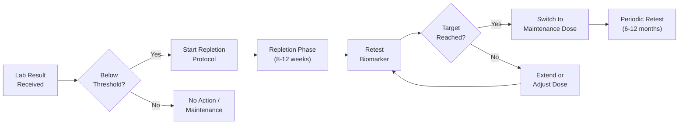
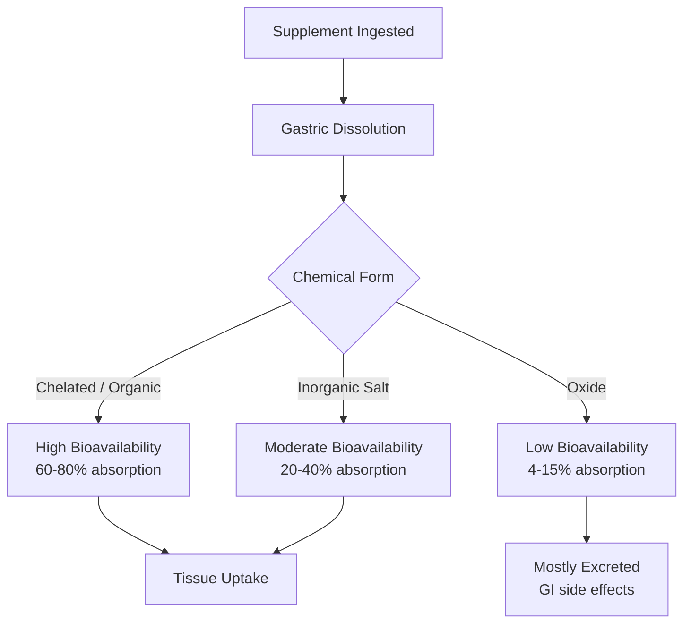
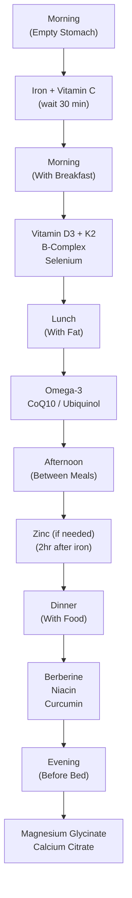

# Evidence-Based Supplement Protocol Reference

> **VitalSync Platform — Clinical Protocol Documentation**
> Version 2.0 · Last Updated: June 2026
> Classification: Internal Clinical Reference

---

## Table of Contents

- [Introduction](#introduction)
- [Evidence Grading System](#evidence-grading-system)
- [Important General Principles](#important-general-principles)
- [Supplement Protocols](#supplement-protocols)
  - [1. Vitamin D Deficiency](#protocol-1-vitamin-d-deficiency)
  - [2. Vitamin D Insufficiency](#protocol-2-vitamin-d-insufficiency)
  - [3. B12 Deficiency](#protocol-3-b12-deficiency)
  - [4. B12 Suboptimal](#protocol-4-b12-suboptimal)
  - [5. Folate Deficiency](#protocol-5-folate-deficiency)
  - [6. Iron Deficiency](#protocol-6-iron-deficiency)
  - [7. Magnesium Insufficiency](#protocol-7-magnesium-insufficiency)
  - [8. Zinc Insufficiency](#protocol-8-zinc-insufficiency)
  - [9. Omega-3 Low](#protocol-9-omega-3-low)
  - [10. Omega-3 Intermediate](#protocol-10-omega-3-intermediate)
  - [11. Elevated Homocysteine](#protocol-11-elevated-homocysteine)
  - [12. High Homocysteine](#protocol-12-high-homocysteine)
  - [13. Elevated hs-CRP](#protocol-13-elevated-hs-crp)
  - [14. Thyroid Support (Subclinical)](#protocol-14-thyroid-support-subclinical)
  - [15. Hashimoto's Nutritional Support](#protocol-15-hashimotos-nutritional-support)
  - [16. Calcium Supplementation Guidelines](#protocol-16-calcium-supplementation-guidelines)
  - [17. Prediabetes Support](#protocol-17-prediabetes-support)
  - [18. Low HDL Support](#protocol-18-low-hdl-support)
- [Supplement Form Guide](#supplement-form-guide)
- [Timing Guide](#timing-guide)
- [References](#references)

---

## Introduction

This document defines every evidence-based supplement recommendation protocol used by VitalSync's personalized healthcare engine. Each protocol is triggered by specific biomarker thresholds, graded by clinical evidence quality, and paired with retest intervals to form a closed-loop optimization cycle.

> [!IMPORTANT]
> VitalSync protocols are **informational supplements** to licensed medical care — they do not constitute diagnosis or treatment. Users are prompted to confirm contraindications and current medications before any recommendation is surfaced.

### Protocol Structure

Every protocol in this document follows a standardized schema:

| Field | Description |
|---|---|
| **Protocol ID** | Unique system identifier (e.g., `PROT-VD-001`) |
| **Trigger** | Biomarker threshold(s) that activate the protocol |
| **Primary Supplement** | Recommended compound and form |
| **Dosage** | Repletion dose and duration |
| **Maintenance** | Long-term maintenance dose after repletion |
| **Preferred Form** | Specific chemical form and absorption notes |
| **Co-Supplements** | Synergistic nutrients to include |
| **Evidence Level** | GRADE quality rating (HIGH / MODERATE / LOW) |
| **Contraindications** | Conditions where protocol must not be applied |
| **Retest Interval** | When to recheck the triggering biomarker |
| **Notes** | Special populations, clinical pearls, edge cases |

---

## Evidence Grading System

VitalSync uses the **GRADE (Grading of Recommendations, Assessment, Development and Evaluations)** framework, the international standard for rating certainty of evidence in clinical guidelines.

### GRADE Evidence Levels

| Level | Icon | Criteria | Interpretation |
|---|---|---|---|
| **HIGH** | 🟢 | Multiple well-designed RCTs, systematic reviews, meta-analyses with consistent results | Very confident the true effect lies close to the estimate |
| **MODERATE** | 🟡 | RCTs with some limitations, strong observational studies, well-designed cohort studies | Moderately confident; true effect is likely close to the estimate but may differ |
| **LOW** | 🟠 | Observational studies, case series, expert consensus, mechanistic reasoning | Limited confidence; true effect may be substantially different from the estimate |

### Factors That Modify Evidence Grades

```
Downgrading Factors          Upgrading Factors
─────────────────────────    ─────────────────────────
• Risk of bias               • Large magnitude of effect
• Inconsistency              • Dose-response gradient
• Indirectness               • All plausible confounders
• Imprecision                  would reduce the effect
• Publication bias
```

### VitalSync Confidence Score Mapping

Evidence grades integrate into VitalSync's recommendation confidence system:

```
GRADE Level  →  Base Confidence  →  With Wearable Correlation  →  With Multi-Biomarker
────────────    ────────────────    ──────────────────────────    ─────────────────────
HIGH             0.85               0.90                          0.95
MODERATE         0.70               0.78                          0.85
LOW              0.55               0.65                          0.72
```

---

## Important General Principles

### 1. Test, Don't Guess

> [!CAUTION]
> **Never recommend supplementation without baseline biomarker data.** Empiric supplementation is only appropriate for well-established, population-level deficiencies (e.g., Vitamin D in northern latitudes) and must be flagged as `empiric` in the recommendation payload.

- Every protocol requires a **triggering biomarker** value from a lab panel
- Wearable data (e.g., WHOOP HRV trends) can **increase confidence** in a recommendation but never **trigger** one independently
- Self-reported symptoms (fatigue, brain fog, poor sleep) serve as **supporting signals** only

### 2. Retest Intervals

Each protocol specifies a retest interval. These are calibrated to the nutrient's pharmacokinetics:

| Nutrient | Half-Life / Repletion Curve | Minimum Retest | Optimal Retest |
|---|---|---|---|
| Vitamin D | ~15 days (serum), 2-3 months (stores) | 8 weeks | 12 weeks |
| B12 | ~6 days (serum), weeks (tissue) | 8 weeks | 12 weeks |
| Folate | ~100 days (RBC folate) | 8 weeks | 12 weeks |
| Iron (Ferritin) | Variable, dose-dependent | 8 weeks | 12 weeks |
| Magnesium (RBC) | Slow tissue repletion | 8 weeks | 12 weeks |
| Zinc | ~14 days (serum) | 6 weeks | 8 weeks |
| Omega-3 Index | ~120 days (RBC membrane) | 12 weeks | 16 weeks |
| Homocysteine | Rapid response to B-vitamins | 6 weeks | 8 weeks |
| hs-CRP | Rapid fluctuation | 6 weeks | 8 weeks |
| HbA1c | ~90-day erythrocyte lifespan | 12 weeks | 12 weeks |
| Lipids (HDL) | Gradual response | 8 weeks | 12 weeks |

### 3. Dose-Time Protocols



### 4. Interaction Awareness

VitalSync's recommendation engine cross-checks every protocol against:
- **Drug-nutrient interactions** (e.g., levothyroxine + calcium/iron separation)
- **Nutrient-nutrient competition** (e.g., zinc ↔ copper, calcium ↔ iron)
- **Condition-nutrient contraindications** (e.g., iron in hemochromatosis)

### 5. Personalization Modifiers

Recommendations adjust based on user profile factors:

| Factor | Modification |
|---|---|
| Age > 65 | Higher B12 dose (reduced intrinsic factor) |
| Pregnancy / Lactation | Folate priority, adjusted Vitamin D |
| Vegan / Vegetarian | B12 mandatory, iron and zinc emphasis |
| High BMI (>30) | Higher Vitamin D dose (volumetric dilution) |
| Chronic GI disease | Prefer sublingual / liquid forms |
| Kidney disease | Restrict Vitamin D dose, monitor calcium |
| Athletic / High-strain | Higher magnesium, omega-3, B-complex |

---

## Supplement Protocols

---

### Protocol 1: Vitamin D Deficiency

| Field | Detail |
|---|---|
| **Protocol ID** | `PROT-VD-001` |
| **Trigger** | 25(OH)D < 20 ng/mL (< 50 nmol/L) |
| **Primary Supplement** | Vitamin D3 (Cholecalciferol) |
| **Dosage** | 5,000–10,000 IU/day for 8–12 weeks |
| **Maintenance** | 2,000–5,000 IU/day |
| **Preferred Form** | D3 over D2 (cholecalciferol > ergocalciferol); take with fat-containing meal for absorption. Softgels or liquid drops preferred over tablets |
| **Co-Supplements** | Vitamin K2 (MK-7) 100–200 mcg/day — directs calcium to bone, prevents arterial calcification |
| **Evidence Level** | 🟢 **HIGH** — Systematic reviews, Endocrine Society Clinical Practice Guideline (2024), multiple RCTs |
| **Contraindications** | Hypercalcemia, hypercalciuria, granulomatous disease (sarcoidosis, TB), Williams syndrome, severe renal impairment without monitoring |
| **Retest Interval** | 12 weeks |
| **Notes** | At-risk groups (>75 yo, pregnant women, prediabetes, dark skin, obesity BMI>30, limited sun exposure) are recommended empiric supplementation even without testing. BMI >30 may require higher loading doses due to volumetric dilution in adipose tissue. Monitor serum calcium if dose exceeds 5,000 IU/day chronically. Target: 40–60 ng/mL |

**Decision Logic:**
```
IF 25OHD < 20:
  dose = 5000 IU/day (default)
  IF BMI > 30: dose = 10000 IU/day
  IF age > 75: dose = 5000 IU/day + monitor calcium
  co_supplement = K2_MK7(200 mcg)
  retest_weeks = 12
  flag_if: granulomatous_disease OR hypercalcemia
```

---

### Protocol 2: Vitamin D Insufficiency

| Field | Detail |
|---|---|
| **Protocol ID** | `PROT-VD-002` |
| **Trigger** | 25(OH)D 20–30 ng/mL (50–75 nmol/L) |
| **Primary Supplement** | Vitamin D3 (Cholecalciferol) |
| **Dosage** | 2,000–4,000 IU/day for 8 weeks |
| **Maintenance** | 1,000–2,000 IU/day |
| **Preferred Form** | D3 softgel or liquid drops; take with largest meal of the day |
| **Co-Supplements** | Vitamin K2 (MK-7) 100 mcg/day |
| **Evidence Level** | 🟢 **HIGH** — Endocrine Society 2024, VITAL trial subgroup analyses |
| **Contraindications** | Same as PROT-VD-001 |
| **Retest Interval** | 12 weeks |
| **Notes** | Insufficiency is highly prevalent (estimated 40–50% of the US adult population). Dietary sources alone (fatty fish, fortified dairy) are rarely sufficient. Consider lifestyle factors: increased outdoor activity, sun exposure 10–15 min/day midday. Target: 40–60 ng/mL |

**Decision Logic:**
```
IF 25OHD >= 20 AND 25OHD < 30:
  dose = 2000 IU/day (default)
  IF BMI > 30: dose = 4000 IU/day
  co_supplement = K2_MK7(100 mcg)
  retest_weeks = 12
  recommend_lifestyle: sun_exposure, dietary_sources
```

---

### Protocol 3: B12 Deficiency

| Field | Detail |
|---|---|
| **Protocol ID** | `PROT-B12-001` |
| **Trigger** | Serum B12 < 200 pg/mL (< 148 pmol/L) |
| **Primary Supplement** | Methylcobalamin or Hydroxocobalamin |
| **Dosage** | 1,000–2,000 mcg/day sublingual for 8–12 weeks; OR 1,000 mcg IM injection weekly × 4, then monthly (physician-directed) |
| **Maintenance** | 1,000 mcg/day sublingual or 1,000 mcg IM monthly |
| **Preferred Form** | Methylcobalamin (active form, no conversion needed) or hydroxocobalamin (longer-acting, better tissue retention). Avoid cyanocobalamin in renal impairment or MTHFR variants. Sublingual preferred over oral tablets for absorption |
| **Co-Supplements** | Folate (5-MTHF) 400–800 mcg — B12 and folate metabolism are interdependent; co-supplement prevents masking of folate deficiency |
| **Evidence Level** | 🟢 **HIGH** — NEJM reviews, ACP guidelines, Cochrane systematic reviews |
| **Contraindications** | Leber's hereditary optic neuropathy (cyanocobalamin form). Caution: do not supplement B12 without checking folate (can mask deficiency). Cobalt allergy (rare) |
| **Retest Interval** | 8–12 weeks; also check methylmalonic acid (MMA) and homocysteine for functional assessment |
| **Notes** | Deficiency prevalent in: vegans/vegetarians (no animal sources), elderly (reduced intrinsic factor/achlorhydria), metformin users, PPI/H2 blocker users, post-bariatric surgery, pernicious anemia. Neuropsychiatric symptoms (peripheral neuropathy, cognitive decline, depression) may precede hematologic findings. If MMA elevated (>0.4 μmol/L), confirms tissue-level deficiency even with borderline serum B12. Target: >400 pg/mL |

**Decision Logic:**
```
IF B12 < 200:
  severity = "deficient"
  IF neurological_symptoms: recommend_IM_injection = true
  IF vegan OR metformin_user OR PPI_user: flag_chronic_risk = true
  dose = methylcobalamin(2000 mcg sublingual)
  co_supplement = folate_5MTHF(800 mcg)
  add_test: [MMA, homocysteine]
  retest_weeks = 8
```

---

### Protocol 4: B12 Suboptimal

| Field | Detail |
|---|---|
| **Protocol ID** | `PROT-B12-002` |
| **Trigger** | Serum B12 200–400 pg/mL (148–295 pmol/L) |
| **Primary Supplement** | Methylcobalamin |
| **Dosage** | 500–1,000 mcg/day sublingual for 8 weeks |
| **Maintenance** | 500 mcg/day sublingual |
| **Preferred Form** | Methylcobalamin sublingual lozenge or liquid |
| **Co-Supplements** | Folate (5-MTHF) 400 mcg if homocysteine elevated |
| **Evidence Level** | 🟡 **MODERATE** — Observational studies showing functional deficiency at levels 200–400, especially with elevated MMA/homocysteine |
| **Contraindications** | Same as PROT-B12-001 |
| **Retest Interval** | 12 weeks; add MMA and homocysteine if not already tested |
| **Notes** | "Suboptimal" range is controversial — many labs report 200–900 as "normal," but functional deficiency symptoms and elevated MMA are frequently observed in the 200–400 range. The Framingham Offspring Study found neurologic symptoms in ~9% of individuals with B12 between 200–300. Optimal target for VitalSync: >500 pg/mL |

---

### Protocol 5: Folate Deficiency

| Field | Detail |
|---|---|
| **Protocol ID** | `PROT-FOL-001` |
| **Trigger** | Serum folate < 3 ng/mL (< 7 nmol/L) or RBC folate < 140 ng/mL |
| **Primary Supplement** | L-Methylfolate (5-MTHF) |
| **Dosage** | 800–1,000 mcg/day for 8–12 weeks |
| **Maintenance** | 400–800 mcg/day |
| **Preferred Form** | L-Methylfolate (5-MTHF, Quatrefolic®) — the bioactive form that bypasses MTHFR polymorphism. Avoid synthetic folic acid in individuals with known MTHFR C677T or A1298C variants |
| **Co-Supplements** | Vitamin B12 (methylcobalamin) 1,000 mcg — **mandatory** co-supplementation to prevent irreversible neurological damage from undiagnosed B12 deficiency masked by folate |
| **Evidence Level** | 🟢 **HIGH** — Strong evidence for NTD prevention (MRC Vitamin Study Trial), hematologic recovery, cardiovascular risk reduction |
| **Contraindications** | Do NOT supplement folate without assessing B12 status (risk of masking B12 deficiency). Caution in epilepsy patients (high-dose folate may reduce seizure threshold). Screen for MTHFR variants if possible |
| **Retest Interval** | 12 weeks (RBC folate preferred over serum for long-term status) |
| **Notes** | Populations at risk: pregnancy planning (begin 3 months before conception), celiac/IBD (malabsorption), alcohol use disorder, methotrexate use (folate antagonist — supplement with leucovorin). Women of childbearing age should maintain RBC folate >400 ng/mL for NTD prevention. MTHFR heterozygous (C677T) reduces enzyme activity by ~35%; homozygous by ~70% — these individuals benefit most from 5-MTHF over folic acid |

---

### Protocol 6: Iron Deficiency

| Field | Detail |
|---|---|
| **Protocol ID** | `PROT-FE-001` |
| **Trigger** | Serum Ferritin < 30 ng/mL (with or without anemia); TSAT < 20% supports diagnosis |
| **Primary Supplement** | Iron Bisglycinate (Ferrochel®) |
| **Dosage** | 25–50 mg elemental iron every other day for 8–12 weeks |
| **Maintenance** | Diet-first approach; 15–25 mg every other day if dietary intake insufficient |
| **Preferred Form** | Iron bisglycinate chelate — superior GI tolerability, does not require acidic environment for absorption. Alternative: ferrous sulfate (cheaper but more GI side effects). Avoid iron oxide. Liquid ferrous sulfate for those who cannot tolerate capsules |
| **Co-Supplements** | Vitamin C 200–500 mg (taken with iron to enhance non-heme absorption by reducing Fe³⁺ to Fe²⁺). Avoid concurrent calcium, coffee, tea, phytates (inhibit absorption) |
| **Evidence Level** | 🟢 **HIGH** — Cochrane reviews, WHO guidelines, alternate-day dosing supported by hepcidin-mediated absorption studies (Stoffel et al., Lancet Haematol 2017) |
| **Contraindications** | Hemochromatosis (HFE gene mutations), hemosiderosis, thalassemia major (iron loading), active inflammatory states (ferritin is an acute phase reactant — check CRP concurrently). Do NOT supplement iron if ferritin >100 without clear clinical indication |
| **Retest Interval** | 8–12 weeks; check full iron panel (ferritin, TIBC, serum iron, TSAT) + CBC |
| **Notes** | **Alternate-day dosing is now preferred** over daily — acute iron doses trigger hepcidin elevation within 6–8 hours, which blocks intestinal absorption for ~24 hours. Taking iron every other day on an empty stomach in the morning optimizes fractional absorption. Target ferritin: 50–100 ng/mL for general health, 50–150 for athletes. Pre-menopausal women, endurance athletes, and vegetarians are highest-risk groups. Always rule out GI blood loss (occult bleeding) in unexplained iron deficiency |

> [!WARNING]
> Iron supplementation requires confirmed deficiency via lab testing. Excess iron is pro-oxidant and cannot be easily excreted. Always check ferritin + CRP together (elevated CRP falsely elevates ferritin as an acute-phase reactant).

---

### Protocol 7: Magnesium Insufficiency

| Field | Detail |
|---|---|
| **Protocol ID** | `PROT-MG-001` |
| **Trigger** | RBC Magnesium < 5.0 mg/dL (or serum Mg < 2.0 mg/dL, though serum is a poor marker — only 1% of body Mg is extracellular) |
| **Primary Supplement** | Magnesium Glycinate (Bisglycinate) or Magnesium L-Threonate |
| **Dosage** | 300–400 mg elemental magnesium/day (split into 2 doses) for 8–12 weeks |
| **Maintenance** | 200–300 mg/day |
| **Preferred Form** | **Glycinate** — high bioavailability, calming effect, minimal GI side effects. **L-Threonate** — crosses BBB, preferred for cognitive/neurological symptoms. **Taurate** — preferred for cardiovascular indications. **Citrate** — good bioavailability but may cause loose stools. **Oxide** — avoid (poor bioavailability ~4%, primarily osmotic laxative) |
| **Co-Supplements** | Vitamin B6 (P5P) 25–50 mg — enhances cellular magnesium uptake. Vitamin D — Mg is a cofactor for vitamin D metabolism (25-hydroxylase and 1α-hydroxylase) |
| **Evidence Level** | 🟡 **MODERATE** — Multiple RCTs for blood pressure reduction, glucose metabolism; observational data for sleep quality, anxiety, cramping. Systematic review (Zhang et al., Nutrients 2017) |
| **Contraindications** | Severe renal impairment (GFR < 30, risk of hypermagnesemia), myasthenia gravis, heart block |
| **Retest Interval** | 12 weeks (RBC Magnesium preferred over serum) |
| **Notes** | Magnesium deficiency is estimated at 50–80% of the US population due to soil depletion, processed food diets, and stress-induced excretion. Subclinical deficiency is strongly associated with: insomnia, anxiety, muscle cramps, migraines, hypertension, insulin resistance, and arrhythmias. WHOOP correlation: low HRV and poor sleep scores often improve with magnesium repletion. Athletes require higher intake due to sweat losses (~15 mg/L sweat). Dietary sources: dark leafy greens, nuts, seeds, dark chocolate |

---

### Protocol 8: Zinc Insufficiency

| Field | Detail |
|---|---|
| **Protocol ID** | `PROT-ZN-001` |
| **Trigger** | Serum Zinc < 80 mcg/dL (< 12.2 μmol/L); or plasma zinc < 70 mcg/dL |
| **Primary Supplement** | Zinc Picolinate or Zinc Bisglycinate |
| **Dosage** | 30–50 mg/day for 8 weeks |
| **Maintenance** | 15–25 mg/day |
| **Preferred Form** | **Picolinate** — highest bioavailability in comparative studies. **Bisglycinate** — good absorption, gentle on stomach. **Citrate** — acceptable alternative. **Gluconate** — adequate. **Oxide** — avoid (poor absorption ~50% less than picolinate) |
| **Co-Supplements** | Copper 1–2 mg/day — **mandatory when supplementing zinc >30 mg/day for >4 weeks** (zinc induces metallothionein which traps copper, causing copper deficiency). Maintain zinc:copper ratio of 10:1 to 15:1 |
| **Evidence Level** | 🟡 **MODERATE** — RCTs for immune function, wound healing, testosterone; observational data for taste/smell, skin health |
| **Contraindications** | Caution with concurrent quinolone or tetracycline antibiotics (chelation). Separate from iron supplements by 2 hours (competitive absorption via DMT1) |
| **Retest Interval** | 8 weeks |
| **Notes** | Zinc is a cofactor for >300 enzymes, including those in immune function, DNA synthesis, wound healing, and testosterone metabolism. Common in: vegetarians/vegans (phytate-rich diets), elderly, athletes (sweat losses), chronic GI disease. Low zinc + low HRV on WHOOP may indicate immune stress. Best taken on empty stomach; if nausea occurs, take with food (reduces absorption ~15–20%). Oysters are the most zinc-dense food (74 mg per 3 oz serving) |

---

### Protocol 9: Omega-3 Low

| Field | Detail |
|---|---|
| **Protocol ID** | `PROT-O3-001` |
| **Trigger** | Omega-3 Index < 4% (high cardiovascular risk zone) |
| **Primary Supplement** | High-potency EPA+DHA Fish Oil or Algal Oil |
| **Dosage** | 3,000–4,000 mg combined EPA+DHA per day for 12–16 weeks |
| **Maintenance** | 2,000–3,000 mg combined EPA+DHA per day |
| **Preferred Form** | **Triglyceride (rTG) form** — 70% better absorption than ethyl ester (EE) form. Look for IFOS 5-star certified products. Algal oil (DHA-rich) for vegans/vegetarians. Take with fat-containing meal. Must be **molecularly distilled** (removes mercury, PCBs, dioxins). EPA:DHA ratio depends on goal — 2:1 EPA:DHA for inflammation; 1:2 DHA:EPA for cognition/brain health |
| **Co-Supplements** | Vitamin E (mixed tocopherols) 200 IU — prevents lipid peroxidation of omega-3 fatty acids in vivo. Most quality fish oils include this |
| **Evidence Level** | 🟢 **HIGH** — REDUCE-IT trial (Bhatt et al., NEJM 2019), VITAL trial, JELIS trial, multiple meta-analyses for cardiovascular mortality reduction |
| **Contraindications** | Fish/shellfish allergy (use algal oil). Caution with anticoagulants (warfarin, DOACs) at doses >3g EPA+DHA — monitor INR. Caution pre-surgery (theoretical bleeding risk at high doses, though clinically minimal) |
| **Retest Interval** | 16 weeks (Omega-3 Index reflects 120-day RBC membrane turnover) |
| **Notes** | Omega-3 Index <4% is associated with a 10× higher risk of sudden cardiac death compared to >8% (Harris & Von Schacky, 2004). This is a **critical deficiency** state. WHOOP correlation: chronically elevated hs-CRP + low HRV + low Omega-3 Index represents a high-priority intervention triad. Target: 8–12% (cardioprotective zone). Japanese populations with traditional diets average 8–12% |

---

### Protocol 10: Omega-3 Intermediate

| Field | Detail |
|---|---|
| **Protocol ID** | `PROT-O3-002` |
| **Trigger** | Omega-3 Index 4–8% (moderate risk zone) |
| **Primary Supplement** | EPA+DHA Fish Oil or Algal Oil |
| **Dosage** | 2,000–3,000 mg combined EPA+DHA per day for 12 weeks |
| **Maintenance** | 1,000–2,000 mg combined EPA+DHA per day |
| **Preferred Form** | Same as PROT-O3-001 — rTG form, IFOS certified |
| **Co-Supplements** | Vitamin E (mixed tocopherols) if not included in product |
| **Evidence Level** | 🟡 **MODERATE** — Dose-response data from intervention trials, prospective cohort data |
| **Contraindications** | Same as PROT-O3-001 |
| **Retest Interval** | 12–16 weeks |
| **Notes** | Most Western populations fall in this range. Dietary optimization should be first-line: 2–3 servings fatty fish per week (salmon, sardines, mackerel, anchovies — the "SMASH" fish). Supplementation bridges the gap to the 8–12% target. If combined with elevated hs-CRP or low HRV on WHOOP, prioritize higher end of dosing range |

---

### Protocol 11: Elevated Homocysteine

| Field | Detail |
|---|---|
| **Protocol ID** | `PROT-HCY-001` |
| **Trigger** | Plasma Homocysteine > 8 μmol/L (functional elevation, suboptimal methylation) |
| **Primary Supplement** | B-Complex — Methylated forms |
| **Dosage** | L-Methylfolate (5-MTHF) 800 mcg + Methylcobalamin (B12) 1,000 mcg + Pyridoxal-5-Phosphate (P5P/B6) 25–50 mg, daily for 8 weeks |
| **Maintenance** | 5-MTHF 400 mcg + B12 500 mcg + P5P 25 mg daily |
| **Preferred Form** | All methylated/active forms — critical for ~40% of population with MTHFR variants who cannot efficiently convert synthetic vitamins to active forms. Sublingual B12 preferred |
| **Co-Supplements** | Riboflavin (B2) 25–50 mg — cofactor for MTHFR enzyme, especially important for C677T carriers. Betaine (TMG) 500–1,500 mg — provides alternative homocysteine remethylation pathway via BHMT enzyme |
| **Evidence Level** | 🟡 **MODERATE** — Homocysteine-lowering reliably achieved with B-vitamins (Swiss Heart Study, HOPE-2); CVD event reduction data is mixed but trending positive in recent meta-analyses. Strong evidence for cognitive decline prevention (VITACOG trial: Smith et al., PLoS ONE 2010) |
| **Contraindications** | Caution with P5P >100 mg/day chronically (risk of peripheral neuropathy). Check B12 before starting high-dose folate |
| **Retest Interval** | 8 weeks; homocysteine responds rapidly to B-vitamin supplementation |
| **Notes** | Homocysteine >8 μmol/L is considered functionally elevated by emerging evidence, though many labs use >15 as the threshold for "high." Optimal target: 6–8 μmol/L. Elevated homocysteine reflects impaired methylation — a central metabolic process affecting DNA repair, neurotransmitter synthesis, detoxification, and cardiovascular health. MTHFR genotyping is informative but not required — empiric methylated B-vitamin supplementation is safe and effective regardless of genotype |

---

### Protocol 12: High Homocysteine

| Field | Detail |
|---|---|
| **Protocol ID** | `PROT-HCY-002` |
| **Trigger** | Plasma Homocysteine > 12 μmol/L (clearly elevated, increased CVD risk) |
| **Primary Supplement** | High-dose methylated B-Complex |
| **Dosage** | L-Methylfolate 5,000 mcg (5 mg) + Methylcobalamin 5,000 mcg (5 mg) sublingual + P5P 50 mg + Riboflavin 50 mg, daily for 8–12 weeks |
| **Maintenance** | 5-MTHF 1,000 mcg + B12 1,000 mcg + P5P 50 mg daily |
| **Preferred Form** | High-dose methylated forms. Consider liposomal delivery for enhanced absorption |
| **Co-Supplements** | Betaine (TMG) 1,500–3,000 mg/day — becomes important at high homocysteine levels as an alternative remethylation pathway. NAC (N-Acetyl Cysteine) 600–1,200 mg — supports glutathione and cysteine metabolism downstream of homocysteine |
| **Evidence Level** | 🟡 **MODERATE** — Strong evidence for homocysteine reduction; moderate for clinical endpoint improvement. VITACOG trial demonstrated slowed brain atrophy in MCI patients with elevated homocysteine |
| **Contraindications** | Same as PROT-HCY-001. Physician referral recommended for homocysteine >15 to rule out CBS deficiency, renal impairment, or B12 deficiency with neurological involvement |
| **Retest Interval** | 6–8 weeks |
| **Notes** | Homocysteine >12 is associated with 3× increased risk of cardiovascular events (meta-analysis: Humphrey et al., Mayo Clin Proc 2008). Also associated with increased risk of Alzheimer's disease, osteoporotic fracture, and pregnancy complications. If homocysteine does not respond to B-vitamin supplementation within 8 weeks, consider: renal function assessment (Cr, eGFR), CBS enzyme deficiency, medication effects (methotrexate, phenytoin, carbamazepine), or hypothyroidism |

---

### Protocol 13: Elevated hs-CRP

| Field | Detail |
|---|---|
| **Protocol ID** | `PROT-CRP-001` |
| **Trigger** | hs-CRP > 1.0 mg/L (elevated systemic inflammation; >3.0 = high risk per AHA/CDC classification) |
| **Primary Supplement** | EPA-dominant Omega-3 + Curcumin |
| **Dosage** | EPA 2,000–3,000 mg/day (high-EPA fish oil) + Curcumin (as Meriva® or Longvida® formulation) 500–1,000 mg/day for 8–12 weeks |
| **Maintenance** | EPA 1,000–2,000 mg/day + Curcumin 500 mg/day |
| **Preferred Form** | EPA-dominant fish oil in rTG form. Curcumin must be in **enhanced bioavailability** formulation — standard curcumin/turmeric powder has <1% bioavailability. Recommended: Meriva® (phytosome), Longvida® (SLCP), or CurcuWIN® (UltraSOL). Piperine-containing formulations (BioPerine) increase absorption 2,000% but interact with drug metabolism (CYP3A4 inhibition) |
| **Co-Supplements** | Vitamin D3 2,000–4,000 IU (anti-inflammatory via VDR activation). Magnesium glycinate 300 mg (CRP independently associated with Mg deficiency). SPMs (Specialized Pro-resolving Mediators) — emerging evidence |
| **Evidence Level** | 🟡 **MODERATE** — REDUCE-IT established EPA benefit; curcumin meta-analyses show CRP reduction (Sahebkar et al., Pharmacol Res 2016). Anti-inflammatory lifestyle (diet, exercise, sleep) has strongest evidence |
| **Contraindications** | Rule out acute infection or tissue injury (CRP is a non-specific acute phase reactant — retest if recent illness/surgery/trauma). Curcumin: caution with gallbladder disease, bile duct obstruction, anticoagulants (mild antiplatelet effect). Do not use curcumin with piperine if on narrow-therapeutic-index drugs (cyclosporine, tacrolimus) |
| **Retest Interval** | 8 weeks; ensure no acute illness at time of draw |
| **Notes** | hs-CRP is the best-validated circulating biomarker of systemic inflammation and independent CVD risk predictor (JUPITER trial). However, it is **non-specific** — lifestyle factors are the primary intervention. Before supplementation, optimize: sleep quality (WHOOP sleep score), exercise (regular but not overtraining — check strain/recovery ratio), stress management, and anti-inflammatory diet (Mediterranean pattern). Persistent CRP >3.0 despite optimization warrants physician evaluation for occult inflammatory conditions |

> [!TIP]
> WHOOP integration signal: If hs-CRP is elevated AND WHOOP shows persistent low recovery (<50% for 3+ days) + elevated resting heart rate, this represents a high-confidence inflammatory state that strengthens the recommendation.

---

### Protocol 14: Thyroid Support (Subclinical)

| Field | Detail |
|---|---|
| **Protocol ID** | `PROT-THY-001` |
| **Trigger** | TSH 2.5–4.5 mIU/L with symptoms (fatigue, cold intolerance, weight gain, brain fog) AND normal Free T4/T3. Not applicable if TSH >4.5 (refer to physician for medication evaluation) |
| **Primary Supplement** | Selenium + Iodine (with caution) + Zinc |
| **Dosage** | Selenium (as selenomethionine) 200 mcg/day + Iodine (as potassium iodide) 150–200 mcg/day + Zinc picolinate 25 mg/day, for 12 weeks |
| **Maintenance** | Selenium 100–200 mcg/day + Iodine 150 mcg/day + Zinc 15 mg/day |
| **Preferred Form** | Selenium: **selenomethionine** (organic form, better retention) or selenium yeast. Iodine: potassium iodide or kelp extract (standardized). Avoid high-dose iodine (>500 mcg) — can worsen autoimmune thyroiditis |
| **Co-Supplements** | Iron (if ferritin <50 — iron is required for thyroid peroxidase function). Vitamin D (thyroid autoimmunity strongly associated with D deficiency). Vitamin A (retinol) 2,500–5,000 IU — required for T3 receptor binding |
| **Evidence Level** | 🟡 **MODERATE** — Selenium: multiple RCTs showing TPO antibody reduction in autoimmune thyroiditis (Toulis et al., Thyroid 2010). Iodine: essential nutrient for thyroid hormone synthesis but complex dose-response |
| **Contraindications** | **Iodine**: do NOT supplement if TPO antibodies are elevated (Hashimoto's — see PROT-THY-002) without specialist guidance, as iodine can exacerbate autoimmune thyroiditis. Selenium: do not exceed 400 mcg/day (upper tolerable limit; risk of selenosis). Brazil nuts: 1–2/day provides ~55–200 mcg selenium naturally |
| **Retest Interval** | 12 weeks; full thyroid panel (TSH, Free T4, Free T3, TPO antibodies, thyroglobulin antibodies) |
| **Notes** | Subclinical hypothyroidism is defined as elevated TSH with normal FT4/FT3. Treatment is controversial — nutritional optimization is a reasonable first-line approach when TSH is mildly elevated (2.5–4.5). If TSH >4.5 or symptoms persist after 12 weeks of nutritional optimization, refer for levothyroxine evaluation. Always check thyroid antibodies to rule out Hashimoto's before iodine supplementation. WHOOP correlation: persistent low recovery + elevated RHR + fatigue may be early signals |

---

### Protocol 15: Hashimoto's Nutritional Support

| Field | Detail |
|---|---|
| **Protocol ID** | `PROT-THY-002` |
| **Trigger** | Positive TPO antibodies (>35 IU/mL) and/or thyroglobulin antibodies (>20 IU/mL), regardless of TSH level |
| **Primary Supplement** | Selenium + Vitamin D3 + Magnesium |
| **Dosage** | Selenium (selenomethionine) 200 mcg/day + Vitamin D3 4,000–5,000 IU/day + Magnesium glycinate 300–400 mg/day for 12 weeks |
| **Maintenance** | Selenium 200 mcg/day + Vitamin D3 2,000–4,000 IU/day + Magnesium 200–300 mg/day |
| **Preferred Form** | Selenium: selenomethionine (consistent evidence in Hashimoto's trials). Vitamin D3: softgel with K2. Magnesium: glycinate for calming effects (Hashimoto's patients often have concurrent anxiety) |
| **Co-Supplements** | Zinc picolinate 25 mg + Copper 2 mg. Omega-3 (EPA+DHA) 2,000 mg/day (anti-inflammatory). B-Complex (methylated) for energy and methylation support. **Myo-inositol** 2,000–4,000 mg/day — emerging evidence for TSH reduction and TPO antibody lowering in subclinical hypothyroidism (Nordio & Basciani, Int J Endocrinol 2017) |
| **Evidence Level** | 🟡 **MODERATE** — Selenium: strong RCT evidence for TPO antibody reduction (20–40% over 12 months). Vitamin D: observational associations, emerging interventional data. Myo-inositol: promising but limited RCTs |
| **Contraindications** | **Do NOT supplement iodine** in confirmed Hashimoto's without endocrinologist guidance (iodine can trigger thyroiditis flares and increase TPO antibodies). Avoid gluten if celiac disease comorbidity present (high overlap with Hashimoto's) |
| **Retest Interval** | 12 weeks; track TPO antibody trend over time (goal: downward trajectory) |
| **Notes** | Hashimoto's is the most common autoimmune disease and the #1 cause of hypothyroidism in iodine-sufficient countries. Nutritional support focuses on: (1) reducing autoimmune inflammation (selenium, D, omega-3), (2) supporting thyroid hormone synthesis (selenium is required for deiodinase enzymes), (3) addressing common comorbid deficiencies. Lifestyle factors are critical: gluten elimination trial (3–6 months), stress management (cortisol-thyroid axis), gut health optimization (intestinal permeability is implicated). This protocol complements, not replaces, thyroid hormone medication if prescribed |

---

### Protocol 16: Calcium Supplementation Guidelines

| Field | Detail |
|---|---|
| **Protocol ID** | `PROT-CA-001` |
| **Trigger** | Dietary calcium intake < 800 mg/day (assessed via dietary questionnaire) AND one or more risk factors: female >50, male >70, osteopenia/osteoporosis diagnosis, postmenopausal, corticosteroid use |
| **Primary Supplement** | Calcium Citrate (preferred) or food-first approach |
| **Dosage** | 500–600 mg/day in divided doses (not to exceed 500 mg per dose for optimal absorption), to bridge dietary gap. Total dietary + supplemental calcium target: 1,000–1,200 mg/day |
| **Maintenance** | Same; ongoing based on dietary assessment |
| **Preferred Form** | **Calcium citrate** — does not require stomach acid for absorption (important for elderly, PPI users), can be taken with or without food. **Calcium carbonate** — more elemental calcium per pill (40% vs 21%) but requires stomach acid, take with meals. **Avoid**: calcium from unrefined sources (bone meal, dolomite, oyster shell) due to potential heavy metal contamination |
| **Co-Supplements** | **Vitamin D3** 2,000–4,000 IU — **essential** for calcium absorption (VDR-mediated intestinal calcium transport). **Vitamin K2 (MK-7)** 100–200 mcg — directs calcium to bone matrix and prevents arterial/soft tissue calcification. **Magnesium** 200–300 mg — synergistic with calcium; maintains Ca:Mg balance |
| **Evidence Level** | 🟡 **MODERATE** — Calcium supplementation for bone health is well-established (WHI trial), but recent meta-analyses raise concerns about cardiovascular risk with calcium supplements without K2 (Bolland et al., BMJ 2010). Food-first approach preferred |
| **Contraindications** | Hypercalcemia, hyperparathyroidism, renal calculi (calcium oxalate stones — though adequate calcium may actually reduce oxalate absorption), severe renal impairment. Do NOT supplement calcium without vitamin D and K2 |
| **Retest Interval** | 12 months (bone density scan if osteopenia); serum calcium and PTH at 12 weeks if supplementing |
| **Notes** | **Food-first approach is strongly preferred.** Dietary calcium from dairy, sardines (with bones), fortified foods, leafy greens, and tofu is better absorbed and not associated with cardiovascular risk. Supplemental calcium should only bridge a gap, not replace dietary sources. Never exceed 500 mg per dose — absorption efficiency drops sharply above this threshold. Always pair with K2 to prevent vascular calcification. The calcium-paradox: countries with highest dairy/calcium intake have highest osteoporosis rates — this is likely due to inadequate K2, D, and weight-bearing exercise. WHOOP has no direct calcium correlation |

> [!WARNING]
> Calcium supplementation without adequate Vitamin K2 may increase cardiovascular calcification risk. Always co-supplement with K2 (MK-7 form, 100–200 mcg/day). Food-first approach is preferred over supplements.

---

### Protocol 17: Prediabetes Support

| Field | Detail |
|---|---|
| **Protocol ID** | `PROT-DM-001` |
| **Trigger** | HbA1c 5.7–6.4% OR Fasting glucose 100–125 mg/dL |
| **Primary Supplement** | Berberine + Chromium + Magnesium |
| **Dosage** | Berberine HCl 500 mg 2–3×/day with meals (total 1,000–1,500 mg/day) + Chromium picolinate 500–1,000 mcg/day + Magnesium glycinate 300–400 mg/day, for 12 weeks |
| **Maintenance** | Berberine 500 mg 2×/day + Chromium 500 mcg + Magnesium 200–300 mg |
| **Preferred Form** | Berberine: **HCl salt** (standard); **Dihydroberberine** (GlucoVantage®) has 5× better absorption at lower doses. Chromium: **picolinate** (most studied form). Magnesium: **glycinate** (insulin sensitivity benefits + sleep support) |
| **Co-Supplements** | Alpha-Lipoic Acid (R-ALA) 300–600 mg/day — improves insulin sensitivity and glucose uptake. Vitamin D3 4,000 IU (deficiency strongly associated with insulin resistance). Omega-3 2,000 mg EPA+DHA (metabolic inflammation). Cinnamon extract (Cinnamomum cassia) 500 mg — modest evidence for fasting glucose reduction |
| **Evidence Level** | 🟡 **MODERATE** — Berberine: multiple RCTs comparable to metformin for glucose reduction (Yin et al., Metabolism 2008; Liang et al., Evidence-Based CAM 2019). Chromium: meta-analyses show modest HbA1c improvement. Lifestyle (diet + exercise) has strongest evidence (DPP trial: 58% diabetes risk reduction) |
| **Contraindications** | Berberine: do NOT combine with metformin without physician supervision (additive hypoglycemia risk, CYP3A4/2D6 interactions). Avoid in pregnancy/lactation. Caution with CYP3A4-metabolized drugs (statins, immunosuppressants). Berberine may cause GI upset — titrate dose slowly. Chromium: caution in renal impairment |
| **Retest Interval** | 12 weeks (HbA1c reflects ~90-day glycemic average) |
| **Notes** | **Lifestyle intervention is the primary treatment for prediabetes** — supplementation is adjunctive. DPP trial demonstrated 150 min/week moderate exercise + 7% weight loss reduces diabetes conversion by 58% (vs 31% for metformin). WHOOP correlation: poor sleep (<6 hours) and high strain without recovery are independently associated with insulin resistance. Optimizing sleep quality (target: WHOOP sleep performance >85%) is a critical co-intervention. Berberine activates AMPK (same pathway as metformin), improves insulin sensitivity, and has lipid-lowering effects. Monitor liver function (ALT/AST) if using berberine long-term |

---

### Protocol 18: Low HDL Support

| Field | Detail |
|---|---|
| **Protocol ID** | `PROT-LIP-001` |
| **Trigger** | HDL-C < 40 mg/dL (men) or < 50 mg/dL (women) |
| **Primary Supplement** | Niacin (Vitamin B3) + Omega-3 + Exercise |
| **Dosage** | Niacin (as inositol hexanicotinate "flush-free" or extended-release) 500–1,500 mg/day (titrate slowly over 4 weeks) + EPA+DHA 2,000–3,000 mg/day for 12 weeks |
| **Maintenance** | Niacin 500–1,000 mg/day + Omega-3 1,000–2,000 mg/day |
| **Preferred Form** | **Inositol hexanicotinate** — "flush-free" niacin, better tolerated. **Extended-release niacin** — reduces flushing but monitor liver function. Avoid immediate-release niacin >500 mg (significant flushing). **Never use sustained-release niacin** (hepatotoxicity risk). Omega-3 in rTG form |
| **Co-Supplements** | Magnesium 300 mg (lipid metabolism support). Vitamin D3 2,000–4,000 IU (low D associated with dyslipidemia). Olive oil / EVOO — dietary monounsaturated fats raise HDL. Citrus bergamot extract 500–1,000 mg — emerging evidence for lipid profile improvement |
| **Evidence Level** | 🟡 **MODERATE** — Niacin is the most effective pharmacologic HDL-raiser (15–35% increase), but AIM-HIGH and HPS2-THRIVE trials questioned cardiovascular benefit of niacin added to statin therapy. As monotherapy in non-statin patients, evidence is more favorable. Exercise is the strongest lifestyle intervention for HDL (5–10% increase) |
| **Contraindications** | Niacin: active liver disease, peptic ulcer, gout (raises uric acid), uncontrolled diabetes (can worsen glucose control at high doses). Monitor LFTs at baseline and 12 weeks. Caution with statin combination (myopathy risk, though lower with niacin than fibrates) |
| **Retest Interval** | 12 weeks; include comprehensive lipid panel with ApoB, Lp(a), LDL-P if available |
| **Notes** | **Exercise is the single most effective HDL intervention** — aerobic exercise 150+ min/week raises HDL 5–10%. Weight loss (especially visceral fat reduction) is second most effective. Smoking cessation raises HDL ~5 mg/dL. Moderate alcohol consumption raises HDL but is not recommended as an intervention. Low HDL in isolation is less predictive of CVD than previously thought — ApoB and LDL particle count are stronger predictors. Focus on metabolic health holistically: insulin sensitivity (see PROT-DM-001), inflammation (PROT-CRP-001), and triglyceride:HDL ratio (<2.0 optimal). WHOOP correlation: regular high-strain cardiovascular exercise with adequate recovery is the best wearable-tracked behavior for HDL optimization |

---

## Supplement Form Guide

Understanding **why supplement form matters** is critical. The same mineral in different chemical forms can have dramatically different absorption rates, side effect profiles, and clinical utility.

### Why Form Matters



### Magnesium Forms

| Form | Bioavailability | Best For | Notes |
|---|---|---|---|
| **Glycinate (Bisglycinate)** | ★★★★★ | Sleep, anxiety, muscle cramps, general repletion | Chelated to glycine (calming amino acid). Minimal GI side effects. Best all-around form |
| **L-Threonate** | ★★★★☆ | Cognitive function, memory, brain health | Only form shown to cross the blood-brain barrier. MagteinⓇ brand patented form. Higher cost |
| **Taurate** | ★★★★☆ | Cardiovascular, arrhythmias, blood pressure | Chelated to taurine (cardiovascular amino acid). Stabilizes cell membranes |
| **Malate** | ★★★★☆ | Fatigue, fibromyalgia, energy production | Malic acid participates in Krebs cycle. Good for chronic fatigue |
| **Citrate** | ★★★☆☆ | General repletion, constipation | Good bioavailability, mild osmotic laxative effect. Can be beneficial or a side effect |
| **Orotate** | ★★★☆☆ | Athletic performance, cardiac tissue | Orotic acid supports pyrimidine synthesis. Popular in sports nutrition |
| **Oxide** | ★☆☆☆☆ | Constipation (osmotic laxative only) | ~4% bioavailability. Essentially a laxative. Avoid for repletion |
| **Sulfate (Epsom salt)** | ★★☆☆☆ | Topical / bath use only | Poorly absorbed orally. Transdermal absorption debated |

### Iron Forms

| Form | Bioavailability | GI Tolerance | Notes |
|---|---|---|---|
| **Bisglycinate (Ferrochel®)** | ★★★★★ | ★★★★★ | Chelated, bypasses hepcidin regulation partially. Best tolerated |
| **Ferrous sulfate** | ★★★☆☆ | ★★☆☆☆ | Most studied, cheapest. Significant constipation/nausea. 20% elemental iron |
| **Ferrous fumarate** | ★★★☆☆ | ★★☆☆☆ | 33% elemental iron. Similar side effects to sulfate |
| **Ferrous gluconate** | ★★★☆☆ | ★★★☆☆ | 12% elemental iron. Slightly better tolerated than sulfate |
| **Polysaccharide iron complex** | ★★★★☆ | ★★★★☆ | Good tolerance, moderate absorption. Ferritin-based |
| **Carbonyl iron** | ★★★☆☆ | ★★★★☆ | Pure microparticulate iron. Low toxicity risk |
| **Ferric iron (Fe³⁺)** | ★★☆☆☆ | ★★★☆☆ | Must be reduced to Fe²⁺ for absorption. Less efficient |

### B12 Forms

| Form | Bioavailability | Conversion Needed | Best For |
|---|---|---|---|
| **Methylcobalamin** | ★★★★★ | None (active form) | General repletion, neurological symptoms, MTHFR carriers |
| **Hydroxocobalamin** | ★★★★★ | Minimal | Long-acting (IM injection), cyanide detoxification, smokers |
| **Adenosylcobalamin** | ★★★★☆ | None (mitochondrial form) | Energy production, mitochondrial support |
| **Cyanocobalamin** | ★★★☆☆ | Requires conversion | Cheapest, most stable. Avoid in renal impairment (cyanide moiety) |

### Zinc Forms

| Form | Bioavailability | Notes |
|---|---|---|
| **Picolinate** | ★★★★★ | Highest absorption in comparative studies |
| **Bisglycinate** | ★★★★☆ | Gentle on stomach, good absorption |
| **Citrate** | ★★★★☆ | Well-absorbed, widely available |
| **Acetate** | ★★★☆☆ | Used in lozenge form for cold treatment |
| **Gluconate** | ★★★☆☆ | Adequate absorption, commonly available |
| **Oxide** | ★★☆☆☆ | ~50% less absorbed than picolinate. Cheap but ineffective |
| **Sulfate** | ★★☆☆☆ | High GI side effects. Avoid |

### Folate Forms

| Form | Bioavailability | Notes |
|---|---|---|
| **L-Methylfolate (5-MTHF)** | ★★★★★ | Bioactive form. Bypasses MTHFR. Quatrefolic® or Metafolin® brands |
| **Folinic acid (5-formyl THF)** | ★★★★☆ | Active form, does not require MTHFR. Used in methotrexate rescue |
| **Folic acid (synthetic)** | ★★★☆☆ | Requires DHFR and MTHFR conversion. Unmetabolized folic acid (UMFA) in serum at >200 mcg doses is a concern |

---

## Timing Guide

Supplement timing can significantly impact absorption, efficacy, and tolerability. This guide provides evidence-based timing recommendations.

### Master Timing Table

| Supplement | Best Time | With Food? | Key Rationale |
|---|---|---|---|
| **Vitamin D3** | Morning or lunch | ✅ With fat-containing meal | Fat-soluble; requires bile for micelle formation. May disrupt sleep if taken late evening (some evidence for melatonin suppression) |
| **Vitamin K2** | With Vitamin D3 | ✅ With fat-containing meal | Fat-soluble; synergistic with D3. Take together |
| **B12** | Morning | ❌ Empty stomach or with food | Energy-promoting; may disrupt sleep if taken evening. Sublingual absorption independent of food |
| **B-Complex** | Morning | ✅ Light meal | Riboflavin (B2) absorbed better with food. B6 can cause vivid dreams if taken late. Energy-promoting |
| **Folate (5-MTHF)** | Morning | ❌ Empty stomach or with food | Absorption not significantly food-dependent |
| **Iron** | Morning, alternate days | ❌ Empty stomach | Hepcidin-mediated absorption best in AM. Vitamin C co-administration enhances absorption. Separate from calcium, coffee, tea by 2+ hours |
| **Magnesium** | Evening (glycinate/threonate) | ✅ With or without food | Calming effect supports sleep. Split doses if >300 mg. Morning for malate/citrate if using for energy |
| **Zinc** | Evening or between meals | ❌ Empty stomach preferred | Can cause nausea if empty stomach — take with small meal if needed. Separate from iron by 2 hours. Separate from calcium by 2 hours |
| **Calcium** | Divided doses, away from iron | ✅ Carbonate: with food / Citrate: any time | Never >500 mg per dose. Separate from levothyroxine by 4 hours, from iron by 2 hours |
| **Omega-3 (Fish Oil)** | With largest meal | ✅ With fat-containing meal | Fat-soluble; absorption increased 3× with high-fat meal vs. empty stomach |
| **Curcumin** | With meals | ✅ With fat + black pepper | Fat-soluble. Piperine (if included) increases absorption 2,000% |
| **Berberine** | With meals, 2-3×/day | ✅ With meals | Reduces postprandial glucose spike. GI tolerance better with food. Split dosing maintains plasma levels |
| **Niacin** | With dinner | ✅ With food | Reduces flushing. Aspirin 81 mg 30 min prior further reduces flush (if not contraindicated) |
| **Selenium** | Morning | ✅ With food | Food reduces GI irritation. Can take with other morning supplements |
| **CoQ10 / Ubiquinol** | Morning or lunch | ✅ With fat-containing meal | Fat-soluble. Energy-promoting — avoid evening |

### Timing Conflict Resolution



### Critical Separation Rules

| Combination | Minimum Separation | Reason |
|---|---|---|
| Iron ↔ Calcium | 2 hours | Competitive absorption via DMT1 transporter |
| Iron ↔ Zinc | 2 hours | Competitive absorption via DMT1 transporter |
| Iron ↔ Coffee/Tea | 1 hour | Polyphenols chelate iron, reducing absorption up to 60% |
| Calcium ↔ Levothyroxine | 4 hours | Calcium binite thyroxine, reducing absorption |
| Zinc ↔ Copper | Take together or same meal | Maintain ratio; zinc induces metallothionein |
| Magnesium ↔ Antibiotics (quinolones) | 2 hours | Chelation reduces antibiotic absorption |
| Berberine ↔ Metformin | Do not combine without MD | Additive hypoglycemia, CYP interactions |

---

## References

### Clinical Practice Guidelines
1. Endocrine Society. (2024). *Evaluation, Treatment, and Prevention of Vitamin D Deficiency: An Endocrine Society Clinical Practice Guideline.* J Clin Endocrinol Metab.
2. American College of Physicians. (2023). *Screening and Management of Vitamin B12 Deficiency.*
3. WHO. (2020). *WHO Guideline on Use of Ferritin Concentrations to Assess Iron Status.*

### Key Trials and Systematic Reviews
4. Bhatt, D.L. et al. (2019). *Cardiovascular Risk Reduction with Icosapent Ethyl for Hypertriglyceridemia.* NEJM, 380(1), 11-22. (REDUCE-IT)
5. Smith, A.D. et al. (2010). *Homocysteine-Lowering by B Vitamins Slows the Rate of Accelerated Brain Atrophy.* PLoS ONE, 5(9), e12244. (VITACOG)
6. Stoffel, N.U. et al. (2017). *Iron absorption from oral iron supplements given on consecutive versus alternate days.* Lancet Haematol, 4(11), e524-e533.
7. Harris, W.S. & Von Schacky, C. (2004). *The Omega-3 Index: a new risk factor for death from coronary heart disease?* Prev Med, 39(1), 212-220.
8. Yin, J. et al. (2008). *Efficacy of berberine in patients with type 2 diabetes mellitus.* Metabolism, 57(5), 712-717.
9. Bolland, M.J. et al. (2010). *Effect of calcium supplements on risk of myocardial infarction.* BMJ, 341, c3691.
10. Toulis, K.A. et al. (2010). *Selenium supplementation in the treatment of Hashimoto's thyroiditis.* Thyroid, 20(10), 1163-1173.
11. Sahebkar, A. et al. (2016). *Curcuminoids modify lipid profile in a dose-dependent manner.* Pharmacol Res, 107, 234-242.
12. Nordio, M. & Basciani, S. (2017). *Myo-inositol plus selenium supplementation restores euthyroid state in Hashimoto's patients.* Int J Endocrinol, 2017.
13. Humphrey, L.L. et al. (2008). *Homocysteine level and coronary heart disease incidence.* Mayo Clin Proc, 83(11), 1203-1212.
14. Diabetes Prevention Program Research Group. (2002). *Reduction in the incidence of type 2 diabetes with lifestyle intervention or metformin.* NEJM, 346(6), 393-403.
15. Zhang, X. et al. (2017). *Effects of magnesium supplementation on blood pressure.* Nutrients, 9(5), 444.

### Evidence Grading
16. Guyatt, G.H. et al. (2008). *GRADE: an emerging consensus on rating quality of evidence and strength of recommendations.* BMJ, 336(7650), 924-926.

---

> **Document Control**
> | Field | Value |
> |---|---|
> | Version | 2.0 |
> | Last Updated | 2026-06-07 |
> | Author | VitalSync Clinical Team |
> | Review Cycle | Quarterly |
> | Next Review | 2026-09-07 |
