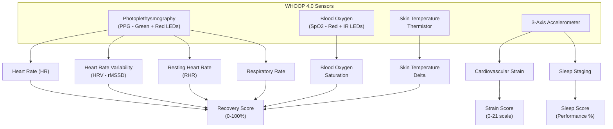
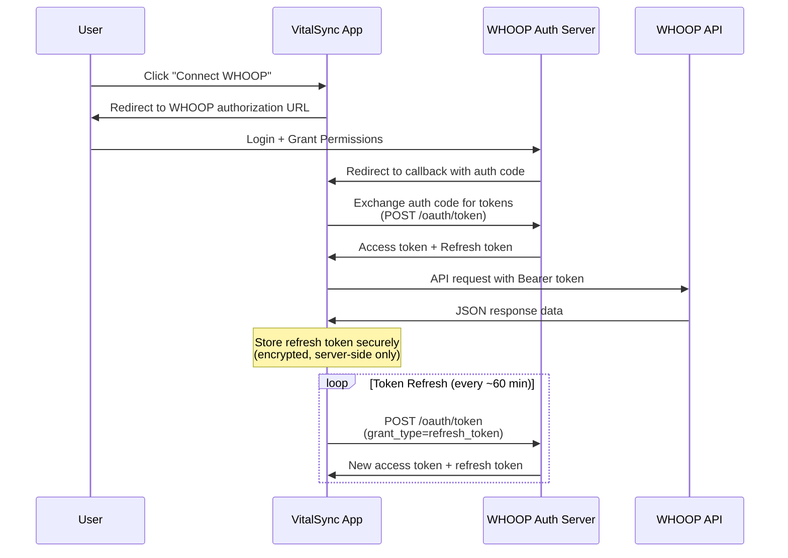
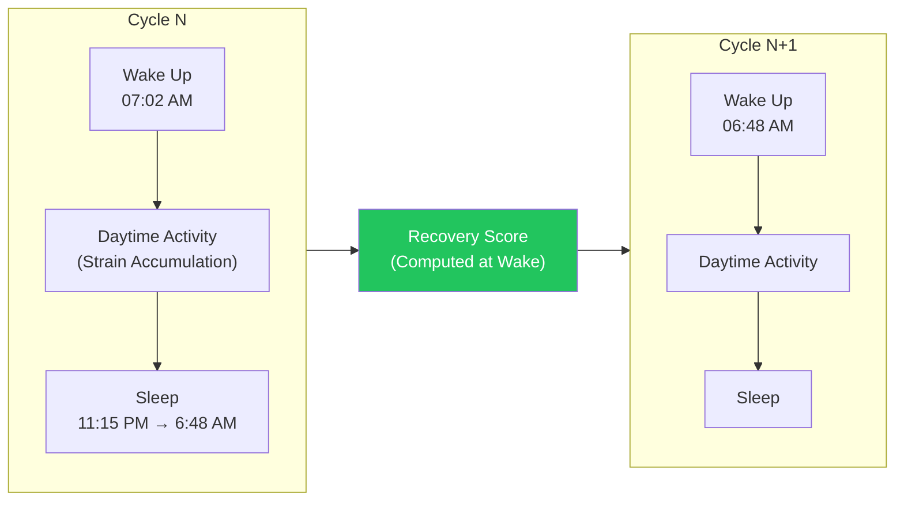
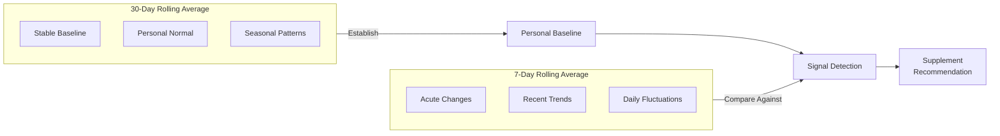
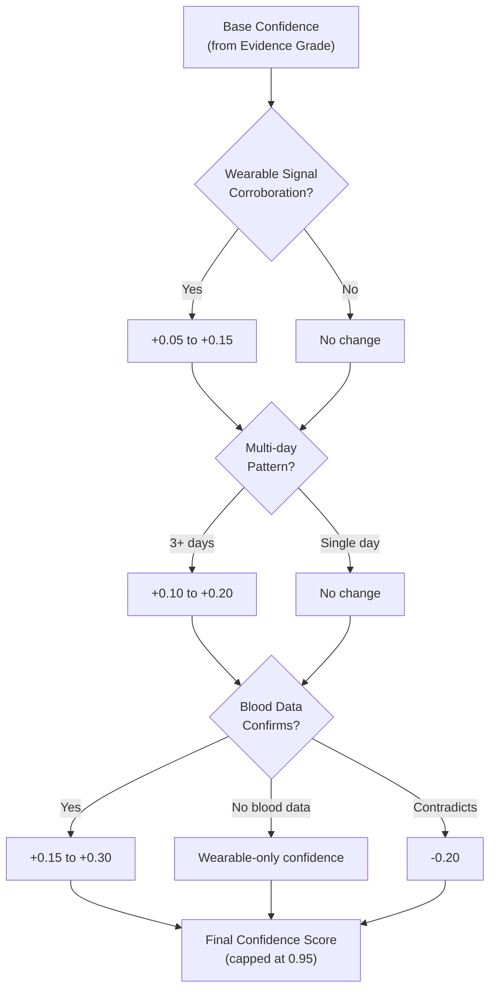
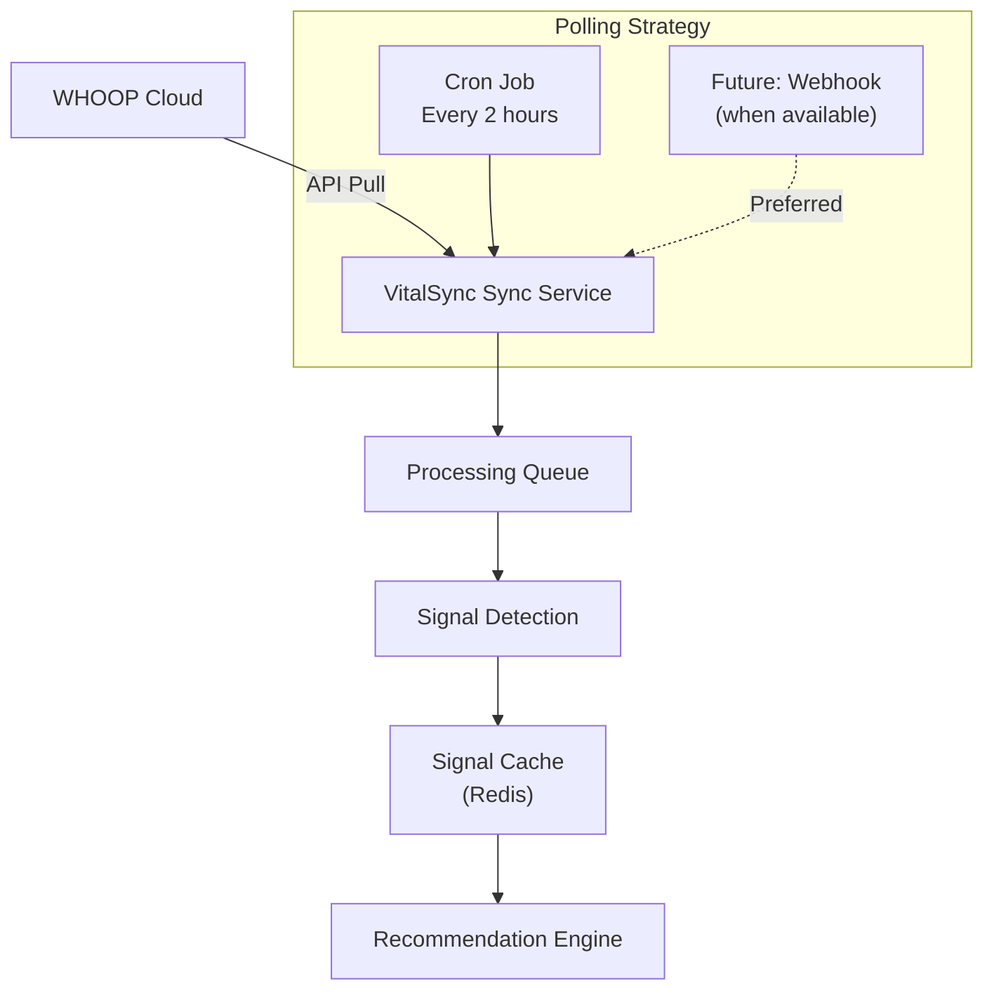
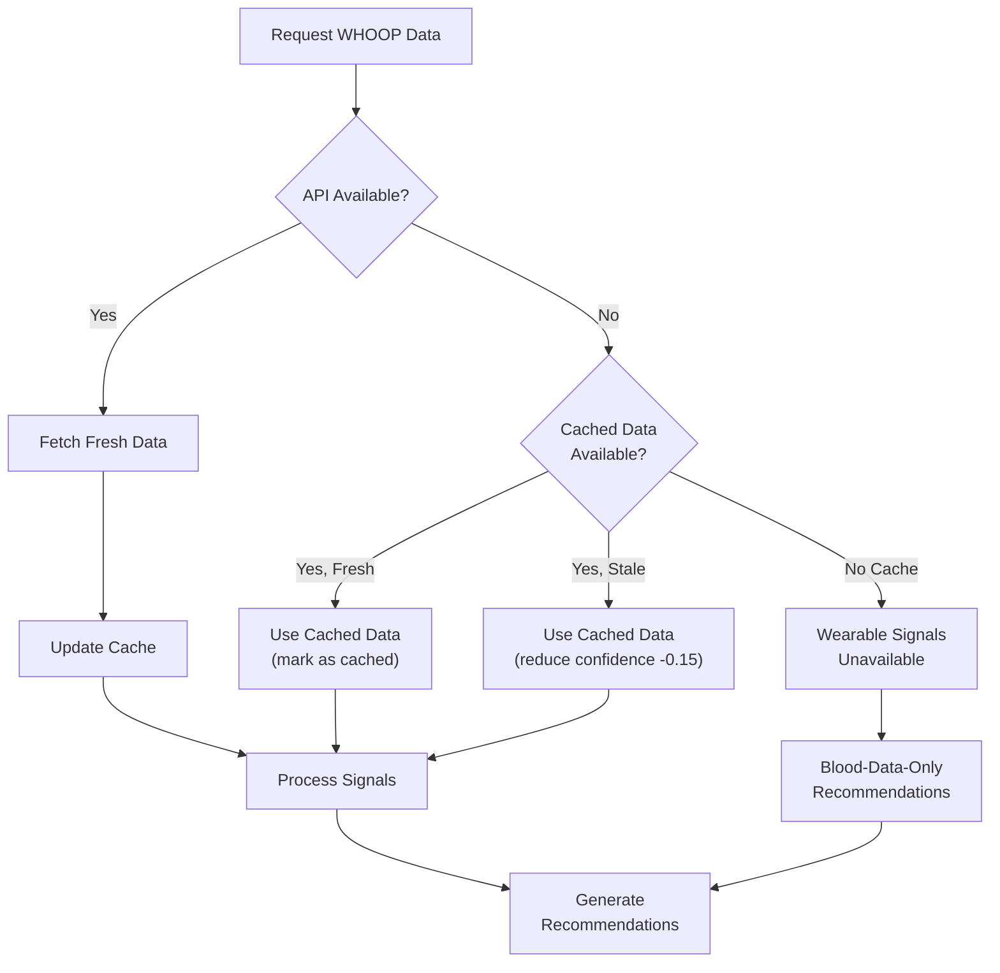
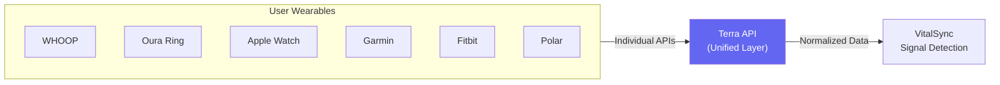

# WHOOP API Integration Guide

> **VitalSync Platform — Wearable Integration Documentation**
> Version 2.0 · Last Updated: June 2026
> Classification: Internal Engineering Reference

---

## Table of Contents

- [1. WHOOP Overview](#1-whoop-overview)
  - [What WHOOP Tracks](#what-whoop-tracks)
  - [Clinical Relevance of WHOOP Metrics](#clinical-relevance-of-whoop-metrics)
- [2. API Authentication](#2-api-authentication)
  - [OAuth 2.0 Authorization Code Flow](#oauth-20-authorization-code-flow)
  - [Developer Portal Registration](#developer-portal-registration)
  - [Scopes](#scopes)
  - [Token Refresh Strategy](#token-refresh-strategy)
- [3. API Endpoints Reference](#3-api-endpoints-reference)
  - [Endpoint Table](#endpoint-table)
  - [JSON Response Examples](#json-response-examples)
- [4. Data Model](#4-data-model)
  - [Cycle-Based Model](#cycle-based-model)
  - [Score States](#score-states)
  - [Duration Encoding](#duration-encoding)
  - [Pagination](#pagination)
- [5. Signal Detection Logic](#5-signal-detection-logic)
  - [Signal Definitions](#signal-definitions)
  - [Baseline Computation](#baseline-computation)
  - [Temporal Pattern Detection](#temporal-pattern-detection)
- [6. Supplement Correlation Matrix](#6-supplement-correlation-matrix)
  - [Signal → Supplement Mapping](#signal--supplement-mapping)
  - [Confidence Modifiers](#confidence-modifiers)
  - [Multi-Signal Compound Recommendations](#multi-signal-compound-recommendations)
- [7. Implementation Notes](#7-implementation-notes)
  - [Baseline Computation Details](#baseline-computation-details)
  - [Data Freshness and Polling](#data-freshness-and-polling)
  - [Error Handling and Offline Fallback](#error-handling-and-offline-fallback)
  - [Terra API Alternative](#terra-api-alternative)

---

## 1. WHOOP Overview

### What WHOOP Tracks

WHOOP is a continuous physiological monitoring wearable that captures 24/7 biometric data without a screen, focusing entirely on recovery, strain, and sleep optimization. Unlike consumer fitness trackers, WHOOP collects clinical-grade data streams that are directly relevant to VitalSync's supplement recommendation engine.



### Core Data Streams

| Data Stream | Measurement | Sampling Rate | Unit | Clinical Analog |
|---|---|---|---|---|
| **Heart Rate (HR)** | Continuous optical PPG | 25 Hz | BPM | Holter monitor |
| **Heart Rate Variability (HRV)** | rMSSD during slow-wave sleep | Nightly | ms | Autonomic nervous system tone |
| **Resting Heart Rate (RHR)** | Lowest rolling 5-min average during sleep | Nightly | BPM | Cardiovascular fitness / stress |
| **Respiratory Rate (RR)** | Derived from PPG waveform modulation | Nightly | breaths/min | Respiratory health, infection |
| **Blood Oxygen (SpO2)** | Red + infrared LED ratio | Nightly | % | Pulse oximetry |
| **Skin Temperature** | Thermistor, delta from baseline | Nightly | °C (delta) | Core body temperature proxy |
| **Sleep Stages** | Accelerometer + HR pattern analysis | Per sleep episode | Minutes per stage | Polysomnography (simplified) |
| **Cardiovascular Strain** | HR-derived accumulated cardiovascular load | Continuous | 0–21 (Borg-like scale) | Exercise stress test |

### Clinical Relevance of WHOOP Metrics

> [!IMPORTANT]
> WHOOP metrics are **physiological signals**, not diagnostic measurements. They serve as trend indicators and confidence modifiers for VitalSync's supplement recommendations, never as standalone diagnostic criteria.

| Metric | Clinical Relevance | VitalSync Application |
|---|---|---|
| **HRV (rMSSD)** | Reflects parasympathetic (vagal) tone. Low HRV is associated with systemic inflammation, chronic stress, overtraining, and autonomic dysfunction | Primary recovery signal. Correlates with magnesium status, omega-3 index, cortisol regulation, sleep quality |
| **RHR** | Marker of cardiovascular fitness and autonomic balance. Elevated RHR at rest indicates sympathetic dominance, dehydration, or acute illness | Trend detection for thyroid dysfunction, iron deficiency (compensatory tachycardia), overtraining |
| **Respiratory Rate** | Elevated RR during sleep suggests respiratory illness, metabolic acidosis, or anxiety. Stable baselines are highly individual | Early illness detection, respiratory infection, anxiety monitoring |
| **SpO2** | Nocturnal desaturation may indicate sleep apnea, anemia, or pulmonary conditions | Iron deficiency screening support, sleep apnea flagging, altitude acclimatization |
| **Skin Temperature** | Deviations from personal baseline correlate with illness onset (fever), menstrual cycle phase, and circadian disruption | Inflammation detection, menstrual cycle tracking for female-specific supplement timing |
| **Sleep Architecture** | Adequate SWS (deep sleep) is essential for growth hormone release, tissue repair, and memory consolidation. Adequate REM is critical for emotional regulation | Magnesium supplementation timing, melatonin evaluation, sleep hygiene recommendations |
| **Strain** | Quantified cardiovascular load. Chronic high strain without adequate recovery leads to overtraining syndrome | Exercise-nutrient timing, electrolyte and magnesium repletion, recovery optimization |
| **Recovery Score** | Composite score (0–100%) derived from HRV, RHR, RR, SpO2, and skin temp | Master signal for VitalSync: persistent low recovery triggers investigation cascade |

---

## 2. API Authentication

### OAuth 2.0 Authorization Code Flow

WHOOP uses the standard **OAuth 2.0 Authorization Code Grant** flow with PKCE support. This is a server-side flow — access tokens are never exposed to the client browser.



### Developer Portal Registration

1. **Navigate to** [https://developer-dashboard.whoop.com](https://developer-dashboard.whoop.com)
2. **Create a Developer Account** — requires a WHOOP membership
3. **Register a New Application:**

| Field | Value |
|---|---|
| Application Name | VitalSync Health Platform |
| Application Description | Personalized supplement recommendations powered by wearable biometric data |
| Redirect URI(s) | `https://app.vitalsync.health/auth/whoop/callback` (production) `http://localhost:3000/auth/whoop/callback` (development) |
| Application Type | Web Application (server-side) |
| Company/Organization | VitalSync Inc. |

4. **Receive Credentials:**
   - `Client ID` — public identifier (safe for frontend)
   - `Client Secret` — **must be stored server-side only**, never in client code or version control

### Client Configuration

```typescript
// config/whoop.ts
export const WHOOP_CONFIG = {
  authorizationUrl: 'https://api.prod.whoop.com/oauth/oauth2/auth',
  tokenUrl: 'https://api.prod.whoop.com/oauth/oauth2/token',
  apiBaseUrl: 'https://api.prod.whoop.com/developer',
  clientId: process.env.WHOOP_CLIENT_ID!,
  clientSecret: process.env.WHOOP_CLIENT_SECRET!,
  redirectUri: process.env.WHOOP_REDIRECT_URI!,
  scopes: [
    'read:recovery',
    'read:sleep',
    'read:cycles',
    'read:workout',
    'read:body_measurement',
    'offline',        // Required for refresh tokens
  ],
} as const;
```

### Step-by-Step Authorization Flow

#### Step 1: Generate Authorization URL

```typescript
import crypto from 'crypto';

function buildAuthorizationUrl(): { url: string; state: string } {
  // Generate cryptographic state parameter for CSRF protection
  const state = crypto.randomBytes(32).toString('hex');

  const params = new URLSearchParams({
    client_id: WHOOP_CONFIG.clientId,
    redirect_uri: WHOOP_CONFIG.redirectUri,
    response_type: 'code',
    scope: WHOOP_CONFIG.scopes.join(' '),
    state: state,
  });

  return {
    url: `${WHOOP_CONFIG.authorizationUrl}?${params.toString()}`,
    state, // Store in session for validation
  };
}
```

#### Step 2: Handle Authorization Callback

```typescript
// routes/auth/whoop/callback.ts
async function handleWhoopCallback(req: Request): Promise<void> {
  const { code, state } = req.query;

  // Validate state parameter against session
  if (state !== req.session.whoopOAuthState) {
    throw new SecurityError('Invalid OAuth state - possible CSRF attack');
  }

  // Exchange authorization code for tokens
  const tokenResponse = await fetch(WHOOP_CONFIG.tokenUrl, {
    method: 'POST',
    headers: {
      'Content-Type': 'application/x-www-form-urlencoded',
    },
    body: new URLSearchParams({
      grant_type: 'authorization_code',
      code: code as string,
      redirect_uri: WHOOP_CONFIG.redirectUri,
      client_id: WHOOP_CONFIG.clientId,
      client_secret: WHOOP_CONFIG.clientSecret,
    }),
  });

  const tokens = await tokenResponse.json();
  // {
  //   access_token: "eyJhbGciOi...",
  //   refresh_token: "def50200...",
  //   token_type: "Bearer",
  //   expires_in: 3600,        // 1 hour
  //   scope: "read:recovery read:sleep ..."
  // }

  // Store tokens securely (encrypted at rest)
  await storeUserTokens(req.user.id, {
    accessToken: encrypt(tokens.access_token),
    refreshToken: encrypt(tokens.refresh_token),
    expiresAt: Date.now() + (tokens.expires_in * 1000),
    scopes: tokens.scope.split(' '),
  });
}
```

### Scopes

| Scope | Data Access | Required for VitalSync? |
|---|---|---|
| `read:recovery` | Recovery scores, HRV, RHR, SpO2, skin temp | ✅ **Required** |
| `read:sleep` | Sleep stages, sleep performance, sleep/wake times | ✅ **Required** |
| `read:cycles` | Physiological cycles (day boundaries), strain | ✅ **Required** |
| `read:workout` | Workout details, sport type, strain per workout | ✅ **Required** |
| `read:body_measurement` | Height, weight, max HR | ✅ **Required** |
| `read:profile` | User profile info (name, email) | ⚠️ Optional |
| `offline` | Enables refresh token grant | ✅ **Required** |

> [!NOTE]
> Request the minimum scopes needed. Over-requesting scopes may cause users to deny authorization. VitalSync requires all data-read scopes for comprehensive signal detection.

### Token Refresh Strategy

Access tokens expire after **1 hour (3600 seconds)**. VitalSync implements proactive token refresh:

```typescript
class WhoopTokenManager {
  private static REFRESH_BUFFER_MS = 5 * 60 * 1000; // Refresh 5 min before expiry

  async getValidToken(userId: string): Promise<string> {
    const stored = await getStoredTokens(userId);

    if (Date.now() >= stored.expiresAt - WhoopTokenManager.REFRESH_BUFFER_MS) {
      return this.refreshToken(userId, stored.refreshToken);
    }

    return decrypt(stored.accessToken);
  }

  private async refreshToken(userId: string, encryptedRefresh: string): Promise<string> {
    const refreshToken = decrypt(encryptedRefresh);

    const response = await fetch(WHOOP_CONFIG.tokenUrl, {
      method: 'POST',
      headers: { 'Content-Type': 'application/x-www-form-urlencoded' },
      body: new URLSearchParams({
        grant_type: 'refresh_token',
        refresh_token: refreshToken,
        client_id: WHOOP_CONFIG.clientId,
        client_secret: WHOOP_CONFIG.clientSecret,
      }),
    });

    if (!response.ok) {
      if (response.status === 401) {
        // Refresh token revoked — user must re-authorize
        await markTokenInvalid(userId);
        throw new ReauthorizationRequired('WHOOP refresh token expired');
      }
      throw new WhoopApiError(`Token refresh failed: ${response.status}`);
    }

    const newTokens = await response.json();

    await storeUserTokens(userId, {
      accessToken: encrypt(newTokens.access_token),
      refreshToken: encrypt(newTokens.refresh_token), // Rotate refresh token
      expiresAt: Date.now() + (newTokens.expires_in * 1000),
    });

    return newTokens.access_token;
  }
}
```

> [!WARNING]
> WHOOP issues **rotating refresh tokens** — each refresh request returns a new refresh token. The old one is immediately invalidated. If you fail to store the new refresh token, the user must re-authenticate. Always update both tokens atomically.

---

## 3. API Endpoints Reference

### Endpoint Table

All endpoints use base URL: `https://api.prod.whoop.com/developer`

| Method | Endpoint | Description | Key Response Fields | Rate Limit |
|---|---|---|---|---|
| `GET` | `/v1/user/profile/basic` | User profile info | `user_id`, `first_name`, `last_name`, `email` | 100/min |
| `GET` | `/v1/user/measurement/body` | Body measurements | `height_meter`, `weight_kilogram`, `max_heart_rate` | 100/min |
| `GET` | `/v1/cycle` | List physiological cycles | `id`, `start`, `end`, `score.strain`, `score.kilojoule`, `score.average_heart_rate` | 100/min |
| `GET` | `/v1/recovery` | List recovery scores | `cycle_id`, `score.recovery_score`, `score.resting_heart_rate`, `score.hrv_rmssd_milli`, `score.spo2_percentage`, `score.skin_temp_celsius` | 100/min |
| `GET` | `/v1/sleep` | List sleep records | `id`, `start`, `end`, `score.stage_summary`, `score.sleep_performance_percentage`, `score.respiratory_rate` | 100/min |
| `GET` | `/v1/workout` | List workouts | `id`, `sport_id`, `start`, `end`, `score.strain`, `score.average_heart_rate`, `score.max_heart_rate`, `score.kilojoule` | 100/min |
| `GET` | `/v1/cycle/{cycleId}` | Single cycle detail | Full cycle object | 100/min |
| `GET` | `/v1/recovery/{cycleId}` | Single recovery detail | Full recovery object | 100/min |
| `GET` | `/v1/sleep/{sleepId}` | Single sleep detail | Full sleep object | 100/min |
| `GET` | `/v1/workout/{workoutId}` | Single workout detail | Full workout object | 100/min |

### Query Parameters (List Endpoints)

| Parameter | Type | Description | Example |
|---|---|---|---|
| `start` | ISO 8601 string | Start of date range (inclusive) | `2026-06-01T00:00:00.000Z` |
| `end` | ISO 8601 string | End of date range (exclusive) | `2026-06-07T00:00:00.000Z` |
| `limit` | integer | Max records per page (default: 25, max: 25) | `25` |
| `nextToken` | string | Pagination cursor from previous response | `eyJhbGciOi...` |

### JSON Response Examples

#### Recovery Response

```json
{
  "records": [
    {
      "cycle_id": 93845627391,
      "sleep_id": 10235878998,
      "user_id": 10129,
      "created_at": "2026-06-06T14:25:31.462Z",
      "updated_at": "2026-06-06T14:25:31.462Z",
      "score_state": "SCORED",
      "score": {
        "user_calibrating": false,
        "recovery_score": 72,
        "resting_heart_rate": 54,
        "hrv_rmssd_milli": 68.432,
        "spo2_percentage": 97.2,
        "skin_temp_celsius": 0.13
      }
    }
  ],
  "next_token": null
}
```

**Field Notes:**
- `recovery_score` — 0–100%, composite metric derived from HRV, RHR, RR, SpO2, skin temp
- `hrv_rmssd_milli` — HRV in milliseconds (rMSSD method), measured during deepest sleep
- `skin_temp_celsius` — delta from personal baseline (not absolute temperature)
- `score_state` — see [Score States](#score-states)

#### Sleep Response

```json
{
  "records": [
    {
      "id": 10235878998,
      "user_id": 10129,
      "created_at": "2026-06-06T14:25:12.933Z",
      "updated_at": "2026-06-06T14:25:12.933Z",
      "start": "2026-06-05T23:14:51.000Z",
      "end": "2026-06-06T07:02:18.000Z",
      "timezone_offset": "+05:30",
      "nap": false,
      "score_state": "SCORED",
      "score": {
        "stage_summary": {
          "total_in_bed_time_milli": 28047000,
          "total_awake_time_milli": 2340000,
          "total_no_data_time_milli": 0,
          "total_light_sleep_time_milli": 14520000,
          "total_slow_wave_sleep_time_milli": 6300000,
          "total_rem_sleep_time_milli": 4887000,
          "sleep_cycle_count": 4,
          "disturbance_count": 3
        },
        "sleep_needed": {
          "baseline_milli": 27360000,
          "need_from_sleep_debt_milli": 1200000,
          "need_from_recent_strain_milli": 480000,
          "need_from_recent_nap_milli": -600000
        },
        "respiratory_rate": 15.2,
        "sleep_performance_percentage": 91,
        "sleep_consistency_percentage": 87,
        "sleep_efficiency_percentage": 92
      }
    }
  ],
  "next_token": null
}
```

**Field Notes:**
- All duration fields are in **milliseconds**
- `stage_summary` provides polysomnography-like sleep architecture data
- `sleep_needed` breaks down total sleep requirement by component
- `sleep_performance_percentage` = (actual sleep / sleep needed) × 100
- `nap` distinguishes naps from primary sleep episodes

#### Cycle (Strain) Response

```json
{
  "records": [
    {
      "id": 93845627391,
      "user_id": 10129,
      "created_at": "2026-06-06T14:25:31.462Z",
      "updated_at": "2026-06-06T14:25:31.462Z",
      "start": "2026-06-06T07:02:18.000Z",
      "end": "2026-06-07T06:48:12.000Z",
      "timezone_offset": "+05:30",
      "score_state": "SCORED",
      "score": {
        "strain": 14.2,
        "kilojoule": 8924.372,
        "average_heart_rate": 72,
        "max_heart_rate": 182
      }
    }
  ],
  "next_token": "eyJhbGciOiJIUzI1NiJ9..."
}
```

---

## 4. Data Model

### Cycle-Based Model

WHOOP organizes data around **physiological cycles** rather than calendar days. A cycle begins when you wake up and ends when you wake up the next day, capturing a full wake-sleep-wake period.



**Key Concepts:**
- Each **cycle** contains exactly one primary sleep episode and one strain period
- **Recovery** is computed at the boundary between cycles (upon waking)
- Cycle boundaries are **not fixed to midnight** — they follow the user's actual sleep/wake pattern
- Naps are recorded as separate sleep records linked to the cycle but do not create new cycles

### Score States

Every scored record includes a `score_state` field indicating data readiness:

| State | Description | VitalSync Handling |
|---|---|---|
| `SCORED` | Data fully processed, scores computed | ✅ Use for analysis and recommendations |
| `PENDING_SCORE` | Data collected but not yet scored (processing) | ⏳ Retry in 15 minutes; do not use for analysis |
| `UNSCORABLE` | Insufficient data quality to compute score | ❌ Skip record; log for data quality monitoring |

```typescript
// Type definition for score states
type ScoreState = 'SCORED' | 'PENDING_SCORE' | 'UNSCORABLE';

function isUsableRecord(record: { score_state: ScoreState }): boolean {
  return record.score_state === 'SCORED';
}
```

### Duration Encoding

> [!IMPORTANT]
> All duration fields in the WHOOP API are encoded in **milliseconds** (not seconds, not minutes). This is consistent across all endpoints.

Common conversion utilities:

```typescript
const WHOOP_DURATION = {
  toMinutes: (ms: number): number => ms / 60_000,
  toHours: (ms: number): number => ms / 3_600_000,
  fromMinutes: (min: number): number => min * 60_000,
} as const;

// Example: Convert sleep stage durations
function parseSleepStages(stageSummary: StageSummary) {
  return {
    totalInBed: WHOOP_DURATION.toHours(stageSummary.total_in_bed_time_milli),
    awake: WHOOP_DURATION.toMinutes(stageSummary.total_awake_time_milli),
    lightSleep: WHOOP_DURATION.toMinutes(stageSummary.total_light_sleep_time_milli),
    deepSleep: WHOOP_DURATION.toMinutes(stageSummary.total_slow_wave_sleep_time_milli),
    remSleep: WHOOP_DURATION.toMinutes(stageSummary.total_rem_sleep_time_milli),
    sleepCycles: stageSummary.sleep_cycle_count,
    disturbances: stageSummary.disturbance_count,
  };
}
```

### Pagination

All list endpoints use **cursor-based pagination** (not offset-based):

| Parameter | Description |
|---|---|
| `limit` | Number of records per page (max: 25, default: 25) |
| `nextToken` | Opaque cursor string returned in previous response |

```typescript
async function fetchAllRecoveryRecords(
  client: WhoopClient,
  startDate: string,
  endDate: string
): Promise<RecoveryRecord[]> {
  const allRecords: RecoveryRecord[] = [];
  let nextToken: string | null = null;

  do {
    const params: Record<string, string> = {
      start: startDate,
      end: endDate,
      limit: '25',
    };
    if (nextToken) params.nextToken = nextToken;

    const response = await client.get('/v1/recovery', { params });
    const data = response.data;

    // Filter to only SCORED records
    const scoredRecords = data.records.filter(
      (r: RecoveryRecord) => r.score_state === 'SCORED'
    );
    allRecords.push(...scoredRecords);

    nextToken = data.next_token;
  } while (nextToken);

  return allRecords;
}
```

> [!NOTE]
> `next_token` is `null` when there are no more pages. Do not confuse with an empty string. Always use strict null checks.

---

## 5. Signal Detection Logic

VitalSync processes WHOOP data through a signal detection layer that identifies physiologically meaningful patterns and maps them to potential supplement interventions.

### Signal Definitions

| Signal ID | Signal Name | Detection Criteria | Severity | Minimum Data Required |
|---|---|---|---|---|
| `SIG-HRV-001` | `LOW_HRV` | HRV < 7-day rolling average by >20% | ⚠️ Moderate | 7 days baseline |
| `SIG-SLP-001` | `POOR_SLEEP` | Sleep performance < 70% | ⚠️ Moderate | Single night (but pattern over 3+ nights increases severity) |
| `SIG-SLP-002` | `LOW_DEEP_SLEEP` | SWS time < personal 30-day baseline by >25% | ⚠️ Moderate | 30 days baseline |
| `SIG-SLP-003` | `LOW_REM` | REM time < personal 30-day baseline by >25% | ⚠️ Moderate | 30 days baseline |
| `SIG-STR-001` | `HIGH_STRAIN_LOW_RECOVERY` | Strain > 15 AND Recovery < 40% | 🔴 High | Single occurrence |
| `SIG-REC-001` | `PERSISTENT_LOW_RECOVERY` | Recovery < 50% for 3+ consecutive days | 🔴 High | 3+ days consecutive |
| `SIG-OX-001` | `LOW_SPO2` | SpO2 consistently < 95% across 3+ nights | 🔴 High | 3 nights |
| `SIG-RR-001` | `ELEVATED_RESP_RATE` | Respiratory rate > 30-day baseline by >15% | ⚠️ Moderate | 30 days baseline |
| `SIG-TEMP-001` | `ELEVATED_SKIN_TEMP` | Skin temp delta > personal baseline by >0.5°C for 2+ days | ⚠️ Moderate | 14 days baseline |
| `SIG-HR-001` | `ELEVATED_RHR` | RHR > 30-day baseline by > 5 BPM | ⚠️ Moderate | 30 days baseline |

### Signal Detection Implementation

```typescript
interface WhoopSignal {
  signalId: string;
  signalName: string;
  severity: 'low' | 'moderate' | 'high' | 'critical';
  detectedAt: Date;
  currentValue: number;
  baselineValue: number;
  deviationPercent: number;
  consecutiveDays: number;
  confidence: number; // 0.0 - 1.0
}

class SignalDetector {
  detectLowHRV(
    currentHRV: number,
    baseline7Day: number
  ): WhoopSignal | null {
    const deviation = ((baseline7Day - currentHRV) / baseline7Day) * 100;

    if (deviation > 20) {
      return {
        signalId: 'SIG-HRV-001',
        signalName: 'LOW_HRV',
        severity: deviation > 40 ? 'high' : 'moderate',
        detectedAt: new Date(),
        currentValue: currentHRV,
        baselineValue: baseline7Day,
        deviationPercent: deviation,
        consecutiveDays: this.getConsecutiveLowHRVDays(),
        confidence: this.calculateConfidence(deviation, 'hrv'),
      };
    }
    return null;
  }

  detectPoorSleep(
    sleepPerformance: number,
    consecutiveNights: number
  ): WhoopSignal | null {
    if (sleepPerformance < 70) {
      return {
        signalId: 'SIG-SLP-001',
        signalName: 'POOR_SLEEP',
        severity: consecutiveNights >= 3 ? 'high' : 'moderate',
        detectedAt: new Date(),
        currentValue: sleepPerformance,
        baselineValue: 85, // Population reference
        deviationPercent: ((85 - sleepPerformance) / 85) * 100,
        consecutiveDays: consecutiveNights,
        confidence: Math.min(0.5 + (consecutiveNights * 0.1), 0.9),
      };
    }
    return null;
  }

  detectPersistentLowRecovery(
    recoveryScores: number[], // Last N days, most recent first
  ): WhoopSignal | null {
    const consecutiveLow = recoveryScores
      .findIndex(score => score >= 50);
    const lowDays = consecutiveLow === -1
      ? recoveryScores.length
      : consecutiveLow;

    if (lowDays >= 3) {
      const avgRecovery = recoveryScores
        .slice(0, lowDays)
        .reduce((a, b) => a + b, 0) / lowDays;

      return {
        signalId: 'SIG-REC-001',
        signalName: 'PERSISTENT_LOW_RECOVERY',
        severity: lowDays >= 5 ? 'critical' : 'high',
        detectedAt: new Date(),
        currentValue: avgRecovery,
        baselineValue: 66, // Population reference for green recovery
        deviationPercent: ((66 - avgRecovery) / 66) * 100,
        consecutiveDays: lowDays,
        confidence: Math.min(0.6 + (lowDays * 0.08), 0.95),
      };
    }
    return null;
  }
}
```

### Baseline Computation

VitalSync uses two baseline windows for different purposes:



| Baseline Type | Window | Update Frequency | Use Case |
|---|---|---|---|
| **7-day rolling** | Last 7 `SCORED` days | Daily | Acute deviation detection (HRV drop, RHR spike) |
| **30-day rolling** | Last 30 `SCORED` days | Daily | Stable personal baseline (what's "normal" for this user) |
| **90-day rolling** | Last 90 `SCORED` days | Weekly | Long-term trends, seasonal adjustments, supplement efficacy tracking |

```typescript
interface BaselineMetrics {
  hrv: { avg7d: number; avg30d: number; avg90d: number; stdDev30d: number };
  rhr: { avg7d: number; avg30d: number; avg90d: number; stdDev30d: number };
  respiratoryRate: { avg30d: number; stdDev30d: number };
  skinTemp: { avg14d: number; stdDev14d: number };
  spo2: { avg30d: number; min7d: number };
  sleepPerformance: { avg7d: number; avg30d: number };
  deepSleepMinutes: { avg30d: number; stdDev30d: number };
  remSleepMinutes: { avg30d: number; stdDev30d: number };
  strain: { avg7d: number; avg30d: number };
  recovery: { avg7d: number; avg30d: number };
}

function computeBaselines(records: ScoredRecord[]): BaselineMetrics {
  const now = new Date();
  const last7d = filterByDays(records, 7);
  const last14d = filterByDays(records, 14);
  const last30d = filterByDays(records, 30);
  const last90d = filterByDays(records, 90);

  return {
    hrv: {
      avg7d: mean(last7d.map(r => r.hrv)),
      avg30d: mean(last30d.map(r => r.hrv)),
      avg90d: mean(last90d.map(r => r.hrv)),
      stdDev30d: stdDev(last30d.map(r => r.hrv)),
    },
    // ... compute for all metrics
  };
}
```

### Temporal Pattern Detection

Single-day anomalies are common and often not actionable. VitalSync uses **multi-day pattern detection** to increase signal confidence:

| Pattern | Definition | Confidence Boost | Action |
|---|---|---|---|
| **Single-day anomaly** | 1 day below threshold | +0.0 | Log only; no recommendation change |
| **2-day trend** | 2 consecutive days below threshold | +0.10 | Flag as emerging pattern |
| **3-day trend** | 3 consecutive days below threshold | +0.20 | Trigger recommendation consideration |
| **5+ day trend** | 5+ consecutive days below threshold | +0.30 | High-priority recommendation; consider multiple signals |
| **Weekly pattern** | Same day of week consistently low (e.g., post-weekend) | +0.05 | Behavioral pattern; lifestyle recommendation |

---

## 6. Supplement Correlation Matrix

This is the core mapping table that connects WHOOP-detected signals to VitalSync supplement recommendations. Each signal alone provides a **wearable-only** confidence level. When corroborated with blood biomarker data, confidence increases significantly.

### Signal → Supplement Mapping

| Signal | Primary Supplement Recommendations | Wearable-Only Confidence | With Supporting Blood Data | Required Blood Biomarker |
|---|---|---|---|---|
| `LOW_HRV` | Magnesium glycinate 300mg, Omega-3 2000mg EPA+DHA, Ashwagandha 600mg (KSM-66) | 0.40 | 0.80 (if low RBC Mg or low Omega-3 Index) | RBC Magnesium, Omega-3 Index, Cortisol |
| `POOR_SLEEP` | Magnesium glycinate 400mg (evening), Glycine 3g (bedtime), L-Theanine 200mg | 0.45 | 0.82 (if low RBC Mg confirmed) | RBC Magnesium, Vitamin D, Ferritin |
| `LOW_DEEP_SLEEP` | Magnesium L-threonate 144mg Mg (2g threonate), Zinc 25mg, Ashwagandha 300mg | 0.35 | 0.78 (if low Mg and/or low Zinc) | RBC Magnesium, Serum Zinc |
| `LOW_REM` | Vitamin B6 (P5P) 50mg, Magnesium glycinate 300mg, Omega-3 DHA-dominant 1000mg | 0.30 | 0.72 (if B-vitamin status suboptimal) | B12, Folate, Homocysteine |
| `HIGH_STRAIN_LOW_RECOVERY` | Electrolyte complex, Magnesium 400mg, Omega-3 3000mg, Vitamin C 1000mg, Protein optimization | 0.55 | 0.85 (if hs-CRP elevated) | hs-CRP, Ferritin, CK (if available) |
| `PERSISTENT_LOW_RECOVERY` | **Full panel investigation recommended.** Interim: Magnesium 400mg, B-Complex (methylated), Vitamin D 4000 IU, Omega-3 3000mg, CoQ10 200mg | 0.50 | 0.90 (multi-biomarker correlation) | Full panel: Vitamin D, B12, Folate, Iron, Thyroid, hs-CRP |
| `LOW_SPO2` | Iron bisglycinate 25mg (if ferritin <30), Vitamin B12 1000mcg, Folate 800mcg | 0.30 | 0.85 (if anemia confirmed by labs) | CBC, Ferritin, B12, Folate, Reticulocyte count |
| `ELEVATED_RESP_RATE` | NAC 600mg (mucolytic), Vitamin C 1000mg, Vitamin D 4000 IU, Zinc 30mg | 0.25 | 0.65 (if hs-CRP elevated, confirming inflammation) | hs-CRP, CBC with differential |
| `ELEVATED_SKIN_TEMP` | Anti-inflammatory protocol: Omega-3 3000mg EPA, Curcumin 500mg, Vitamin D 4000 IU | 0.30 | 0.75 (if hs-CRP >1.0) | hs-CRP, CBC, Thyroid panel |
| `ELEVATED_RHR` | Magnesium taurate 300mg, Omega-3 2000mg, CoQ10 200mg, Potassium (dietary) | 0.35 | 0.80 (if thyroid or iron abnormality confirmed) | Thyroid panel (TSH, FT4), Ferritin, hs-CRP |

### Confidence Modifiers

Confidence scores are dynamically adjusted based on data quality, temporal patterns, and corroborating evidence:



#### Confidence Modifier Table

| Modifier | Condition | Adjustment | Example |
|---|---|---|---|
| **Temporal consistency** | Signal persists 3+ days | +0.10 to +0.20 | LOW_HRV for 5 days → +0.20 |
| **Multi-signal convergence** | 2+ signals point to same root cause | +0.10 per additional signal | LOW_HRV + POOR_SLEEP + ELEVATED_RHR → +0.20 |
| **Blood biomarker confirmation** | Lab data confirms suspected deficiency | +0.15 to +0.30 | LOW_HRV + confirmed low RBC Mg → +0.30 |
| **Blood biomarker contradiction** | Lab data shows normal levels | -0.15 to -0.25 | LOW_HRV but normal Mg, Omega-3, Cortisol → -0.20 |
| **Demographic match** | User profile matches at-risk population | +0.05 | Vegan + LOW_SPO2 → higher prior for B12/iron |
| **Historical response** | Previous supplement improved the metric | +0.10 | Past Mg supplementation raised HRV → +0.10 |
| **Data freshness** | Stale data (>48h old) | -0.10 to -0.20 | Last sync 3 days ago → -0.15 |
| **Baseline quality** | < 14 days of baseline data | -0.15 | New user with 5 days of data → -0.15 |

### Multi-Signal Compound Recommendations

When multiple signals converge, VitalSync identifies **root cause patterns** and generates compound recommendations:

| Pattern | Signals | Likely Root Cause | Compound Recommendation |
|---|---|---|---|
| **Inflammatory State** | `LOW_HRV` + `ELEVATED_SKIN_TEMP` + `ELEVATED_RHR` | Systemic inflammation | Anti-inflammatory protocol: Omega-3 3000mg EPA + Curcumin 500mg + Vitamin D 4000 IU. **Priority: blood panel for hs-CRP** |
| **Overtraining Syndrome** | `HIGH_STRAIN_LOW_RECOVERY` + `PERSISTENT_LOW_RECOVERY` + `LOW_HRV` | Chronic overreaching, HPA axis stress | Recovery protocol: Magnesium 400mg + Ashwagandha 600mg + Omega-3 3000mg + strain reduction advice. **Priority: cortisol, ferritin, CK** |
| **Sleep Architecture Collapse** | `POOR_SLEEP` + `LOW_DEEP_SLEEP` + `LOW_REM` | Magnesium/mineral depletion, stress | Sleep optimization: Mg glycinate 400mg + Mg L-threonate 144mg + Glycine 3g + P5P 50mg. **Priority: RBC Mg, B6, Zinc** |
| **Anemia Pattern** | `LOW_SPO2` + `ELEVATED_RHR` + `POOR_SLEEP` | Iron deficiency / B12 deficiency anemia | Anemia investigation: **Defer supplements until labs confirm.** Priority: CBC, Ferritin + CRP, B12, Folate, Reticulocyte count |
| **Thyroid Pattern** | `ELEVATED_RHR` + `PERSISTENT_LOW_RECOVERY` + `ELEVATED_SKIN_TEMP` | Thyroid dysfunction | Thyroid investigation: Selenium 200mcg (safe empiric). **Priority: TSH, FT4, FT3, TPO antibodies** |

> [!CAUTION]
> The **Anemia Pattern** requires lab confirmation before any iron or B12 supplementation. Low SpO2 + elevated RHR has multiple differential diagnoses (sleep apnea, pulmonary conditions, deconditioning). VitalSync flags this pattern for urgent lab work, not empiric supplementation.

---

## 7. Implementation Notes

### Baseline Computation Details

#### Cold Start Problem

New users lack baseline data. VitalSync handles this with a **calibration phase**:

```typescript
enum CalibrationState {
  INSUFFICIENT = 'INSUFFICIENT',  // < 7 days
  PARTIAL = 'PARTIAL',            // 7-13 days (7-day baselines available)
  ADEQUATE = 'ADEQUATE',          // 14-29 days (short-term baselines reliable)
  FULL = 'FULL',                  // 30+ days (all baselines computed)
}

function getCalibrationState(daysOfData: number): CalibrationState {
  if (daysOfData < 7) return CalibrationState.INSUFFICIENT;
  if (daysOfData < 14) return CalibrationState.PARTIAL;
  if (daysOfData < 30) return CalibrationState.ADEQUATE;
  return CalibrationState.FULL;
}

function getMaxAllowedConfidence(state: CalibrationState): number {
  switch (state) {
    case CalibrationState.INSUFFICIENT: return 0.30; // Very limited signals
    case CalibrationState.PARTIAL: return 0.55;       // Basic HRV trends
    case CalibrationState.ADEQUATE: return 0.75;      // Most signals reliable
    case CalibrationState.FULL: return 0.95;          // Full signal detection
  }
}
```

#### Outlier Handling

Baselines use **trimmed means** (excluding top/bottom 10%) to prevent single anomalous nights from skewing baselines:

```typescript
function trimmedMean(values: number[], trimPercent: number = 0.1): number {
  const sorted = [...values].sort((a, b) => a - b);
  const trimCount = Math.floor(sorted.length * trimPercent);
  const trimmed = sorted.slice(trimCount, sorted.length - trimCount);
  return trimmed.reduce((a, b) => a + b, 0) / trimmed.length;
}
```

### Data Freshness and Polling

#### Sync Architecture



#### Polling Frequency

| Data Type | Polling Interval | Rationale |
|---|---|---|
| Recovery scores | Every 2 hours (morning priority: 6–10 AM) | Recovery is computed once per cycle upon waking |
| Sleep data | Every 2 hours (morning priority) | Sleep data finalized after wake-up |
| Cycle/Strain | Every 4 hours | Strain accumulates throughout the day |
| Workouts | Every 4 hours | Real-time workout tracking not needed for supplement recommendations |
| Body measurements | Once daily | Rarely changes |

#### Data Staleness Rules

```typescript
interface DataFreshnessConfig {
  maxAge: {
    recovery: number;    // 36 hours — must have yesterday's recovery
    sleep: number;       // 36 hours
    cycle: number;       // 48 hours
    baseline: number;    // 7 days (baselines are inherently historical)
  };
}

const FRESHNESS_CONFIG: DataFreshnessConfig = {
  maxAge: {
    recovery: 36 * 60 * 60 * 1000,  // 36 hours in ms
    sleep: 36 * 60 * 60 * 1000,
    cycle: 48 * 60 * 60 * 1000,
    baseline: 7 * 24 * 60 * 60 * 1000,
  },
};

function isDataFresh(lastSync: Date, dataType: keyof DataFreshnessConfig['maxAge']): boolean {
  return Date.now() - lastSync.getTime() < FRESHNESS_CONFIG.maxAge[dataType];
}
```

### Error Handling and Offline Fallback

#### API Error Handling

```typescript
class WhoopApiClient {
  private async request<T>(
    endpoint: string,
    options: RequestOptions = {}
  ): Promise<T> {
    const maxRetries = 3;
    let lastError: Error | null = null;

    for (let attempt = 0; attempt < maxRetries; attempt++) {
      try {
        const token = await this.tokenManager.getValidToken(this.userId);

        const response = await fetch(
          `${WHOOP_CONFIG.apiBaseUrl}${endpoint}`,
          {
            ...options,
            headers: {
              'Authorization': `Bearer ${token}`,
              'Content-Type': 'application/json',
              ...options.headers,
            },
          }
        );

        switch (response.status) {
          case 200:
            return response.json();

          case 401:
            // Token expired mid-request — force refresh and retry
            await this.tokenManager.forceRefresh(this.userId);
            continue;

          case 429:
            // Rate limited — exponential backoff
            const retryAfter = parseInt(
              response.headers.get('Retry-After') || '60'
            );
            await sleep(retryAfter * 1000 * Math.pow(2, attempt));
            continue;

          case 404:
            throw new WhoopNotFoundError(endpoint);

          case 500:
          case 502:
          case 503:
            // Server error — retry with backoff
            await sleep(1000 * Math.pow(2, attempt));
            continue;

          default:
            throw new WhoopApiError(
              `Unexpected status ${response.status}`,
              response.status
            );
        }
      } catch (error) {
        lastError = error as Error;
        if (error instanceof WhoopNotFoundError) throw error;
        if (error instanceof ReauthorizationRequired) throw error;
      }
    }

    throw new WhoopApiError(
      `Failed after ${maxRetries} retries: ${lastError?.message}`
    );
  }
}
```

#### Offline Fallback Strategy

When WHOOP API is unavailable or user's device hasn't synced:



| Scenario | Behavior | Confidence Impact |
|---|---|---|
| API online, fresh data | Normal processing | Full confidence |
| API online, PENDING_SCORE | Retry in 15 min | Defer signal detection |
| API down, cache < 24h old | Use cached data | -0.05 confidence |
| API down, cache 24-48h old | Use cached data with warning | -0.15 confidence |
| API down, cache > 48h old | Mark wearable data as stale | -0.25 confidence; blood-data-only mode |
| No WHOOP connected | Blood-data-only mode | Wearable confidence = 0.0 |

### Terra API Alternative

For users with wearables other than WHOOP (Oura, Apple Watch, Garmin, Fitbit), VitalSync can integrate via the **Terra API** — a unified wearable data aggregation platform.

#### Terra Overview



#### Terra vs Direct WHOOP Integration

| Feature | Direct WHOOP API | Terra API |
|---|---|---|
| **Data granularity** | Full native granularity | Normalized (some loss) |
| **Sleep stages** | Full (light, deep, REM, awake) | Full (mapped to standard schema) |
| **HRV** | rMSSD in milliseconds | rMSSD or SDNN (device-dependent) |
| **SpO2** | Available | Available (device-dependent) |
| **Skin temperature** | Available | Available (Oura, WHOOP) |
| **Recovery score** | Native WHOOP score | Not available (must compute) |
| **Latency** | Near real-time (2h polling) | Slight delay (~30 min additional) |
| **Multi-device** | WHOOP only | 200+ devices |
| **Cost** | Free (WHOOP API) | Per-user pricing |
| **Reliability** | Single point of failure | Abstraction layer adds resilience |

#### Terra Integration Code

```typescript
// config/terra.ts
export const TERRA_CONFIG = {
  apiKey: process.env.TERRA_API_KEY!,
  devId: process.env.TERRA_DEV_ID!,
  baseUrl: 'https://api.tryterra.co/v2',
  webhookSecret: process.env.TERRA_WEBHOOK_SECRET!,
} as const;

// Fetch normalized sleep data from any connected wearable
async function fetchTerraSleep(
  terraUserId: string,
  startDate: string,
  endDate: string
): Promise<NormalizedSleepData[]> {
  const response = await fetch(
    `${TERRA_CONFIG.baseUrl}/sleep?` +
    `user_id=${terraUserId}&start_date=${startDate}&end_date=${endDate}`,
    {
      headers: {
        'dev-id': TERRA_CONFIG.devId,
        'x-api-key': TERRA_CONFIG.apiKey,
      },
    }
  );

  const data = await response.json();

  // Normalize to VitalSync internal format
  return data.data.map((record: TerraSleeRecord) => ({
    source: record.metadata.provider || 'unknown',
    startTime: record.metadata.start_time,
    endTime: record.metadata.end_time,
    totalSleepMinutes: record.sleep_durations_data?.asleep?.duration_asleep_state_seconds / 60,
    deepSleepMinutes: record.sleep_durations_data?.asleep?.duration_deep_sleep_state_seconds / 60,
    remSleepMinutes: record.sleep_durations_data?.asleep?.duration_REM_sleep_state_seconds / 60,
    lightSleepMinutes: record.sleep_durations_data?.asleep?.duration_light_sleep_state_seconds / 60,
    hrvAvg: record.heart_rate_data?.hrv?.avg_hrv_rmssd,
    respiratoryRate: record.respiration_data?.avg_breaths_per_min,
    spo2Avg: record.blood_oxygen_data?.avg_saturation_percentage,
    skinTempDelta: record.temperature_data?.delta,
  }));
}
```

> [!TIP]
> **Recommended architecture**: Use direct WHOOP API integration for WHOOP users (maximum data fidelity) and Terra API for all other wearables. The VitalSync signal detection layer should accept a normalized `WearableData` interface that both integrations conform to.

#### Normalized Wearable Interface

```typescript
/**
 * Unified wearable data interface.
 * Both WHOOP direct and Terra integrations must conform to this shape.
 */
interface NormalizedWearableData {
  // Metadata
  source: 'whoop' | 'oura' | 'apple_watch' | 'garmin' | 'fitbit' | 'polar' | 'other';
  userId: string;
  syncedAt: Date;
  dataDate: string; // ISO date

  // Recovery metrics
  recovery?: {
    score?: number;          // 0-100 (WHOOP native; computed for others)
    hrv_rmssd_ms: number;    // Heart rate variability in ms
    resting_hr_bpm: number;  // Resting heart rate
    spo2_percent?: number;   // Blood oxygen saturation
    skin_temp_delta_c?: number; // Skin temperature delta from baseline
    respiratory_rate?: number;  // Breaths per minute
  };

  // Sleep metrics
  sleep?: {
    total_sleep_minutes: number;
    deep_sleep_minutes: number;
    rem_sleep_minutes: number;
    light_sleep_minutes: number;
    awake_minutes: number;
    sleep_performance?: number;  // 0-100%
    sleep_efficiency?: number;   // 0-100%
    disturbance_count?: number;
  };

  // Activity metrics
  activity?: {
    strain?: number;             // 0-21 (WHOOP scale; mapped for others)
    active_calories: number;
    total_calories: number;
    active_minutes: number;
  };
}
```

---

## Appendix A: WHOOP Sport Type IDs

Common `sport_id` values returned in workout responses:

| Sport ID | Activity |
|---|---|
| -1 | Activity (generic) |
| 0 | Running |
| 1 | Cycling |
| 16 | Baseball |
| 17 | Basketball |
| 22 | Cross Country Skiing |
| 24 | CrossFit |
| 25 | Dancing |
| 32 | Football |
| 33 | Golf |
| 43 | HIIT |
| 44 | Hockey |
| 48 | Lacrosse |
| 52 | Martial Arts |
| 56 | Rowing |
| 57 | Rugby |
| 63 | Soccer |
| 64 | Softball |
| 66 | Squash |
| 70 | Swimming |
| 71 | Tennis |
| 73 | Track & Field |
| 75 | Volleyball |
| 76 | Water Polo |
| 82 | Yoga |
| 83 | Weightlifting |
| 84 | Pilates |
| 86 | Functional Fitness |
| 87 | Meditation |
| 88 | Stretching |

---

## Appendix B: Rate Limiting Strategy

```typescript
class RateLimiter {
  private requestCount = 0;
  private windowStart = Date.now();
  private readonly maxRequests = 90; // Conservative: 90/100 per minute
  private readonly windowMs = 60_000;

  async throttle(): Promise<void> {
    const elapsed = Date.now() - this.windowStart;

    if (elapsed > this.windowMs) {
      // Reset window
      this.requestCount = 0;
      this.windowStart = Date.now();
    }

    if (this.requestCount >= this.maxRequests) {
      // Wait until window resets
      const waitTime = this.windowMs - elapsed + 100; // 100ms buffer
      await sleep(waitTime);
      this.requestCount = 0;
      this.windowStart = Date.now();
    }

    this.requestCount++;
  }
}
```

---

> **Document Control**
> | Field | Value |
> |---|---|
> | Version | 2.0 |
> | Last Updated | 2026-06-07 |
> | Author | VitalSync Engineering Team |
> | Review Cycle | Quarterly |
> | Next Review | 2026-09-07 |
> | API Version | WHOOP Developer API v1 |
> | Terra API Version | v2 |
